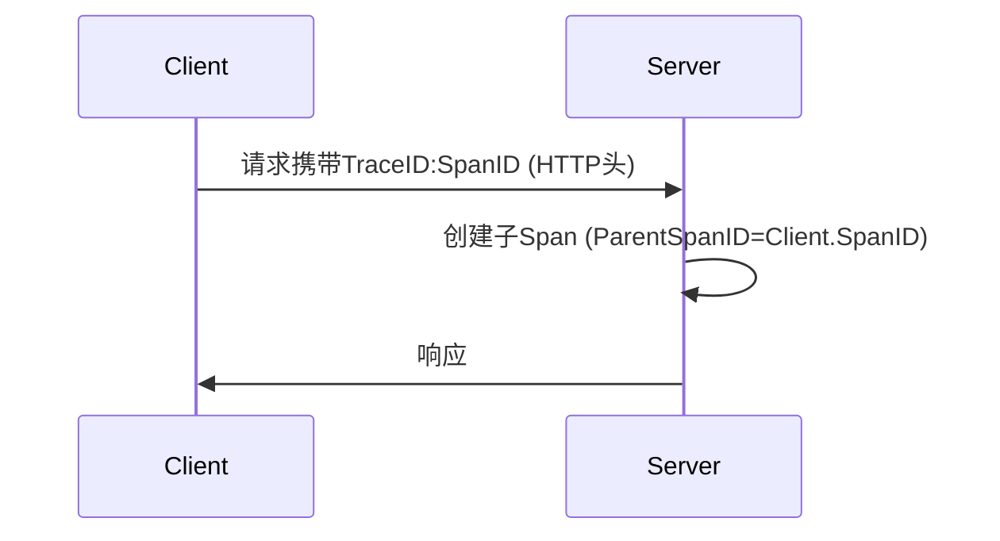

# 上下文传播实现

## 介绍

在分布式系统中，**上下文传播（Context Propagation）**是确保请求在不同服务间流转时，能够保持调用链完整性的关键技术。Zipkin和OpenTelemetry通过传递**TraceID**和**SpanID**等上下文信息，将分散的日志、指标和追踪数据关联起来，形成完整的调用链（Trace）。

:::tip 核心概念
- **TraceID**：唯一标识整个调用链的ID，所有相关Span共享同一个TraceID。
- **SpanID**：标识单个操作的ID，如一个HTTP请求或数据库查询。
- **上下文载体（Context Carrier）**：HTTP头、gRPC元数据等用于传递上下文信息的媒介。
:::

## 基本实现原理

### 1. 手动传播（以HTTP为例）
在Zipkin中，上下文通常通过HTTP头（如 `X-B3-TraceId`）传播。以下是一个手动注入和提取上下文的示例：

```javascript
// 客户端：注入上下文到HTTP头
const headers = {
  'X-B3-TraceId': '80f198ee56343ba864fe8b2a57d3eff7',
  'X-B3-SpanId': 'e457b5a2e4d86bd1'
};

// 服务端：从HTTP头提取上下文
const traceId = req.headers['x-b3-traceid'];
const spanId = req.headers['x-b3-spanid'];
```

### 2. OpenTelemetry自动传播
OpenTelemetry提供了自动化的上下文传播机制。以下是Node.js中的示例：

```javascript
const { propagation, trace } = require('@opentelemetry/api');

// 客户端：自动注入上下文
const carrier = {};
propagation.inject(context.active(), carrier);
// carrier现在包含类似 `traceparent: '00-80f198ee56343ba864fe8b2a57d3eff7-e457b5a2e4d86bd1-01'` 的字段

// 服务端：自动提取
const context = propagation.extract(context.active(), carrier);
```

## 上下文传播流程



## 实际案例：电商订单流程

假设一个订单流程涉及3个服务：
1. **API网关**接收用户请求，生成初始TraceID。
2. **订单服务**调用**支付服务**时传递上下文。

```javascript
// 订单服务调用支付服务（使用Fetch API）
fetch('https://payment-service', {
  headers: {
    'traceparent': '00-80f198ee56343ba864fe8b2a57d3eff7-e457b5a2e4d86bd1-01'
  }
});
```

在Zipkin UI中，您将看到完整的调用链：
- API网关 Span (Root)
  └─ 订单服务 Span
     └─ 支付服务 Span

## 常见问题与调试

:::caution 上下文丢失的场景
1. 未正确配置传播器（如OpenTelemetry的 `W3CTraceContextPropagator`）。
2. 异步操作未正确保存上下文（需使用 `context.with`）。
3. 自定义中间件未转发HTTP头。
:::

调试建议：
- 使用OpenTelemetry的 `console.log(context.active())` 检查当前上下文。
- 在Zipkin中搜索不完整的Trace。

## 总结与练习

### 关键点总结
1. 上下文传播是分布式追踪的基础。
2. Zipkin使用B3格式，OpenTelemetry默认使用W3C TraceContext。
3. 自动传播比手动更可靠，但需正确配置。

### 练习建议
1. 尝试手动实现一个跨服务的上下文传播。
2. 使用OpenTelemetry配置自动传播，对比两种方式的差异。
3. 在Zipkin中观察不同服务的Span关联情况。

### 扩展阅读
- [W3C Trace Context规范](https://www.w3.org/TR/trace-context/)
- [OpenTelemetry上下文管理文档](https://opentelemetry.io/docs/concepts/context/)