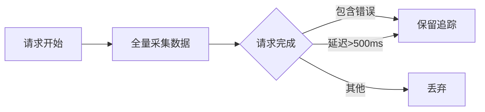

# OpenTelemetry采样策略

## 介绍

在分布式系统中，追踪（Tracing）是理解请求流和诊断问题的关键工具。然而，全量采集所有追踪数据可能会带来高昂的存储和计算成本。OpenTelemetry的**采样策略**允许开发者控制哪些追踪数据需要收集，从而在保证可观测性的同时平衡系统资源消耗。

采样策略决定了哪些请求的追踪数据会被记录和导出。OpenTelemetry提供了多种内置采样策略，并支持自定义实现。

## 采样策略类型

### 1. 头部采样（Head-based Sampling）
在请求开始时决定是否采样，通常基于概率或特定规则。

#### 示例：概率采样
```python
from opentelemetry.sdk.trace import TracerProvider
from opentelemetry.sdk.trace.sampling import TraceIdRatioBased

# 设置50%的采样率
sampler = TraceIdRatioBased(0.5)
provider = TracerProvider(sampler=sampler)
```

### 2. 尾部采样（Tail-based Sampling）
在请求完成后根据其属性（如延迟、错误状态）决定是否采样。



## 常用采样策略详解

### 概率采样（Probability Sampling）
最简单的策略，按固定比例随机采样。

:::tip 适用场景
- 生产环境的基础监控
- 需要均匀覆盖所有请求类型时
:::

```python
# 设置10%的采样率
sampler = TraceIdRatioBased(0.1)
```

### 速率限制采样（Rate Limiting Sampling）
控制单位时间内的最大采样数。

```go
import (
    "go.opentelemetry.io/otel/sdk/trace"
    "time"
)

sampler := trace.NewRateLimitingSampler(100) // 每秒最多100条
```

### 动态采样（Dynamic Sampling）
根据运行时条件调整采样策略。

:::caution 注意
动态采样需要额外的配置存储（如远程配置服务）来实时更新规则。
:::

## 实际案例

### 电商平台采样策略
1. **关键路径**：支付流程100%采样
2. **高延迟请求**：超过1秒的请求100%采样
3. **其他请求**：基础概率采样（5%）

```yaml
# OpenTelemetry Collector配置示例
processors:
  tail_sampling:
    policies:
      - name: payment-policy
        type: string_attribute
        string_attribute:
          key: "http.route"
          values: ["/checkout/payment"]
          enabled: true
      - name: slow-requests
        type: latency
        latency:
          threshold_ms: 1000
```

## 总结

| 策略类型       | 优点                     | 缺点                     |
|----------------|--------------------------|--------------------------|
| 概率采样       | 实现简单，资源消耗可预测 | 可能遗漏重要事件         |
| 尾部采样       | 精准捕获异常请求         | 需要临时存储所有追踪数据 |
| 动态采样       | 灵活性高                 | 实现复杂度高             |

## 延伸学习

1. **实践练习**：在本地环境中配置两种不同的采样策略，比较收集到的数据差异
2. **官方文档**：[OpenTelemetry Sampling Specification](https://github.com/open-telemetry/opentelemetry-specification/blob/main/specification/trace/sdk.md#sampling)
3. **进阶话题**：如何结合业务指标（如错误率）动态调整采样率

:::note 记住
合理的采样策略应该：
- 确保关键业务路径的完整可见性
- 在资源消耗和数据价值间取得平衡
- 能够随业务需求灵活调整
:::