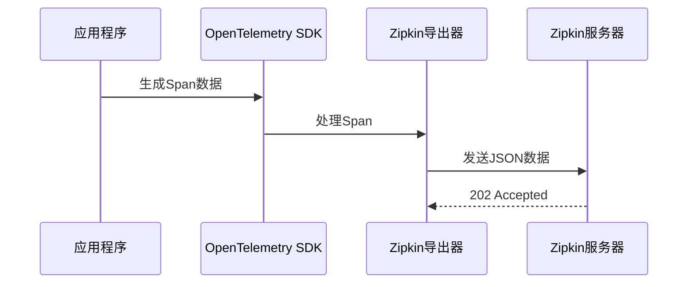

# Zipkin 导出器设置

## 介绍

在分布式系统中，Zipkin是一个流行的开源追踪工具，用于收集时序数据以排查延迟问题。OpenTelemetry作为新一代遥测框架，可以通过**Zipkin导出器**将追踪数据发送到Zipkin后端。本章将指导你完成导出器的配置过程。

:::note 关键概念
- **导出器(Exporter)**: 负责将采集的遥测数据转换为目标格式并传输到指定后端。
- **Zipkin格式**: 一种基于JSON的追踪数据格式，与OpenTelemetry协议兼容。
:::

## 前置条件

1. 已安装OpenTelemetry SDK（如Python的`opentelemetry-sdk`）
2. 运行中的Zipkin服务器（默认地址`http://localhost:9411`）

## 基础配置

### Python示例

```python
from opentelemetry import trace
from opentelemetry.exporter.zipkin.json import ZipkinExporter
from opentelemetry.sdk.trace import TracerProvider
from opentelemetry.sdk.trace.export import BatchSpanProcessor

# 1. 创建Zipkin导出器
exporter = ZipkinExporter(
    endpoint="http://localhost:9411/api/v2/spans",
    service_name="my-service"
)

# 2. 配置追踪提供者
trace.set_tracer_provider(TracerProvider())

# 3. 添加批量处理器
span_processor = BatchSpanProcessor(exporter)
trace.get_tracer_provider().add_span_processor(span_processor)

# 4. 生成测试追踪
tracer = trace.get_tracer(__name__)
with tracer.start_as_current_span("hello"):
    print("生成追踪数据...")
```

### Java示例

```java
import io.opentelemetry.api.trace.Tracer;
import io.opentelemetry.exporter.zipkin.ZipkinSpanExporter;
import io.opentelemetry.sdk.trace.SdkTracerProvider;
import io.opentelemetry.sdk.trace.export.BatchSpanProcessor;

public class Main {
  public static void main(String[] args) {
    // 创建导出器
    ZipkinSpanExporter exporter = ZipkinSpanExporter.builder()
        .setEndpoint("http://localhost:9411/api/v2/spans")
        .build();

    // 配置提供者
    SdkTracerProvider tracerProvider = SdkTracerProvider.builder()
        .addSpanProcessor(BatchSpanProcessor.builder(exporter).build())
        .build();

    // 获取Tracer实例
    Tracer tracer = tracerProvider.get("my-service");
  }
}
```

## 高级配置选项

| 参数 | 描述 | 默认值 |
|------|------|--------|
| `endpoint` | Zipkin接收端点 | 必填 |
| `service_name` | 服务标识 | "unknown_service" |
| `timeout` | 请求超时(秒) | 10 |
| `max_tag_value_length` | 标签值最大长度 | 1024 |

:::tip 生产环境建议
- 使用环境变量管理敏感配置
- 启用`gzip`压缩减少网络开销
- 设置合理的批处理大小（如`max_export_batch_size=512`）
:::

## 数据流转示意图



## 故障排查

常见问题及解决方案：

1. **连接拒绝**:
   - 确认Zipkin服务运行状态
   - 检查防火墙规则
   ```bash
   curl -v http://localhost:9411/api/v2/spans
   ```

2. **数据格式错误**:
   - 验证OpenTelemetry与Zipkin版本兼容性
   - 检查`Content-Type: application/json`头

3. **性能问题**:
   - 调整批处理参数
   - 考虑使用异步导出模式

## 实际应用案例

**电商系统订单追踪**：

```python
# 订单服务中的关键追踪点
with tracer.start_as_current_span("process_order") as span:
    span.set_attribute("order.id", order_id)
    span.set_attribute("payment.amount", amount)
    
    # 记录事件时间点
    span.add_event("inventory_checked")
    check_inventory()
    
    # 记录错误
    try:
        process_payment()
    except Exception as e:
        span.record_exception(e)
        span.set_status(Status(StatusCode.ERROR))
```

在Zipkin UI中可以看到：
- 服务依赖图
- 每个订单的完整调用链
- 各阶段耗时统计

## 总结

通过配置Zipkin导出器，你可以：
- 将OpenTelemetry数据无缝对接现有Zipkin基础设施
- 利用Zipkin的可视化工具分析系统性能
- 保持与现有监控体系的兼容性

## 延伸学习

1. [Zipkin官方文档](https://zipkin.io/)
2. OpenTelemetry导出器规范
3. 尝试集成Prometheus指标导出器
4. 实验：比较Zipkin与Jaeger导出器的性能差异

:::warning 注意
生产部署时务必配置：
- 导出器失败重试策略
- 合理的采样率
- 敏感数据的过滤规则
:::