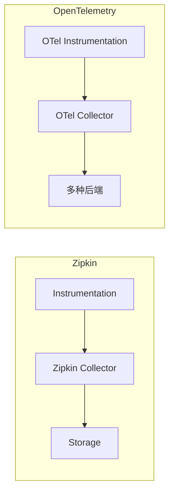

# 迁移至OpenTelemetry

## 介绍

OpenTelemetry（简称OTel）是一个开源的观测性框架，用于生成、收集和管理遥测数据（如指标、日志和追踪）。它逐渐成为云原生领域的事实标准，而Zipkin作为老牌分布式追踪系统，许多用户正计划迁移到OpenTelemetry。本章将帮助你理解迁移的必要性、核心差异以及具体实施步骤。

:::note 为什么迁移？
- **标准化**：OpenTelemetry是CNCF项目，得到广泛生态支持<br />
- **多信号支持**：统一处理追踪、指标和日志<br />
- **未来兼容性**：Zipkin等传统系统的维护可能逐渐减少
:::

---

## 核心概念对比

### 1. 架构差异


### 2. 关键组件替换
| Zipkin组件       | OpenTelemetry等效       |
|------------------|-------------------------|
| Zipkin Tracer    | OTel SDK Tracer         |
| Brave库          | OTel Java/Go/Python SDK |
| Zipkin Reporter  | OTel Exporter           |

---

## 迁移步骤

### 步骤1：依赖替换
移除Zipkin的依赖（如Brave），添加OpenTelemetry SDK和导出器：
```java
// 旧Zipkin依赖（移除）
// implementation 'io.zipkin.brave:brave:5.13.2'

// 新OTel依赖（添加）
implementation 'io.opentelemetry:opentelemetry-api:1.25.0'
implementation 'io.opentelemetry:opentelemetry-exporter-zipkin:1.25.0'
```

### 步骤2：配置Tracer
修改初始化代码：
```java
// Zipkin旧配置
// Tracer tracer = BraveTracer.create(...);

// OTel新配置
OpenTelemetry openTelemetry = OpenTelemetrySdk.builder()
    .setTracerProvider(...)
    .build();
Tracer tracer = openTelemetry.getTracer("my-app");
```

### 步骤3：导出数据到Zipkin
过渡期间可同时使用Zipkin后端：
```java
ZipkinSpanExporter exporter = ZipkinSpanExporter.builder()
    .setEndpoint("http://zipkin:9411/api/v2/spans")
    .build();
```

:::tip 渐进式迁移
可以分阶段迁移：
1. 先保持Zipkin后端，仅替换SDK
2. 逐步替换为OTel原生后端（如Jaeger/Prometheus）
3. 最后启用高级功能（自动仪表、指标等）
:::

---

## 实际案例

### 电商应用迁移
**背景**：某电商平台使用Zipkin追踪订单流程：
```
用户下单 → 库存服务 → 支付服务 → 物流服务
```

**迁移过程**：
1. 在订单服务中先替换SDK
2. 保持Zipkin导出器确保数据不断
3. 两周后全量切换至OTel Collector
4. 最终采用OTel原生存储（如Tempo）

**效果**：
- 追踪数据量增加15%（OTel采样更灵活）
- 资源消耗降低20%（OTel Collector优化）

---

## 常见问题

### Q：Zipkin的注解如何转换？
Zipkin的 `@SpanTag` 对应OTel的Attribute：
```java
// Zipkin
@SpanTag("order.id") String orderId

// OTel
span.setAttribute("order.id", orderId);
```

### Q：B3传播头还适用吗？
是的，OTel默认支持B3：
```yaml
# OTel Collector配置
receivers:
  otlp:
    protocols:
      http:
        headers:
          - "b3"
```

---

## 总结

迁移到OpenTelemetry需要：
1. 理解架构差异
2. 逐步替换组件
3. 验证数据一致性
4. 利用OTel的扩展功能

:::warning 注意
生产环境建议：
- 保留旧系统并行运行至少2周
- 监控新旧系统数据差异
- 优先在测试环境验证
:::

## 扩展资源
1. [OpenTelemetry官方迁移指南](https://opentelemetry.io/docs/migration/)
2. [Zipkin与OTel协议对比](https://github.com/openzipkin/zipkin/issues/...) 
3. 练习：尝试将示例应用从Zipkin迁移到OTel