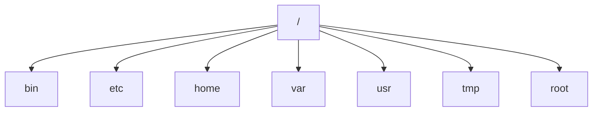

## 介绍

CentOS是一种基于Linux的操作系统，广泛用于服务器环境。了解其目录结构是掌握系统管理和文件操作的基础。CentOS的目录结构遵循**文件系统层次结构标准（FHS）**，这是一种定义Linux系统中目录和文件组织的标准。

本文将逐步介绍CentOS的主要目录及其功能，帮助初学者快速理解文件系统的布局。

---

## CentOS 目录结构概述

在CentOS中，所有文件和目录都从根目录（`/`）开始。根目录是文件系统的起点，所有其他目录和文件都嵌套在其中。以下是CentOS中一些关键目录的概述：



### 1. `/`（根目录）
根目录是文件系统的顶层目录，所有其他目录和文件都位于其下。

### 2. `/bin`（二进制文件）
`/bin`目录包含系统启动和运行所需的基本命令（二进制文件），例如`ls`、`cp`和`mv`。这些命令对所有用户都可用。

:::tip
在CentOS 7及更高版本中，`/bin`是`/usr/bin`的符号链接。
:::

### 3. `/etc`（配置文件）
`/etc`目录包含系统的配置文件。例如：
- `/etc/passwd`：用户账户信息。
- `/etc/hosts`：主机名解析配置。

```bash
# 查看/etc/passwd文件内容
cat /etc/passwd
```

### 4. `/home`（用户主目录）
`/home`目录包含每个用户的主目录。例如，用户`john`的主目录是`/home/john`。

### 5. `/var`（可变数据）
`/var`目录存储经常变化的文件，例如日志文件（`/var/log`）和数据库文件。

```bash
# 查看系统日志
cat /var/log/messages
```

### 6. `/usr`（用户程序）
`/usr`目录包含用户安装的应用程序和文件。例如：
- `/usr/bin`：用户命令。
- `/usr/lib`：库文件。

### 7. `/tmp`（临时文件）
`/tmp`目录用于存储临时文件。系统重启后，该目录中的文件通常会被删除。

### 8. `/root`（超级用户主目录）
`/root`是超级用户（root）的主目录，而不是`/home/root`。

---

## 实际案例

### 案例1：查找系统日志
假设你需要查看系统的启动日志，可以导航到`/var/log`目录并使用以下命令：

```bash
# 查看启动日志
cat /var/log/boot.log
```

### 案例2：添加新用户
当你添加一个新用户时，系统会在`/home`目录下创建该用户的主目录：

```bash
# 添加用户
sudo useradd john
# 设置密码
sudo passwd john
```

添加后，`/home/john`目录将自动创建。

---

## 总结

CentOS的目录结构是系统管理和文件操作的基础。通过了解关键目录的作用，你可以更高效地管理系统和解决问题。以下是本文的要点：
- 根目录（`/`）是文件系统的起点。
- `/bin`和`/usr/bin`包含系统命令。
- `/etc`存储配置文件。
- `/home`是用户主目录的存储位置。
- `/var`包含可变数据，如日志文件。

---

## 附加资源与练习

### 练习
1. 使用`ls`命令列出`/etc`目录的内容，并尝试理解其中的配置文件。
2. 在`/tmp`目录中创建一个临时文件，并观察系统重启后文件是否被删除。

### 进一步学习
- 阅读[文件系统层次结构标准（FHS）](https://refspecs.linuxfoundation.org/FHS_3.0/fhs/index.html)以深入了解Linux目录结构。
- 探索`man`命令，例如`man ls`，以了解更多关于系统命令的详细信息。

通过不断实践和探索，你将逐渐掌握CentOS文件系统的精髓！