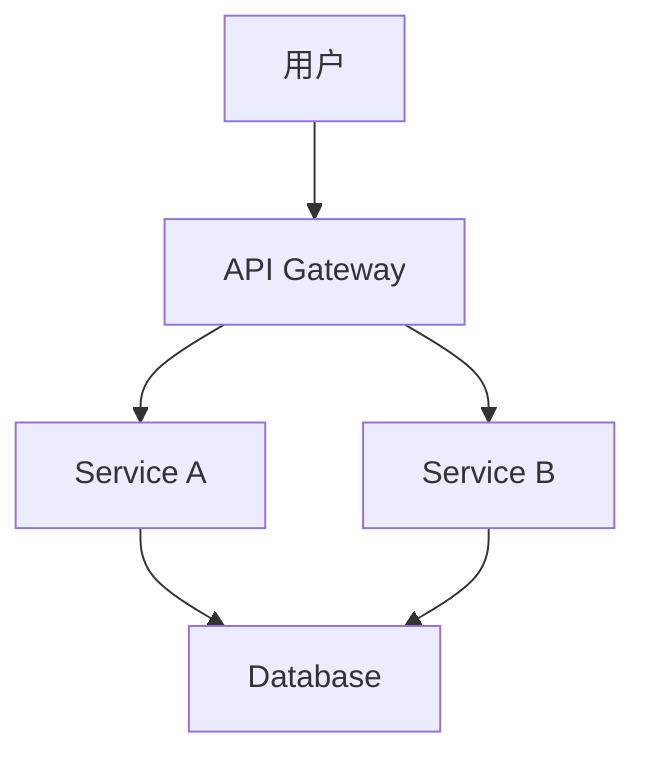

# CentOS 容器网络

在现代虚拟化技术中，容器网络是连接容器与外部世界的关键组件。它允许容器之间以及容器与外部网络进行通信。本文将详细介绍CentOS容器网络的基础知识，帮助初学者理解其工作原理、配置方法以及实际应用场景。

## 什么是容器网络？

容器网络是指为容器提供网络连接的技术和机制。容器本身是轻量级的虚拟化技术，但它们需要网络来与其他容器或外部系统通信。容器网络的主要功能包括：

- **容器间通信**：允许同一主机或不同主机上的容器相互通信。
- **外部访问**：允许外部网络访问容器提供的服务。
- **网络隔离**：确保容器之间的网络流量不会相互干扰。

## 容器网络模式

在CentOS中，容器网络通常通过Docker或Podman等容器运行时来管理。以下是几种常见的容器网络模式：

### 1. 桥接模式（Bridge）

桥接模式是默认的网络模式。在这种模式下，容器通过一个虚拟网络桥接器连接到主机网络。每个容器都会分配一个独立的IP地址，并且可以通过主机的网络接口与外部通信。

```bash
# 创建一个桥接网络
docker network create my_bridge_network

# 运行一个容器并连接到桥接网络
docker run -d --name my_container --network my_bridge_network nginx
```

### 2. 主机模式（Host）

在主机模式下，容器直接使用主机的网络栈，而不进行任何网络隔离。这意味着容器与主机共享IP地址和端口。

```bash
# 运行一个容器并使用主机网络模式
docker run -d --name my_container --network host nginx
```

### 3. 无网络模式（None）

在无网络模式下，容器没有网络接口，无法与外部网络通信。这种模式通常用于不需要网络连接的场景。

```bash
# 运行一个容器并使用无网络模式
docker run -d --name my_container --network none nginx
```

### 4. 覆盖网络（Overlay）

覆盖网络允许跨多个主机的容器进行通信。它通常用于分布式应用程序，如Kubernetes集群。

```bash
# 创建一个覆盖网络
docker network create -d overlay my_overlay_network

# 运行一个容器并连接到覆盖网络
docker service create --name my_service --network my_overlay_network nginx
```

## 容器网络配置

在CentOS中，容器网络的配置通常通过容器运行时（如Docker或Podman）来完成。以下是一些常见的配置选项：

### 1. 自定义网络

你可以创建自定义网络，并为容器分配特定的IP地址或子网。

```bash
# 创建一个自定义网络
docker network create --subnet 192.168.1.0/24 my_custom_network

# 运行一个容器并指定IP地址
docker run -d --name my_container --network my_custom_network --ip 192.168.1.10 nginx
```

### 2. 端口映射

端口映射允许将容器的端口映射到主机的端口，从而使外部网络可以访问容器中的服务。

```bash
# 运行一个容器并将容器的80端口映射到主机的8080端口
docker run -d --name my_container -p 8080:80 nginx
```

### 3. DNS配置

你可以为容器配置自定义的DNS服务器，以解析特定的域名。

```bash
# 运行一个容器并指定DNS服务器
docker run -d --name my_container --dns 8.8.8.8 nginx
```

## 实际应用场景

### 1. 微服务架构

在微服务架构中，多个容器需要相互通信。通过使用桥接模式或覆盖网络，可以轻松实现容器之间的通信。



### 2. 负载均衡

通过端口映射和自定义网络，可以将多个容器暴露给外部网络，并使用负载均衡器分发流量。

```bash
# 运行多个容器并将它们暴露给外部网络
docker run -d --name web1 -p 8081:80 nginx
docker run -d --name web2 -p 8082:80 nginx
```

### 3. 开发环境隔离

在开发环境中，可以使用无网络模式来隔离容器，确保它们不会与外部网络通信。

```bash
# 运行一个容器并使用无网络模式
docker run -d --name my_container --network none nginx
```

## 总结

容器网络是容器化技术中不可或缺的一部分。通过理解不同的网络模式及其配置方法，你可以更好地管理和优化容器化应用程序的网络连接。无论是微服务架构、负载均衡还是开发环境隔离，容器网络都提供了灵活且强大的解决方案。

## 附加资源

- [Docker官方文档](https://docs.docker.com/network/)
- [Podman官方文档](https://podman.io/docs/)
- [Kubernetes网络指南](https://kubernetes.io/docs/concepts/cluster-administration/networking/)

## 练习

1. 创建一个自定义桥接网络，并运行两个容器，使它们能够相互通信。
2. 使用端口映射将一个Nginx容器的80端口映射到主机的8080端口，并通过浏览器访问该服务。
3. 尝试在覆盖网络中运行一个跨主机的容器服务，并验证容器之间的通信。

通过完成这些练习，你将更深入地理解CentOS容器网络的工作原理和应用场景。