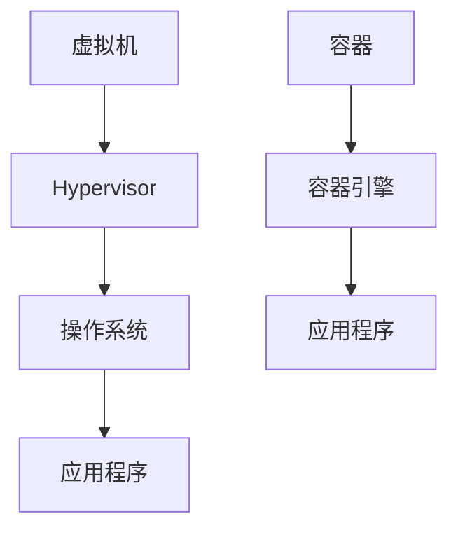

# CentOS 容器技术

## 介绍

容器技术是一种轻量级的虚拟化技术，它允许开发者将应用程序及其依赖项打包到一个独立的单元中，从而实现快速部署和跨平台运行。与传统的虚拟机相比，容器更加轻量、启动更快，并且资源占用更少。在CentOS中，容器技术主要通过Docker和Podman等工具实现。

本文将带你了解CentOS中的容器技术，包括基本概念、使用方法、实际案例以及如何通过容器技术优化开发和部署流程。

## 什么是容器？

容器是一种将应用程序及其依赖项打包在一起的轻量级虚拟化技术。每个容器都运行在独立的环境中，但共享主机的操作系统内核。这使得容器比传统虚拟机更加高效。

### 容器与虚拟机的区别



- **虚拟机**：每个虚拟机都包含一个完整的操作系统，运行在Hypervisor之上。虚拟机启动较慢，资源占用较多。
- **容器**：容器共享主机的操作系统内核，启动速度快，资源占用少。

## 在CentOS中使用容器

在CentOS中，你可以使用Docker或Podman来管理容器。以下是如何在CentOS中安装和使用Docker的步骤。

### 安装Docker

1. 更新系统包：
   ```bash
   sudo yum update -y
   ```

2. 安装Docker：
   ```bash
   sudo yum install -y docker
   ```

3. 启动Docker服务：
   ```bash
   sudo systemctl start docker
   ```

4. 设置Docker开机自启：
   ```bash
   sudo systemctl enable docker
   ```

### 运行第一个容器

安装完成后，你可以运行一个简单的容器来测试Docker是否正常工作。

```bash
sudo docker run hello-world
```

**输出示例：**
```
Hello from Docker!
This message shows that your installation appears to be working correctly.
```

### 使用Podman

Podman是一个无需守护进程的容器管理工具，与Docker兼容。你可以通过以下命令安装Podman：

```bash
sudo yum install -y podman
```

运行容器的命令与Docker类似：

```bash
podman run hello-world
```

## 实际案例：部署一个Web应用

假设你有一个简单的Node.js Web应用，你想通过容器技术将其部署到CentOS服务器上。

### 创建Dockerfile

首先，创建一个名为`Dockerfile`的文件，内容如下：

```dockerfile
# 使用Node.js官方镜像
FROM node:14

# 设置工作目录
WORKDIR /app

# 复制package.json和package-lock.json
COPY package*.json ./

# 安装依赖
RUN npm install

# 复制应用代码
COPY . .

# 暴露端口
EXPOSE 3000

# 启动应用
CMD ["node", "app.js"]
```

### 构建镜像

在包含`Dockerfile`的目录中运行以下命令来构建镜像：

```bash
sudo docker build -t my-node-app .
```

### 运行容器

构建完成后，你可以运行容器：

```bash
sudo docker run -p 3000:3000 my-node-app
```

现在，你的Node.js应用已经在容器中运行，并且可以通过`http://localhost:3000`访问。

## 总结

容器技术为现代应用开发和部署提供了极大的便利。通过使用Docker或Podman，你可以在CentOS中轻松地创建、管理和部署容器化应用。本文介绍了容器的基本概念、安装方法以及如何通过容器技术部署一个简单的Web应用。

## 附加资源

- [Docker官方文档](https://docs.docker.com/)
- [Podman官方文档](https://podman.io/)
- [CentOS官方文档](https://www.centos.org/docs/)

## 练习

1. 尝试在CentOS中安装Podman，并运行一个简单的容器。
2. 创建一个包含Python应用的Dockerfile，并构建和运行该容器。
3. 探索Docker Compose，并尝试使用它来管理多个容器。

通过以上练习，你将更深入地理解CentOS中的容器技术，并能够在实际项目中应用这些知识。