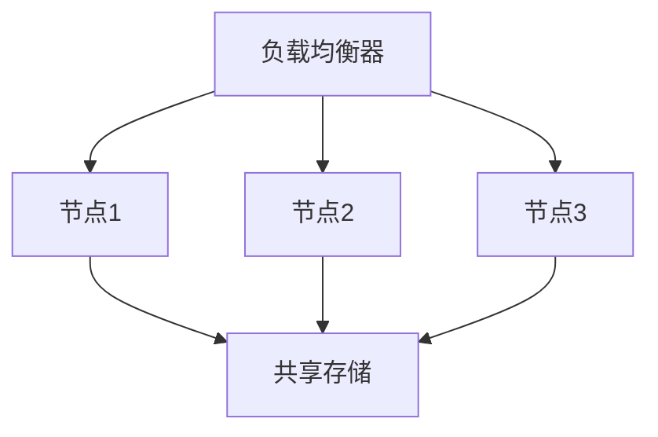

# CentOS 集群概述

在现代计算环境中，高可用性和负载均衡是确保系统稳定性和性能的关键。CentOS集群是一种通过将多台服务器组合在一起，提供高可用性、负载均衡和故障恢复能力的解决方案。本文将带你了解CentOS集群的基本概念、架构以及实际应用场景。

## 什么是CentOS集群？

CentOS集群是由多台运行CentOS操作系统的服务器组成的集合，这些服务器协同工作以提供高可用性、负载均衡和故障恢复能力。集群中的每台服务器称为一个节点，节点之间通过网络连接并共享资源。

:::note
**高可用性（High Availability, HA）**：指系统能够在出现故障时继续运行，确保服务不中断。
:::

## CentOS 集群的架构

CentOS集群通常由以下几个关键组件组成：

1. **节点（Node）**：集群中的每台服务器都是一个节点，可以是物理服务器或虚拟机。
2. **共享存储（Shared Storage）**：所有节点共享的存储设备，用于存储数据和配置文件。
3. **集群管理软件（Cluster Management Software）**：用于管理集群中的节点、监控状态和处理故障的软件，如Pacemaker和Corosync。
4. **负载均衡器（Load Balancer）**：用于将请求分发到集群中的各个节点，确保负载均衡。

## CentOS 集群的工作原理

CentOS集群通过以下方式实现高可用性和负载均衡：

1. **故障检测与恢复**：集群管理软件会定期检查节点的健康状态。如果某个节点出现故障，集群会自动将工作负载转移到其他节点。
2. **负载均衡**：负载均衡器将用户请求分发到集群中的各个节点，确保每个节点的负载均衡。
3. **数据同步**：共享存储确保所有节点访问相同的数据，避免数据不一致。

:::tip
**实际案例**：假设你运行一个电子商务网站，使用CentOS集群可以确保在某个服务器出现故障时，网站仍然可以正常运行，避免因服务器故障导致的业务中断。
:::

## 实际应用场景

CentOS集群广泛应用于以下场景：

1. **Web服务器集群**：通过负载均衡器将用户请求分发到多个Web服务器，确保高并发情况下的性能。
2. **数据库集群**：通过共享存储和数据同步技术，确保数据库的高可用性和数据一致性。
3. **应用服务器集群**：在分布式应用中，通过集群技术确保应用的高可用性和负载均衡。

## 总结

CentOS集群是一种强大的技术，能够通过多台服务器的协同工作，提供高可用性、负载均衡和故障恢复能力。通过理解集群的基本概念、架构和工作原理，你可以更好地设计和部署高可用系统。

:::caution
**注意**：在部署CentOS集群时，确保所有节点的配置一致，并定期测试故障恢复机制。
:::

## 附加资源与练习

1. **资源**：
   - [Pacemaker官方文档](https://clusterlabs.org/pacemaker/doc/)
   - [Corosync官方文档](https://corosync.github.io/corosync/)
2. **练习**：
   - 尝试在本地虚拟机中搭建一个简单的CentOS集群，使用Pacemaker和Corosync进行管理。
   - 模拟节点故障，观察集群的故障恢复过程。

通过本文的学习，你应该对CentOS集群有了初步的了解。接下来，你可以进一步探索集群管理软件的使用和高级配置。