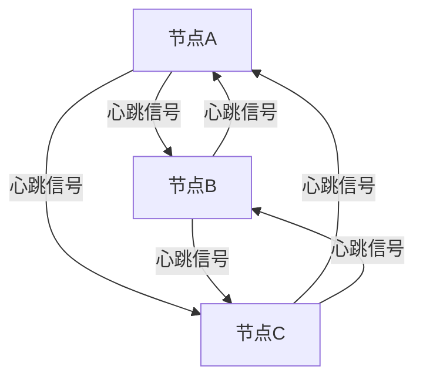

## 介绍

在现代IT基础设施中，高可用性（High Availability, HA）是一个至关重要的概念。高可用性意味着系统能够在出现故障时继续运行，从而最大限度地减少停机时间。CentOS作为一种广泛使用的Linux发行版，提供了多种工具和技术来实现高可用集群。本文将深入探讨CentOS高可用集群的基本原理，帮助初学者理解如何构建和管理高可用系统。

## 什么是高可用性？

高可用性是指系统在出现硬件故障、软件故障或其他意外情况时，仍能保持正常运行的能力。高可用性通常通过冗余和故障转移来实现。冗余是指在系统中添加额外的组件（如服务器、存储设备等），以便在某个组件发生故障时，其他组件可以接管其工作。故障转移则是指在一个组件发生故障时，系统能够自动将工作负载转移到其他健康的组件上。

## CentOS 高可用集群的基本原理

CentOS高可用集群通常由多个节点（Node）组成，这些节点可以是物理服务器或虚拟机。集群中的节点通过心跳（Heartbeat）机制相互通信，以检测彼此的运行状态。如果某个节点发生故障，其他节点可以接管其工作负载，从而实现高可用性。

### 心跳机制

心跳机制是CentOS高可用集群的核心组成部分。每个节点会定期向其他节点发送心跳信号，以表明自己处于正常运行状态。如果某个节点在一定时间内没有收到其他节点的心跳信号，就会认为该节点发生了故障，并启动故障转移过程。

### 故障转移

故障转移是指在检测到某个节点发生故障时，系统自动将工作负载转移到其他健康的节点上。CentOS高可用集群通常使用Pacemaker和Corosync等工具来实现故障转移。

:::note
Pacemaker是一个开源的集群资源管理器，它可以管理集群中的资源（如IP地址、服务等），并在节点发生故障时自动进行故障转移。
:::

### 资源管理

在CentOS高可用集群中，资源是指可以被集群管理的实体，如IP地址、服务、存储设备等。Pacemaker负责管理这些资源，并确保它们在集群中的正确分配和运行。

## 实际案例

假设我们有一个由三个节点组成的CentOS高可用集群，节点A、节点B和节点C。集群中运行着一个Web服务，该服务通过一个虚拟IP地址（VIP）对外提供服务。

1. **正常情况**：节点A是主节点，负责运行Web服务，并通过VIP对外提供服务。节点B和节点C作为备用节点，定期接收节点A的心跳信号。

2. **节点A故障**：如果节点A发生故障，节点B和节点C将无法收到节点A的心跳信号。Pacemaker会检测到这一情况，并自动将Web服务迁移到节点B或节点C上，同时将VIP绑定到新的主节点。

3. **节点A恢复**：如果节点A恢复正常，Pacemaker会重新评估集群状态，并决定是否将Web服务迁移回节点A。

## 总结

CentOS高可用集群通过心跳机制、故障转移和资源管理来实现系统的高可用性。理解这些基本原理是构建和管理高可用系统的关键。通过使用Pacemaker和Corosync等工具，您可以轻松地在CentOS上实现高可用集群。

## 附加资源

- [Pacemaker官方文档](https://clusterlabs.org/pacemaker/doc/)
- [Corosync官方文档](https://corosync.github.io/corosync/)
- [CentOS高可用集群配置指南](https://wiki.centos.org/HowTos/HighAvailability)

## 练习

1. 在一个由两个节点组成的CentOS集群中，配置Pacemaker和Corosync，并实现一个简单的Web服务的高可用性。
2. 模拟节点故障，观察Pacemaker如何进行故障转移，并记录整个过程。
3. 尝试在集群中添加第三个节点，并配置资源管理策略，确保在多个节点之间实现负载均衡。

通过以上练习，您将更深入地理解CentOS高可用集群的工作原理，并掌握其实际应用。