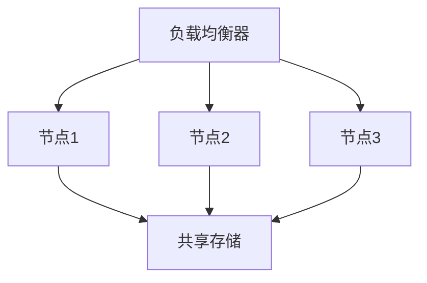

# CentOS 集群最佳实践

## 介绍

在现代IT基础设施中，高可用性（High Availability, HA）是一个关键目标。CentOS作为一种广泛使用的Linux发行版，常被用于构建高可用集群。本文将介绍如何在CentOS环境中设计和实现高可用集群，并提供一些最佳实践，帮助初学者快速上手。

## 什么是高可用集群？

高可用集群是一组相互协作的服务器，旨在通过冗余和故障转移机制确保服务的持续可用性。当集群中的某个节点发生故障时，其他节点可以接管其工作负载，从而避免服务中断。

## 集群架构设计

在设计CentOS高可用集群时，通常需要考虑以下几个关键组件：

1. **负载均衡器**：用于将流量分发到集群中的各个节点。
2. **共享存储**：确保所有节点可以访问相同的数据。
3. **心跳机制**：用于检测节点的健康状况。
4. **故障转移机制**：在节点故障时自动将工作负载转移到其他节点。

### 示例架构

以下是一个简单的CentOS高可用集群架构示例：



## 配置管理

在CentOS集群中，配置管理是确保所有节点一致性的关键。常用的配置管理工具有Ansible、Puppet和Chef等。以下是一个使用Ansible配置Nginx的示例：

```yaml
- name: 安装并配置Nginx
  hosts: webservers
  become: yes
  tasks:
    - name: 安装Nginx
      yum:
        name: nginx
        state: present

    - name: 启动Nginx服务
      service:
        name: nginx
        state: started
        enabled: yes
```

:::tip
使用配置管理工具可以大大简化集群的维护工作，并确保配置的一致性。
:::

## 心跳机制与故障转移

心跳机制是检测节点健康状况的关键。常用的工具有Pacemaker和Corosync。以下是一个简单的Pacemaker配置示例：

```bash
# 安装Pacemaker和Corosync
sudo yum install pacemaker corosync pcs

# 启动Pacemaker和Corosync服务
sudo systemctl start pcsd.service
sudo systemctl enable pcsd.service

# 配置集群
sudo pcs cluster auth node1 node2 -u hacluster -p password
sudo pcs cluster setup --name mycluster node1 node2
sudo pcs cluster start --all
```

:::caution
确保所有节点的时间同步，否则可能导致心跳机制失效。
:::

## 实际案例

假设我们有一个Web应用，需要确保其高可用性。我们可以使用CentOS集群来实现这一目标。以下是一个简单的案例：

1. **负载均衡器**：使用HAProxy将流量分发到两个Web服务器。
2. **Web服务器**：在两台CentOS服务器上运行Nginx。
3. **共享存储**：使用NFS共享Web内容。
4. **心跳机制**：使用Pacemaker和Corosync检测节点健康状况。

### 配置示例

```bash
# 在负载均衡器上配置HAProxy
frontend http_front
    bind *:80
    default_backend http_back

backend http_back
    balance roundrobin
    server web1 192.168.1.101:80 check
    server web2 192.168.1.102:80 check
```

:::note
在实际生产环境中，建议使用更复杂的配置和监控工具，如Zabbix或Nagios。
:::

## 总结

构建CentOS高可用集群需要仔细的规划和配置。通过使用负载均衡器、共享存储、心跳机制和故障转移机制，可以确保服务的高可用性。配置管理工具如Ansible可以大大简化集群的维护工作。

## 附加资源

- [Pacemaker官方文档](https://clusterlabs.org/pacemaker/doc/)
- [Ansible官方文档](https://docs.ansible.com/)
- [HAProxy官方文档](https://www.haproxy.org/)

## 练习

1. 使用Ansible配置一个包含两个节点的CentOS集群。
2. 配置Pacemaker和Corosync实现故障转移。
3. 使用HAProxy实现负载均衡，并测试其效果。

通过以上步骤，您将能够掌握CentOS高可用集群的基本构建方法，并能够在实际项目中应用这些知识。