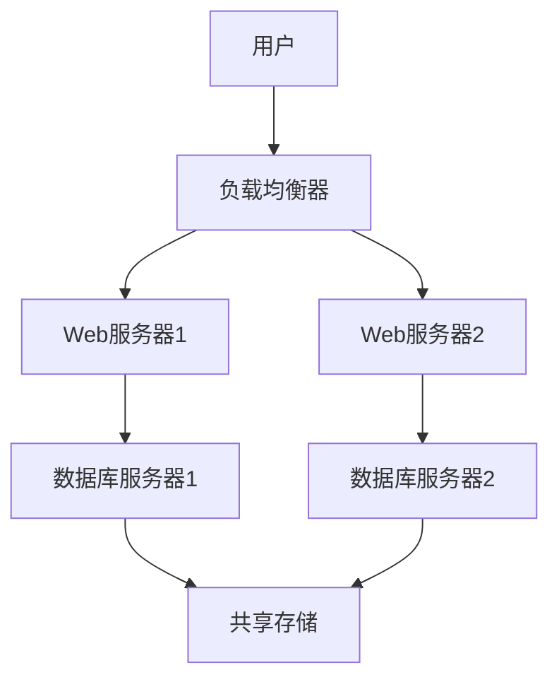

# CentOS 集群案例分析

## 介绍

在现代IT基础设施中，**高可用性（High Availability, HA）** 是一个关键需求。高可用性意味着系统能够在任何时间点提供服务，即使某些组件发生故障。为了实现这一目标，**集群（Cluster）** 技术应运而生。集群是由多台服务器组成的系统，它们协同工作以提供更高的可靠性、性能和可扩展性。

在本文中，我们将通过一个实际案例，分析如何在CentOS操作系统上构建一个高可用集群，并探讨其在实际应用中的表现。

## 什么是CentOS集群？

CentOS集群是指在CentOS操作系统上运行的服务器集群。这些服务器通过共享资源、负载均衡和故障转移等技术，共同提供高可用性服务。常见的集群类型包括：

- **负载均衡集群**：将请求分发到多个服务器，以提高性能和吞吐量。
- **高可用集群**：通过故障转移机制，确保服务在单点故障时仍能正常运行。
- **高性能计算集群**：用于处理大规模计算任务，通常用于科学计算和数据分析。

在本案例中，我们将重点讨论**高可用集群**。

## 案例背景

假设我们有一个在线商城系统，需要确保其24/7不间断运行。为了实现这一目标，我们决定构建一个基于CentOS的高可用集群。该集群将包含以下组件：

1. **Web服务器**：处理用户请求。
2. **数据库服务器**：存储和管理数据。
3. **负载均衡器**：将用户请求分发到多个Web服务器。
4. **共享存储**：用于存储Web服务器和数据库服务器的共享数据。

## 集群架构

以下是该集群的架构图：



在这个架构中，负载均衡器将用户请求分发到两个Web服务器。每个Web服务器都与一个数据库服务器通信，而数据库服务器则共享一个存储系统。如果其中一个Web服务器或数据库服务器发生故障，负载均衡器会自动将请求转发到另一个正常的服务器，从而确保服务的高可用性。

## 实现步骤

### 1. 安装和配置CentOS

首先，在所有服务器上安装CentOS操作系统。确保所有服务器的网络配置正确，并且能够相互通信。

```bash
# 检查网络连通性
ping 192.168.1.2
```

### 2. 配置负载均衡器

我们使用**HAProxy**作为负载均衡器。安装并配置HAProxy：

```bash
# 安装HAProxy
sudo yum install haproxy

# 配置HAProxy
sudo vi /etc/haproxy/haproxy.cfg
```

在配置文件中，添加以下内容：

```bash
frontend http_front
    bind *:80
    default_backend http_back

backend http_back
    balance roundrobin
    server web1 192.168.1.3:80 check
    server web2 192.168.1.4:80 check
```

### 3. 配置Web服务器

在两个Web服务器上安装Apache HTTP服务器：

```bash
# 安装Apache
sudo yum install httpd

# 启动Apache
sudo systemctl start httpd
sudo systemctl enable httpd
```

### 4. 配置数据库服务器

在两个数据库服务器上安装MySQL：

```bash
# 安装MySQL
sudo yum install mysql-server

# 启动MySQL
sudo systemctl start mysqld
sudo systemctl enable mysqld
```

配置MySQL主从复制，以确保数据的一致性：

```bash
# 在主服务器上配置
sudo vi /etc/my.cnf
```

添加以下内容：

```bash
[mysqld]
server-id=1
log-bin=mysql-bin
```

在从服务器上配置：

```bash
[mysqld]
server-id=2
```

### 5. 配置共享存储

我们使用**NFS（Network File System）** 作为共享存储。在存储服务器上安装NFS：

```bash
# 安装NFS
sudo yum install nfs-utils

# 配置NFS
sudo vi /etc/exports
```

添加以下内容：

```bash
/shared 192.168.1.0/24(rw,sync,no_root_squash)
```

在Web服务器和数据库服务器上挂载共享存储：

```bash
# 挂载共享存储
sudo mount 192.168.1.5:/shared /mnt/shared
```

## 实际应用场景

在这个案例中，我们的在线商城系统通过高可用集群实现了以下目标：

1. **高可用性**：即使某个Web服务器或数据库服务器发生故障，系统仍能正常运行。
2. **负载均衡**：用户请求被均匀分发到多个Web服务器，提高了系统的性能和吞吐量。
3. **数据一致性**：通过MySQL主从复制，确保了数据的一致性和可靠性。

## 总结

通过本案例，我们了解了如何在CentOS上构建一个高可用集群，并探讨了其在实际应用中的表现。高可用集群不仅提高了系统的可靠性，还增强了性能和可扩展性。对于初学者来说，理解这些概念并掌握其实现方法是非常重要的。

## 附加资源

- [HAProxy官方文档](https://www.haproxy.org/)
- [MySQL主从复制指南](https://dev.mysql.com/doc/refman/8.0/en/replication.html)
- [NFS配置指南](https://access.redhat.com/documentation/en-us/red_hat_enterprise_linux/7/html/storage_administration_guide/ch-nfs)

## 练习

1. 尝试在本地的虚拟机环境中搭建一个类似的CentOS高可用集群。
2. 模拟一个服务器故障，观察集群的故障转移机制是否正常工作。
3. 研究其他负载均衡器（如Nginx）的配置方法，并尝试替换HAProxy。

通过实践，你将更深入地理解高可用集群的工作原理及其在实际应用中的价值。