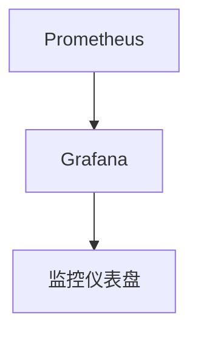

# CentOS Web服务监控

在运行Web服务时，监控是确保其稳定性和性能的关键步骤。通过监控，您可以实时了解服务器的健康状况、资源使用情况以及潜在问题。本文将介绍如何在CentOS上监控Web服务，帮助您快速发现并解决问题。

## 什么是Web服务监控？

Web服务监控是指通过工具和技术手段，实时跟踪和分析Web服务器的运行状态、资源使用情况（如CPU、内存、磁盘和网络）以及服务的响应时间。通过监控，您可以：

- 确保Web服务的高可用性。
- 快速发现并解决性能瓶颈。
- 预测潜在问题，防止服务中断。

## 监控工具介绍

在CentOS上，有许多工具可以用于监控Web服务。以下是几种常用的工具：

1. **top**：实时查看系统资源使用情况。
2. **htop**：`top`的增强版，提供更友好的界面和更多功能。
3. **nmon**：监控CPU、内存、磁盘和网络等资源。
4. **Nagios**：功能强大的监控工具，支持告警和通知。
5. **Prometheus + Grafana**：组合使用，提供强大的监控和可视化功能。

### 使用 `top` 监控系统资源

`top` 是一个简单的命令行工具，可以实时显示系统的资源使用情况。以下是如何使用 `top` 的示例：

```bash
top
```

输出示例：

```
top - 14:32:01 up  1:23,  2 users,  load average: 0.15, 0.10, 0.05
Tasks: 123 total,   1 running, 122 sleeping,   0 stopped,   0 zombie
%Cpu(s):  1.5 us,  0.5 sy,  0.0 ni, 97.5 id,  0.5 wa,  0.0 hi,  0.0 si,  0.0 st
MiB Mem :   8000.0 total,   2000.0 free,   3000.0 used,   3000.0 buff/cache
MiB Swap:   2000.0 total,   2000.0 free,      0.0 used.   4000.0 avail Mem

  PID USER      PR  NI    VIRT    RES    SHR S  %CPU  %MEM     TIME+ COMMAND
 1234 apache    20   0  100000   5000   3000 S   1.0   0.1   0:00.10 httpd
```

:::tip
按 `q` 键退出 `top`。
:::

### 使用 `htop` 监控系统资源

`htop` 是 `top` 的增强版，提供了更友好的界面和更多功能。安装 `htop` 的命令如下：

```bash
sudo yum install htop
```

运行 `htop`：

```bash
htop
```

输出示例：

```
  PID USER      PRI  NI  VIRT   RES   SHR S CPU% MEM%   TIME+  Command
 1234 apache    20   0  100M   5M    3M  S  1.0  0.1   0:00.10 httpd
```

:::note
`htop` 支持鼠标操作，您可以通过点击列标题来排序进程。
:::

## 监控Web服务的响应时间

除了系统资源，Web服务的响应时间也是一个重要的监控指标。您可以使用 `curl` 命令来测试Web服务的响应时间：

```bash
curl -o /dev/null -s -w "%{time_total}\n" http://your-website.com
```

输出示例：

```
0.123
```

:::caution
如果响应时间过长，可能是服务器负载过高或网络延迟导致的。
:::

## 使用 Prometheus + Grafana 进行高级监控

`Prometheus` 是一个开源的监控系统，而 `Grafana` 是一个强大的可视化工具。结合使用它们，您可以创建丰富的监控仪表盘。

### 安装 Prometheus

1. 下载并解压 Prometheus：

   ```bash
   wget https://github.com/prometheus/prometheus/releases/download/v2.30.3/prometheus-2.30.3.linux-amd64.tar.gz
   tar xvfz prometheus-2.30.3.linux-amd64.tar.gz
   cd prometheus-2.30.3.linux-amd64
   ```

2. 启动 Prometheus：

   ```bash
   ./prometheus --config.file=prometheus.yml
   ```

### 安装 Grafana

1. 下载并安装 Grafana：

   ```bash
   sudo yum install https://dl.grafana.com/oss/release/grafana-8.1.5-1.x86_64.rpm
   sudo systemctl start grafana-server
   sudo systemctl enable grafana-server
   ```

2. 访问 Grafana 的Web界面（默认地址为 `http://localhost:3000`），并配置 Prometheus 作为数据源。

### 创建监控仪表盘

在 Grafana 中，您可以创建自定义的监控仪表盘，实时显示Web服务的各项指标。例如，您可以监控CPU使用率、内存使用率、请求响应时间等。



## 实际案例：监控Apache Web服务器

假设您正在运行一个Apache Web服务器，以下是监控Apache的步骤：

1. 安装 `mod_status` 模块：

   ```bash
   sudo yum install httpd
   sudo systemctl start httpd
   sudo systemctl enable httpd
   ```

2. 启用 `mod_status` 模块：

   编辑 `/etc/httpd/conf/httpd.conf` 文件，添加以下内容：

   ```apache
   <Location "/server-status">
       SetHandler server-status
       Require ip 127.0.0.1
   </Location>
   ```

3. 重启Apache：

   ```bash
   sudo systemctl restart httpd
   ```

4. 访问 `http://your-server-ip/server-status`，查看Apache的状态信息。

## 总结

监控Web服务是确保其稳定性和性能的关键步骤。通过使用 `top`、`htop`、`Prometheus` 和 `Grafana` 等工具，您可以实时了解服务器的运行状态，并快速发现和解决问题。希望本文能帮助您掌握CentOS上的Web服务监控。

## 附加资源

- [Prometheus 官方文档](https://prometheus.io/docs/)
- [Grafana 官方文档](https://grafana.com/docs/)
- [Apache `mod_status` 模块文档](https://httpd.apache.org/docs/2.4/mod/mod_status.html)

## 练习

1. 使用 `top` 和 `htop` 监控您的服务器，记录CPU和内存使用情况。
2. 使用 `curl` 测试您的Web服务的响应时间。
3. 安装并配置 Prometheus 和 Grafana，创建一个监控仪表盘。