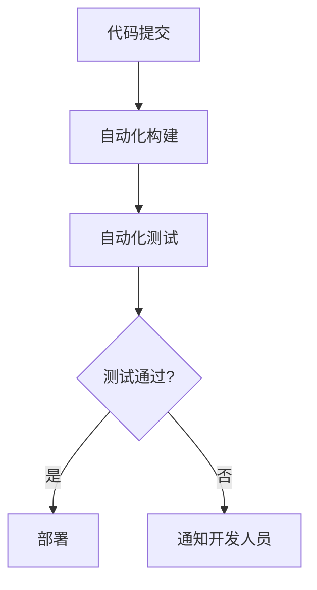

## 什么是持续集成？

持续集成（Continuous Integration，简称CI）是一种软件开发实践，开发人员频繁地将代码集成到共享仓库中。每次集成都通过自动化构建和测试来验证代码的正确性，从而尽早发现并修复问题。在CentOS环境中，持续集成可以帮助团队更高效地协作，减少集成问题，并提高代码质量。

## 为什么需要持续集成？

在传统的开发流程中，开发人员通常在开发完成后才将代码合并到主分支。这种方式容易导致集成问题，尤其是在多人协作的项目中。持续集成的核心思想是通过频繁的集成和自动化测试，尽早发现问题，从而减少修复成本。

:::tip
持续集成不仅适用于大型团队，即使是个人开发者也能从中受益。它可以帮助你更早地发现代码中的问题，并确保代码库始终处于可部署状态。
:::

## 持续集成的基本流程

持续集成的流程通常包括以下几个步骤：

1. **代码提交**：开发人员将代码提交到版本控制系统（如Git）。
2. **自动化构建**：持续集成服务器（如Jenkins）检测到代码提交后，自动触发构建过程。
3. **自动化测试**：构建完成后，运行自动化测试（如单元测试、集成测试等）。
4. **反馈**：如果构建或测试失败，开发人员会立即收到通知，并可以快速修复问题。



## 在CentOS中配置持续集成

在CentOS中，我们可以使用Jenkins作为持续集成服务器。以下是如何在CentOS上安装和配置Jenkins的步骤：

### 1. 安装Jenkins

首先，确保你的CentOS系统已经安装了Java，因为Jenkins是基于Java的应用程序。

```bash
sudo yum install java-11-openjdk-devel
```

接下来，添加Jenkins的官方仓库并安装Jenkins：

```bash
sudo wget -O /etc/yum.repos.d/jenkins.repo https://pkg.jenkins.io/redhat-stable/jenkins.repo
sudo rpm --import https://pkg.jenkins.io/redhat-stable/jenkins.io.key
sudo yum install jenkins
```

### 2. 启动Jenkins服务

安装完成后，启动Jenkins服务并设置为开机自启：

```bash
sudo systemctl start jenkins
sudo systemctl enable jenkins
```

### 3. 配置Jenkins

打开浏览器，访问 `http://your-server-ip:8080`，按照提示完成Jenkins的初始配置。你需要从日志文件中获取初始管理员密码：

```bash
sudo cat /var/lib/jenkins/secrets/initialAdminPassword
```

### 4. 创建一个简单的Jenkins任务

在Jenkins中，创建一个新的任务（Job），选择“自由风格项目”。在“源码管理”部分，配置你的Git仓库地址。然后在“构建触发器”部分，选择“轮询SCM”以定期检查代码变更。

在“构建”部分，添加一个“执行Shell”步骤，输入以下命令来运行一个简单的构建脚本：

```bash
echo "开始构建..."
mvn clean install
```

保存任务后，手动触发一次构建，确保一切正常。

## 实际案例：自动化测试与部署

假设你正在开发一个基于Spring Boot的Web应用，并且希望在每次代码提交后自动运行测试并部署到测试环境。

### 1. 配置自动化测试

在Jenkins任务中，添加一个“执行Shell”步骤来运行测试：

```bash
echo "运行测试..."
mvn test
```

### 2. 配置自动化部署

在测试通过后，你可以添加另一个“执行Shell”步骤来将应用部署到测试服务器：

```bash
echo "部署到测试环境..."
scp target/myapp.jar user@test-server:/opt/myapp/
ssh user@test-server "systemctl restart myapp"
```

### 3. 配置通知

如果构建或测试失败，你可以配置Jenkins发送通知邮件或Slack消息，以便开发人员及时修复问题。

## 总结

持续集成是现代软件开发中不可或缺的一部分，它可以帮助团队更高效地协作，减少集成问题，并提高代码质量。在CentOS中，通过Jenkins等工具，你可以轻松实现持续集成流程。

:::note
持续集成只是DevOps实践的一部分。如果你对自动化部署、持续交付等概念感兴趣，可以进一步探索这些领域。
:::

## 附加资源与练习

- **练习**：尝试在CentOS上配置一个简单的Jenkins任务，自动构建并测试一个开源项目。
- **资源**：
  - [Jenkins官方文档](https://www.jenkins.io/doc/)
  - [Maven官方文档](https://maven.apache.org/guides/)
  - [Spring Boot官方文档](https://spring.io/projects/spring-boot)

通过实践和不断学习，你将能够掌握持续集成的精髓，并将其应用到实际项目中。