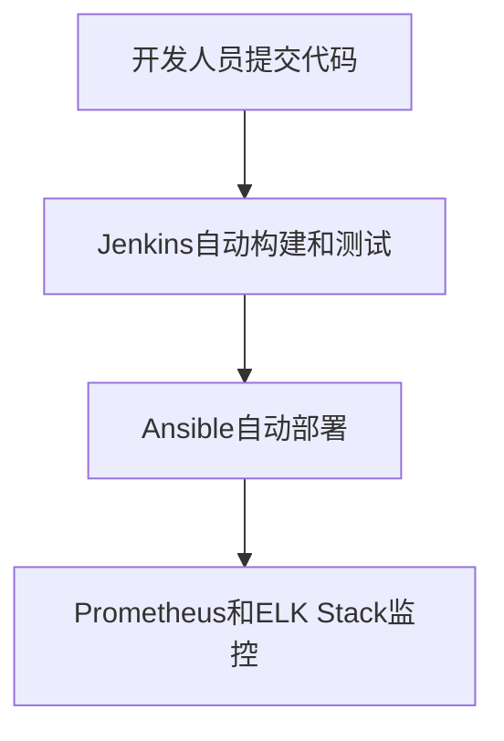

# CentOS 持续交付

持续交付（Continuous Delivery，简称CD）是现代软件开发和运维中的关键实践之一。它通过自动化流程，确保软件能够快速、可靠地发布到生产环境。对于CentOS用户来说，掌握持续交付的概念和工具，可以显著提高运维效率和软件质量。

## 什么是持续交付？

持续交付是一种软件开发实践，旨在通过自动化流程，将代码变更快速、安全地部署到生产环境。它的核心目标是减少手动操作，降低人为错误，同时提高发布频率和软件质量。

:::note
持续交付与持续集成（Continuous Integration，简称CI）密切相关。持续集成关注的是代码的频繁集成和测试，而持续交付则关注如何将这些集成后的代码快速、可靠地部署到生产环境。
:::

## 持续交付的核心组件

在CentOS环境中实现持续交付，通常需要以下几个核心组件：

1. **版本控制系统（VCS）**：如Git，用于管理代码变更。
2. **持续集成工具**：如Jenkins，用于自动化构建和测试。
3. **配置管理工具**：如Ansible，用于自动化服务器配置。
4. **容器化技术**：如Docker，用于打包和部署应用。
5. **监控和日志工具**：如Prometheus和ELK Stack，用于监控系统状态和日志分析。

## 实现持续交付的步骤

### 1. 设置版本控制系统

首先，确保你的代码存储在版本控制系统中。Git是最常用的选择。以下是一个简单的Git命令示例：

```bash
# 克隆远程仓库
git clone https://github.com/your-repo/your-project.git

# 创建新分支
git checkout -b feature-branch

# 提交更改
git add .
git commit -m "Add new feature"

# 推送分支到远程仓库
git push origin feature-branch
```

### 2. 配置持续集成工具

Jenkins是一个流行的持续集成工具。以下是一个简单的Jenkins Pipeline脚本示例：

```groovy
pipeline {
    agent any

    stages {
        stage('Build') {
            steps {
                sh 'mvn clean package'
            }
        }
        stage('Test') {
            steps {
                sh 'mvn test'
            }
        }
        stage('Deploy') {
            steps {
                sh 'ansible-playbook deploy.yml'
            }
        }
    }
}
```

### 3. 使用配置管理工具

Ansible是一个强大的配置管理工具。以下是一个简单的Ansible Playbook示例，用于部署应用：

```yaml
- hosts: webservers
  tasks:
    - name: Ensure Apache is installed
      yum:
        name: httpd
        state: present

    - name: Start Apache service
      service:
        name: httpd
        state: started
```

### 4. 容器化应用

Docker可以帮助你将应用打包成容器，确保在不同环境中的一致性。以下是一个简单的Dockerfile示例：

```dockerfile
FROM centos:7
RUN yum install -y httpd
COPY index.html /var/www/html/
EXPOSE 80
CMD ["httpd", "-D", "FOREGROUND"]
```

### 5. 监控和日志分析

Prometheus和ELK Stack是常用的监控和日志分析工具。以下是一个简单的Prometheus配置示例：

```yaml
global:
  scrape_interval: 15s

scrape_configs:
  - job_name: 'node_exporter'
    static_configs:
      - targets: ['localhost:9100']
```

## 实际案例

假设你正在开发一个Web应用，并希望在CentOS服务器上实现持续交付。以下是一个简化的流程：

1. **开发阶段**：开发人员在本地编写代码，并通过Git提交到远程仓库。
2. **构建和测试阶段**：Jenkins自动拉取最新代码，运行构建和测试脚本。
3. **部署阶段**：Ansible Playbook自动将应用部署到CentOS服务器。
4. **监控阶段**：Prometheus和ELK Stack监控应用运行状态，收集日志。



## 总结

持续交付是提高软件开发和运维效率的关键实践。通过自动化构建、测试、部署和监控，你可以在CentOS环境中实现快速、可靠的软件发布。掌握这些工具和技术，将帮助你在自动化运维的道路上迈出重要的一步。

## 附加资源

- [Jenkins官方文档](https://www.jenkins.io/doc/)
- [Ansible官方文档](https://docs.ansible.com/)
- [Docker官方文档](https://docs.docker.com/)
- [Prometheus官方文档](https://prometheus.io/docs/)

## 练习

1. 在你的CentOS服务器上安装Jenkins，并配置一个简单的Pipeline。
2. 使用Ansible编写一个Playbook，自动化部署一个简单的Web应用。
3. 使用Docker将你的应用容器化，并在CentOS服务器上运行。

通过这些练习，你将更深入地理解持续交付的概念和实践。祝你学习愉快！