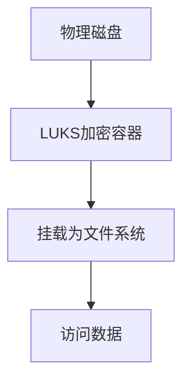

# CentOS 存储加密

在现代计算环境中，数据安全至关重要。存储加密是一种保护敏感数据免受未经授权访问的有效方法。本文将介绍如何在CentOS中实现存储加密，帮助您确保数据的安全性。

## 什么是存储加密？

存储加密是指对存储在磁盘上的数据进行加密，以防止未经授权的访问。即使物理磁盘被盗或丢失，加密的数据也无法被轻易读取。CentOS提供了多种工具和技术来实现存储加密，其中最常用的是**LUKS**（Linux Unified Key Setup）。

## LUKS简介

LUKS是Linux下的标准磁盘加密格式，它提供了强大的加密功能，并且易于管理。LUKS支持多种加密算法，如AES、Serpent等，并且可以与多种文件系统（如ext4、XFS）结合使用。

### LUKS的工作原理

LUKS通过创建一个加密的容器来存储数据。这个容器实际上是一个块设备，可以被挂载为普通的文件系统。在挂载时，用户需要提供解密密钥，数据才能被读取或写入。



## 在CentOS中设置LUKS加密

### 1. 安装必要的工具

首先，确保系统已安装`cryptsetup`工具，它是管理LUKS加密的主要工具。

```bash
sudo yum install cryptsetup
```

### 2. 创建加密容器

假设我们有一个未使用的磁盘分区`/dev/sdb1`，我们可以将其加密。

```bash
sudo cryptsetup luksFormat /dev/sdb1
```

系统会提示您确认操作，并设置一个密码。这个密码将用于解密容器。

### 3. 打开加密容器

创建加密容器后，您需要打开它以进行进一步的操作。

```bash
sudo cryptsetup open /dev/sdb1 my_encrypted_disk
```

这将创建一个名为`my_encrypted_disk`的设备，位于`/dev/mapper/`目录下。

### 4. 格式化并挂载加密容器

现在，您可以像普通磁盘一样格式化并挂载加密容器。

```bash
sudo mkfs.ext4 /dev/mapper/my_encrypted_disk
sudo mount /dev/mapper/my_encrypted_disk /mnt/encrypted
```

### 5. 使用加密容器

现在，您可以在`/mnt/encrypted`目录下存储数据。所有写入的数据都会自动加密，读取时自动解密。

### 6. 关闭加密容器

使用完毕后，您可以卸载并关闭加密容器。

```bash
sudo umount /mnt/encrypted
sudo cryptsetup close my_encrypted_disk
```

## 实际案例：加密备份存储

假设您有一个重要的备份目录`/backup`，您希望将其加密存储在一个外部硬盘上。以下是实现步骤：

1. 将外部硬盘分区并格式化为LUKS加密容器。
2. 挂载加密容器到`/mnt/backup`。
3. 使用`rsync`将`/backup`目录的内容复制到`/mnt/backup`。
4. 卸载并关闭加密容器。

这样，即使外部硬盘丢失，备份数据也不会泄露。

## 总结

存储加密是保护敏感数据的重要手段。通过LUKS，您可以在CentOS中轻松实现磁盘加密。本文介绍了LUKS的基本概念、设置步骤以及一个实际案例，帮助您理解并应用存储加密技术。

## 附加资源与练习

- **练习**：尝试在您的CentOS系统上创建一个LUKS加密容器，并存储一些测试数据。
- **进一步阅读**：查阅`cryptsetup`的官方文档，了解更多高级功能和选项。

:::tip
始终记住备份您的加密密钥和密码，以防止数据丢失。
:::