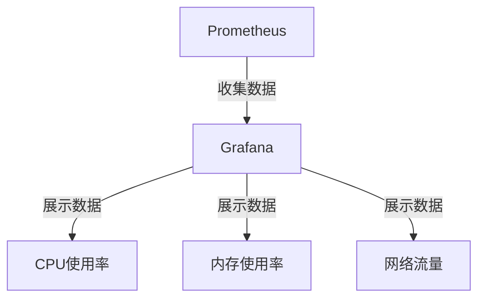

# CentOS 监控数据可视化

在现代服务器管理中，监控系统性能和资源使用情况是至关重要的。CentOS作为一种广泛使用的Linux发行版，提供了多种工具来收集系统监控数据。然而，仅仅收集数据是不够的，我们还需要将这些数据可视化，以便更直观地理解系统的运行状态。本文将介绍如何在CentOS系统中实现监控数据的可视化。

## 1. 监控数据收集

在开始可视化之前，我们需要先收集系统的监控数据。常用的工具包括：

- **sysstat**：用于收集CPU、内存、磁盘I/O等系统性能数据。
- **netdata**：一个实时性能监控工具，提供丰富的可视化界面。
- **Prometheus**：一个开源的系统监控和警报工具包。

### 安装sysstat

首先，我们需要安装`sysstat`工具来收集系统性能数据：

```bash
sudo yum install sysstat
```

安装完成后，启动并启用`sysstat`服务：

```bash
sudo systemctl start sysstat
sudo systemctl enable sysstat
```

### 收集数据

`sysstat`工具会定期收集系统性能数据，并将其存储在`/var/log/sa/`目录下。我们可以使用`sar`命令来查看这些数据：

```bash
sar -u 1 5
```

上述命令将显示过去5秒内的CPU使用情况。

## 2. 数据可视化工具

收集到数据后，我们需要使用可视化工具来展示这些数据。常用的可视化工具包括：

- **Grafana**：一个开源的可视化和监控平台，支持多种数据源。
- **Kibana**：通常与Elasticsearch一起使用，用于日志数据的可视化。
- **netdata**：自带可视化界面，适合实时监控。

### 安装Grafana

Grafana是一个功能强大的可视化工具，支持多种数据源。我们可以通过以下步骤在CentOS上安装Grafana：

```bash
sudo yum install https://dl.grafana.com/oss/release/grafana-8.1.5-1.x86_64.rpm
sudo systemctl start grafana-server
sudo systemctl enable grafana-server
```

安装完成后，访问`http://<your-server-ip>:3000`，使用默认的用户名和密码（admin/admin）登录Grafana。

### 配置数据源

在Grafana中，我们需要配置数据源来连接我们的监控数据。假设我们使用Prometheus作为数据源，可以在Grafana中添加Prometheus数据源：

1. 登录Grafana后，点击左侧菜单中的“Configuration” -> “Data Sources”。
2. 点击“Add data source”，选择“Prometheus”。
3. 在URL字段中输入Prometheus服务器的地址（例如`http://localhost:9090`）。
4. 点击“Save & Test”以保存并测试连接。

### 创建仪表盘

配置好数据源后，我们可以创建仪表盘来展示监控数据。以下是一个简单的CPU使用率仪表盘的创建步骤：

1. 点击左侧菜单中的“Create” -> “Dashboard”。
2. 点击“Add new panel”。
3. 在“Query”选项卡中，选择Prometheus数据源，并输入查询表达式`rate(node_cpu_seconds_total{mode="user"}[1m])`。
4. 在“Visualization”选项卡中，选择“Graph”作为可视化类型。
5. 点击“Apply”以保存面板。

## 3. 实际案例

假设我们有一个运行在CentOS上的Web服务器，我们需要监控其CPU、内存和网络使用情况。我们可以使用以下步骤来实现：

1. **安装并配置Prometheus**：在服务器上安装Prometheus，并配置其抓取系统性能数据。
2. **安装Grafana**：在另一台服务器上安装Grafana，并配置Prometheus作为数据源。
3. **创建仪表盘**：在Grafana中创建仪表盘，展示CPU、内存和网络使用情况。

### 示例仪表盘

以下是一个简单的仪表盘配置示例，展示CPU使用率、内存使用率和网络流量：



## 4. 总结

通过本文，我们学习了如何在CentOS系统中收集监控数据，并使用Grafana等工具将这些数据可视化。数据可视化不仅帮助我们更好地理解系统性能，还能及时发现潜在的问题。希望本文能为初学者提供一个清晰的入门指南。

## 5. 附加资源与练习

- **练习**：尝试在Grafana中创建一个新的仪表盘，展示磁盘I/O的使用情况。
- **资源**：
  - [Grafana官方文档](https://grafana.com/docs/)
  - [Prometheus官方文档](https://prometheus.io/docs/)
  - [sysstat手册](https://github.com/sysstat/sysstat)

:::tip
提示：在实际生产环境中，建议定期备份Grafana的仪表盘配置，以防止数据丢失。
:::