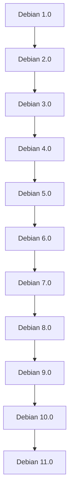

## 介绍

Debian 是一个广泛使用的 Linux 发行版，以其稳定性、自由软件理念和庞大的软件包库而闻名。它不仅是许多其他发行版的基础（如 Ubuntu），还在服务器、桌面和嵌入式系统中得到了广泛应用。了解 Debian 的历史，有助于我们更好地理解其设计哲学和发展方向。

## Debian 的起源

Debian 项目由 Ian Murdock 于 1993 年 8 月 16 日创立。Ian 当时是普渡大学的一名学生，他希望创建一个完全由自由软件组成的操作系统。Debian 的名字来源于 Ian 和他的妻子 Debra 的名字组合。

:::note
**自由软件**：Debian 始终坚持自由软件的理念，所有软件包都必须符合 Debian 自由软件指南（DFSG）。
:::

## 发展历程

### 1. 早期版本（1993-1996）

Debian 的第一个版本（0.01）于 1993 年发布，随后在 1994 年发布了 0.90 版本。这些早期版本主要面向开发者，功能较为基础。

### 2. Debian 1.0（1996）

1996 年，Debian 1.0 正式发布。这是 Debian 的第一个稳定版本，标志着 Debian 开始走向成熟。

### 3. Debian 2.0（1998）

Debian 2.0（代号 "Hamm"）引入了新的包管理系统（dpkg），并增加了对多种架构的支持。这一版本奠定了 Debian 作为多架构操作系统的基础。

### 4. Debian 3.0（2002）

Debian 3.0（代号 "Woody"）进一步扩展了软件包库，并引入了 APT（Advanced Package Tool），使得软件包的管理更加便捷。

:::tip
**APT**：APT 是 Debian 的包管理工具，允许用户轻松安装、更新和删除软件包。
:::

### 5. Debian 4.0（2007）

Debian 4.0（代号 "Etch"）引入了对 64 位架构的支持，并改进了硬件支持。

### 6. Debian 5.0（2009）

Debian 5.0（代号 "Lenny"）进一步增强了系统的稳定性和安全性。

### 7. Debian 6.0（2011）

Debian 6.0（代号 "Squeeze"）引入了对 ARM 架构的支持，并改进了系统管理工具。

### 8. Debian 7.0（2013）

Debian 7.0（代号 "Wheezy"）增加了对 UEFI 启动的支持，并引入了 systemd 作为可选初始化系统。

### 9. Debian 8.0（2015）

Debian 8.0（代号 "Jessie"）正式将 systemd 作为默认初始化系统，并改进了对容器技术的支持。

### 10. Debian 9.0（2017）

Debian 9.0（代号 "Stretch"）引入了对 Wayland 显示服务器的支持，并改进了安全性和性能。

### 11. Debian 10.0（2019）

Debian 10.0（代号 "Buster"）进一步增强了系统的稳定性和安全性，并引入了对 AppArmor 的支持。

### 12. Debian 11.0（2021）

Debian 11.0（代号 "Bullseye"）引入了对 exFAT 文件系统的支持，并改进了对现代硬件的支持。

## Debian 的社区与治理

Debian 是一个由全球志愿者组成的社区项目，其治理结构基于民主原则。Debian 项目领导者（DPL）由社区选举产生，负责协调项目的整体方向。

:::caution
**社区贡献**：Debian 的成功离不开全球志愿者的贡献。如果你对开源感兴趣，可以考虑加入 Debian 社区。
:::

## 实际案例

### 案例 1：服务器环境

Debian 以其稳定性和安全性著称，因此在服务器环境中得到了广泛应用。许多企业和组织选择 Debian 作为其服务器操作系统，以确保系统的长期稳定运行。

### 案例 2：桌面环境

Debian 提供了多种桌面环境（如 GNOME、KDE、XFCE 等），用户可以根据自己的需求选择合适的桌面环境。Debian 的桌面版本适合那些希望使用自由软件的用户。

### 案例 3：嵌入式系统

Debian 支持多种架构（如 ARM、MIPS 等），因此在嵌入式系统中也得到了广泛应用。许多物联网设备使用 Debian 作为其操作系统。

## 总结

Debian 是一个历史悠久、功能强大的 Linux 发行版，以其稳定性、自由软件理念和庞大的软件包库而闻名。通过了解 Debian 的历史，我们可以更好地理解其设计哲学和发展方向。

## 附加资源与练习

- **官方文档**：[Debian 官方网站](https://www.debian.org/)
- **社区论坛**：[Debian 社区论坛](https://forums.debian.net/)
- **练习**：尝试在虚拟机中安装 Debian，并熟悉其包管理工具（如 `apt` 和 `dpkg`）。

:::warning
**注意**：Debian 的版本更新周期较长，通常每两年发布一次新版本。因此，在选择 Debian 时，请确保选择适合你需求的版本。
:::