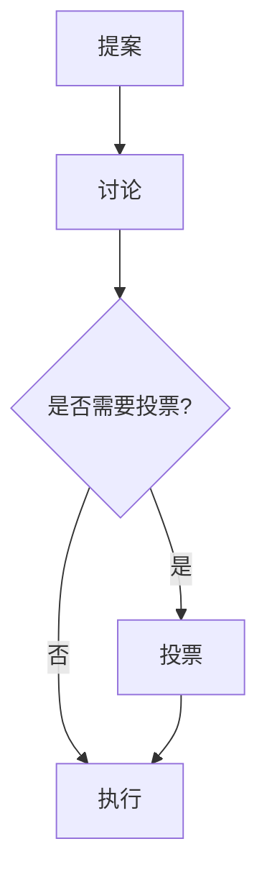

## 介绍

Debian 是一个由全球志愿者组成的开源操作系统项目。它的成功不仅依赖于技术，还依赖于一个强大且有序的社区结构。了解 Debian 社区的结构对于初学者来说非常重要，因为它能帮助你更好地理解如何参与其中，并为项目做出贡献。

## Debian 社区的核心结构

Debian 社区由多个不同的角色和团队组成，每个角色都有其特定的职责。以下是 Debian 社区的主要组成部分：

### 1. **开发者（Developers）**
开发者是 Debian 社区的核心成员，他们负责维护软件包、修复漏洞、更新系统等。开发者需要具备一定的技术能力，并且需要通过严格的审核流程才能成为正式成员。

### 2. **维护者（Maintainers）**
维护者是负责特定软件包的开发者。他们确保软件包在 Debian 系统中的正常运行，并及时更新和修复问题。

### 3. **技术委员会（Technical Committee）**
技术委员会是 Debian 社区的技术决策机构，负责解决技术争议和制定技术政策。委员会成员由社区选举产生。

### 4. **项目领导者（Project Leader）**
项目领导者是 Debian 社区的官方代表，负责协调社区活动、代表社区对外沟通等。项目领导者每年通过社区选举产生。

### 5. **贡献者（Contributors）**
贡献者是尚未成为正式开发者的社区成员，他们通过提交补丁、报告漏洞、编写文档等方式为 Debian 项目做出贡献。

### 6. **用户（Users）**
用户是 Debian 系统的最终使用者，他们通过反馈问题、提出建议等方式帮助改进系统。

## Debian 社区的决策流程

Debian 社区的决策流程是高度民主化的，通常通过邮件列表和投票来进行。以下是一个典型的决策流程：

1. **提案**：社区成员在邮件列表中提出提案。
2. **讨论**：社区成员对提案进行讨论，提出意见和建议。
3. **投票**：如果提案涉及重大决策，社区会进行投票。
4. **执行**：一旦提案通过，相关团队会负责执行。

## 实际案例：如何参与 Debian 社区

假设你是一个初学者，想要为 Debian 社区做出贡献。以下是一个简单的步骤指南：

1. **加入邮件列表**：Debian 社区有多个邮件列表，你可以选择加入与你兴趣相关的列表。
2. **报告问题**：如果你在使用 Debian 时遇到问题，可以通过邮件列表或 Bug 跟踪系统报告。
3. **提交补丁**：如果你有能力修复问题，可以提交补丁给相关维护者。
4. **参与讨论**：积极参与社区讨论，提出你的意见和建议。

:::tip
在参与社区讨论时，务必遵守社区的行为准则，保持礼貌和尊重。
:::

## 总结

Debian 社区是一个高度组织化的开源社区，由开发者、维护者、技术委员会、项目领导者、贡献者和用户等多个角色组成。了解社区的结构和决策流程对于初学者来说非常重要，它不仅能帮助你更好地理解 Debian 项目，还能为你提供参与其中的途径。

## 附加资源

- [Debian 官方网站](https://www.debian.org/)
- [Debian 邮件列表](https://lists.debian.org/)
- [Debian Bug 跟踪系统](https://bugs.debian.org/)

## 练习

1. 加入一个 Debian 邮件列表，并参与一次讨论。
2. 尝试在 Debian 系统中报告一个 Bug，并观察社区的响应。
3. 如果你有能力，尝试为一个 Debian 软件包提交补丁。

通过以上步骤，你将逐步融入 Debian 社区，并为这个伟大的开源项目做出贡献。