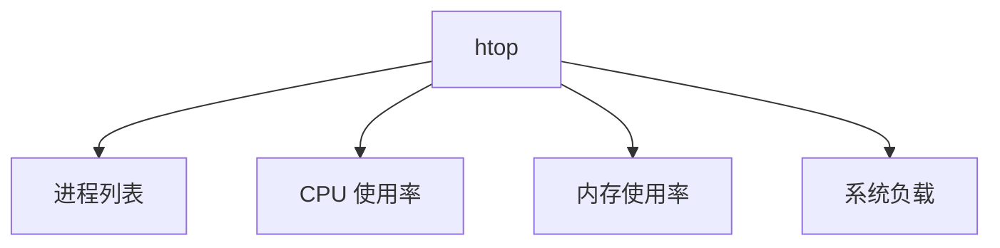

# Debian 进程管理

在 Debian 系统中，进程管理是系统管理员和用户必须掌握的核心技能之一。进程是正在运行的程序的实例，了解如何管理这些进程可以帮助你优化系统性能、排查问题以及确保系统的稳定性。

## 什么是进程？

进程是操作系统中的一个基本概念，它代表了一个正在执行的程序。每个进程都有一个唯一的进程 ID（PID），并且可以包含一个或多个线程。进程可以是前台运行的（与用户交互）或后台运行的（无需用户干预）。

## 查看进程

在 Debian 中，最常用的查看进程的命令是 `ps` 和 `top`。

### 使用 `ps` 命令

`ps` 命令用于显示当前用户的进程状态。以下是一些常用的 `ps` 命令选项：

```bash
ps aux
```

- `a`：显示所有用户的进程。
- `u`：显示进程的详细信息，包括 CPU 和内存使用情况。
- `x`：显示没有控制终端的进程。

**示例输出：**

```bash
USER       PID %CPU %MEM    VSZ   RSS TTY      STAT START   TIME COMMAND
root         1  0.0  0.1 169416 13056 ?        Ss   10:00   0:01 /sbin/init
root         2  0.0  0.0      0     0 ?        S    10:00   0:00 [kthreadd]
```

### 使用 `top` 命令

`top` 命令提供了一个动态的实时视图，显示系统中正在运行的进程及其资源使用情况。

```bash
top
```

**示例输出：**

```bash
top - 10:05:01 up  1:00,  1 user,  load average: 0.00, 0.01, 0.05
Tasks:  95 total,   1 running,  94 sleeping,   0 stopped,   0 zombie
%Cpu(s):  0.3 us,  0.2 sy,  0.0 ni, 99.5 id,  0.0 wa,  0.0 hi,  0.0 si,  0.0 st
MiB Mem :   2000.0 total,   1500.0 free,    200.0 used,    300.0 buff/cache
MiB Swap:   1000.0 total,   1000.0 free,      0.0 used.   1700.0 avail Mem

  PID USER      PR  NI    VIRT    RES    SHR S  %CPU  %MEM     TIME+ COMMAND
    1 root      20   0  169416  13056   9800 S   0.0   0.7   0:01.00 systemd
    2 root      20   0       0      0      0 S   0.0   0.0   0:00.00 kthreadd
```

:::tip
你可以按 `q` 键退出 `top` 命令。
:::

## 启动和停止进程

### 启动进程

在 Debian 中，你可以通过命令行直接启动一个进程。例如，启动一个简单的 `sleep` 进程：

```bash
sleep 100 &
```

`&` 符号表示将进程放到后台运行。

### 停止进程

要停止一个进程，可以使用 `kill` 命令。首先，你需要找到进程的 PID，然后使用 `kill` 命令发送终止信号。

```bash
kill PID
```

例如，停止 PID 为 1234 的进程：

```bash
kill 1234
```

:::caution
使用 `kill` 命令时要小心，确保你终止的是正确的进程。
:::

## 监控进程

### 使用 `htop`

`htop` 是一个更强大的进程监控工具，它提供了比 `top` 更友好的用户界面和更多的功能。

```bash
sudo apt install htop
htop
```

**示例输出：**



:::note
`htop` 允许你通过方向键和功能键来导航和操作进程。
:::

## 实际案例

### 案例 1：查找并终止占用过多 CPU 的进程

假设你发现系统变得非常缓慢，怀疑某个进程占用了过多的 CPU 资源。你可以使用 `top` 或 `htop` 来查找占用 CPU 最多的进程，然后使用 `kill` 命令终止它。

1. 打开 `top` 或 `htop`。
2. 按 `P` 键（在 `top` 中）或使用鼠标（在 `htop` 中）按 CPU 使用率排序。
3. 找到占用 CPU 最多的进程，记下其 PID。
4. 使用 `kill PID` 命令终止该进程。

### 案例 2：后台运行长时间任务

假设你需要运行一个长时间的任务，但不想让它占用终端。你可以使用 `&` 符号将任务放到后台运行。

```bash
long_running_task &
```

然后，你可以使用 `jobs` 命令查看后台任务的状态。

```bash
jobs
```

## 总结

在 Debian 系统中，进程管理是一个非常重要的技能。通过使用 `ps`、`top`、`htop` 和 `kill` 等命令，你可以有效地查看、启动、停止和监控进程。掌握这些工具和技巧将帮助你更好地管理系统资源，确保系统的稳定性和性能。

## 附加资源

- [Debian 官方文档](https://www.debian.org/doc/)
- [Linux 进程管理指南](https://www.linux.com/training-tutorials/linux-process-management/)

## 练习

1. 使用 `ps aux` 命令查看当前系统中的所有进程，并找出占用内存最多的进程。
2. 使用 `top` 命令监控系统资源，尝试按 CPU 使用率排序。
3. 启动一个后台进程，并使用 `jobs` 命令查看其状态。
4. 使用 `htop` 终止一个占用过多 CPU 的进程。

通过完成这些练习，你将更加熟悉 Debian 系统中的进程管理。