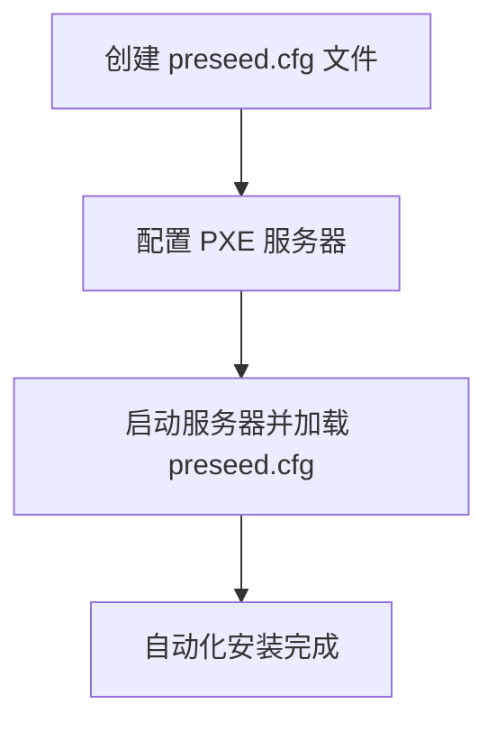

# Debian 安装程序定制

Debian 是一个广泛使用的 Linux 发行版，以其稳定性和灵活性著称。默认的 Debian 安装程序已经非常强大，但在某些情况下，您可能需要对其进行定制，以满足特定的需求或自动化安装过程。本文将引导您了解如何定制 Debian 安装程序，从基础概念到实际应用。

## 什么是 Debian 安装程序定制？

Debian 安装程序定制是指通过修改安装程序的配置文件或添加自定义脚本，来改变安装过程的行为。这种定制可以用于自动化安装、预配置系统设置、添加额外的软件包等。

## 定制 Debian 安装程序的基本步骤

### 1. 获取 Debian 安装介质

首先，您需要获取 Debian 的安装介质。您可以从 [Debian 官方网站](https://www.debian.org/distrib/) 下载 ISO 文件，并将其写入 USB 驱动器或光盘。

### 2. 修改 `preseed.cfg` 文件

`preseed.cfg` 文件是 Debian 安装程序的核心配置文件之一。它允许您通过预定义的答案来自动化安装过程。以下是一个简单的 `preseed.cfg` 示例：

```bash
# 设置语言和区域
d-i debian-installer/locale string en_US
d-i keyboard-configuration/xkb-keymap select us

# 设置网络
d-i netcfg/choose_interface select auto
d-i netcfg/get_hostname string debian
d-i netcfg/get_domain string example.com

# 设置分区
d-i partman-auto/disk string /dev/sda
d-i partman-auto/method string regular
d-i partman-auto/choose_recipe select atomic

# 设置用户和密码
d-i passwd/user-fullname string Debian User
d-i passwd/username string debian
d-i passwd/user-password password insecure
d-i passwd/user-password-again password insecure

# 安装基本系统
tasksel tasksel/first multiselect standard
d-i pkgsel/include string openssh-server vim
```

### 3. 将 `preseed.cfg` 文件添加到安装介质

将 `preseed.cfg` 文件添加到安装介质的根目录，并在启动时通过内核参数指定该文件。例如，在 GRUB 启动菜单中，您可以添加以下参数：

```bash
auto url=http://example.com/preseed.cfg
```

### 4. 测试定制安装

启动安装介质并观察安装过程是否按照 `preseed.cfg` 文件中的配置进行。如果一切顺利，安装过程将自动完成，无需用户干预。

## 实际案例：自动化服务器部署

假设您需要在一组服务器上自动化部署 Debian 系统。您可以通过以下步骤实现：

1. **创建 `preseed.cfg` 文件**：根据服务器的硬件和网络环境，编写一个适合的 `preseed.cfg` 文件。
2. **配置 PXE 服务器**：通过网络启动服务器，并使用 PXE 服务器提供定制的安装介质。
3. **自动化安装**：在服务器启动时，自动加载 `preseed.cfg` 文件并开始安装。



## 总结

通过定制 Debian 安装程序，您可以大大简化系统部署过程，特别是在需要批量安装或自动化配置的情况下。本文介绍了如何通过修改 `preseed.cfg` 文件来实现这一目标，并提供了一个实际案例来展示其应用场景。

## 附加资源

- [Debian 官方文档](https://www.debian.org/doc/)
- [Debian Preseed 配置指南](https://wiki.debian.org/DebianInstaller/Preseed)

## 练习

1. 尝试创建一个 `preseed.cfg` 文件，用于自动化安装一个包含 LAMP 堆栈的 Debian 系统。
2. 配置一个 PXE 服务器，并使用 `preseed.cfg` 文件通过网络启动并安装 Debian。

:::tip
在定制 Debian 安装程序时，务必在测试环境中进行充分测试，以确保配置文件的正确性和安装过程的稳定性。
:::