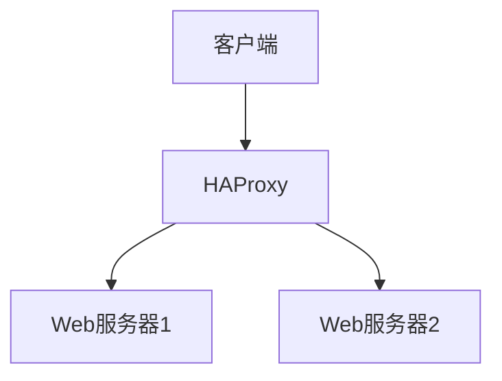

# Debian 负载均衡技术

## 介绍

负载均衡是一种将网络流量或计算任务分配到多个服务器或资源的技术，旨在优化资源使用、最大化吞吐量、最小化响应时间，并避免任何单一资源的过载。在Debian系统中，负载均衡可以通过多种方式实现，例如使用软件工具（如HAProxy、Nginx）或硬件设备。

本文将介绍如何在Debian系统中配置和使用负载均衡技术，帮助初学者理解其基本原理和实际应用。

## 负载均衡的基本概念

负载均衡的核心目标是将请求分发到多个服务器，以确保每个服务器的负载相对均衡。常见的负载均衡算法包括：

- **轮询（Round Robin）**：依次将请求分发到每个服务器。
- **加权轮询（Weighted Round Robin）**：根据服务器的处理能力分配不同的权重。
- **最少连接（Least Connections）**：将请求分发到当前连接数最少的服务器。
- **IP哈希（IP Hash）**：根据客户端IP地址将请求分发到固定的服务器。

## 使用HAProxy实现负载均衡

HAProxy是一个开源的负载均衡器和代理服务器，广泛用于高可用性和负载均衡场景。以下是如何在Debian系统中安装和配置HAProxy的步骤。

### 安装HAProxy

首先，更新软件包列表并安装HAProxy：

```bash
sudo apt update
sudo apt install haproxy
```

### 配置HAProxy

HAProxy的配置文件通常位于 `/etc/haproxy/haproxy.cfg`。以下是一个简单的配置示例，用于将HTTP请求分发到两个后端服务器：

```bash
frontend http_front
    bind *:80
    default_backend http_back

backend http_back
    balance roundrobin
    server server1 192.168.1.101:80 check
    server server2 192.168.1.102:80 check
```

在这个配置中：

- `frontend` 部分定义了HAProxy监听的端口和协议。
- `backend` 部分定义了后端服务器和负载均衡算法（本例中使用轮询算法）。
- `server` 行定义了后端服务器的IP地址和端口，`check` 选项表示HAProxy会定期检查服务器的健康状态。

### 启动HAProxy

配置完成后，启动HAProxy服务：

```bash
sudo systemctl start haproxy
sudo systemctl enable haproxy
```

### 验证配置

你可以通过访问HAProxy的IP地址来验证负载均衡是否正常工作。使用 `curl` 命令多次访问，观察请求是否被分发到不同的后端服务器：

```bash
curl http://<haproxy-ip>
```

## 实际案例：Web服务器负载均衡

假设你有一个高流量的网站，使用两台Debian服务器作为Web服务器。为了提高性能和可靠性，你决定使用HAProxy实现负载均衡。

### 架构图



### 配置步骤

1. **安装Web服务器**：在两台Debian服务器上安装Nginx或Apache。
2. **配置HAProxy**：按照上述步骤配置HAProxy，将请求分发到两台Web服务器。
3. **测试负载均衡**：使用 `curl` 或浏览器访问HAProxy的IP地址，观察请求是否被均衡分发。

## 总结

负载均衡是提高系统性能和可靠性的关键技术。通过使用HAProxy等工具，你可以在Debian系统中轻松实现负载均衡。本文介绍了负载均衡的基本概念、HAProxy的安装和配置步骤，并通过实际案例展示了其应用场景。

## 附加资源

- [HAProxy官方文档](https://www.haproxy.org/)
- [Debian官方手册](https://www.debian.org/doc/)
- [Nginx负载均衡配置指南](https://nginx.org/en/docs/http/load_balancing.html)

## 练习

1. 在本地虚拟机中设置两台Debian服务器，并使用HAProxy实现负载均衡。
2. 尝试不同的负载均衡算法（如加权轮询、最少连接），并观察其效果。
3. 配置HAProxy的健康检查功能，模拟服务器故障，观察HAProxy的行为。

通过以上练习，你将更深入地理解负载均衡的工作原理和实际应用。