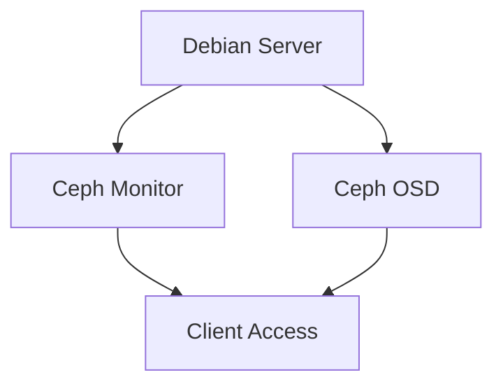
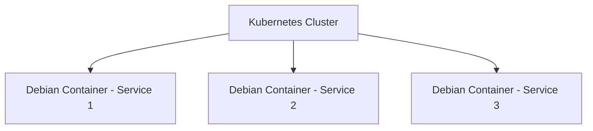

# Debian 云计算概述

## 介绍

云计算是一种通过互联网提供计算资源（如服务器、存储、数据库、网络等）的技术。它允许用户按需访问这些资源，而无需管理物理硬件。Debian，作为一个稳定且广泛使用的Linux发行版，在云计算领域扮演着重要角色。本文将带您了解Debian如何支持云计算环境，以及如何利用Debian构建和管理云基础设施。

## Debian 与云计算的关系

Debian是一个自由操作系统，以其稳定性和广泛的软件包支持而闻名。在云计算中，Debian常被用作虚拟机镜像的基础操作系统，或作为容器化应用的基础镜像。其强大的包管理系统和社区支持使其成为云计算环境中的理想选择。

### 为什么选择Debian？

- **稳定性**：Debian以其稳定性著称，适合需要长时间运行的云环境。
- **广泛的软件包支持**：Debian拥有超过59,000个软件包，涵盖了从开发工具到服务器应用的广泛领域。
- **社区支持**：Debian拥有庞大的社区，提供丰富的文档和支持资源。

## Debian 在云计算中的应用

### 1. 虚拟机镜像

在云计算中，虚拟机（VM）是常见的资源形式。Debian提供了官方的云镜像，可以直接在云平台上使用。例如，您可以在AWS、Google Cloud或Azure上启动一个基于Debian的虚拟机。

#### 示例：在AWS上启动Debian实例

```bash
aws ec2 run-instances \
    --image-id ami-0abcdef1234567890 \
    --instance-type t2.micro \
    --key-name my-key-pair \
    --security-group-ids sg-0abcdef1234567890 \
    --subnet-id subnet-0abcdef1234567890
```

### 2. 容器化应用

容器化技术（如Docker）在云计算中越来越流行。Debian是许多容器镜像的基础操作系统。您可以使用Debian作为基础镜像来构建自定义的容器化应用。

#### 示例：使用Debian构建Docker镜像

```dockerfile
FROM debian:latest
RUN apt-get update && apt-get install -y nginx
CMD ["nginx", "-g", "daemon off;"]
```

### 3. 自动化部署与配置管理

在云计算中，自动化是关键。Debian支持多种自动化工具，如Ansible、Puppet和Chef，用于配置管理和部署。

#### 示例：使用Ansible配置Debian服务器

```yaml
- hosts: webservers
  tasks:
    - name: Ensure nginx is installed
      apt:
        name: nginx
        state: present
```

## 实际案例

### 案例1：基于Debian的云存储解决方案

假设您需要构建一个基于Debian的云存储解决方案。您可以使用Debian作为基础操作系统，结合Ceph（一个分布式存储系统）来实现高可用性和可扩展的存储。



### 案例2：基于Debian的微服务架构

在微服务架构中，每个服务可以运行在独立的Debian容器中。通过使用Kubernetes进行编排，您可以轻松管理这些服务。



## 总结

Debian在云计算中具有广泛的应用，从虚拟机镜像到容器化应用，再到自动化部署。其稳定性、广泛的软件包支持和强大的社区使其成为云计算环境中的理想选择。通过本文的介绍，您应该对Debian在云计算中的应用有了初步的了解。

## 附加资源与练习

- **资源**：
  - [Debian官方文档](https://www.debian.org/doc/)
  - [AWS Debian云镜像](https://aws.amazon.com/marketplace/pp/B00CIYTQTC)
  - [Docker Hub上的Debian镜像](https://hub.docker.com/_/debian)

- **练习**：
  1. 在AWS上启动一个基于Debian的虚拟机，并安装一个Web服务器。
  2. 使用Debian作为基础镜像，构建一个包含Python应用的Docker容器。
  3. 使用Ansible自动化配置一个Debian服务器，安装并配置Nginx。

:::tip
如果您在练习中遇到问题，可以访问Debian社区论坛或相关文档获取帮助。
:::