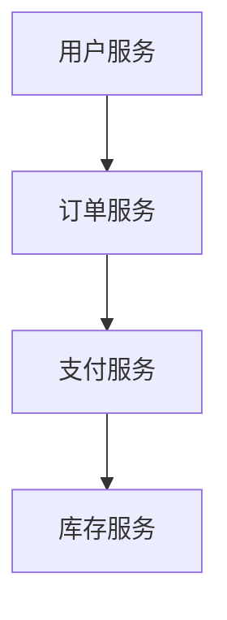

# Debian 微服务架构

微服务架构是一种将应用程序拆分为多个小型、独立服务的软件开发方法。每个服务都运行在自己的进程中，并通过轻量级机制（通常是HTTP API）进行通信。这种方法使得应用程序更易于开发、测试、部署和维护。本文将介绍如何在Debian系统中构建和部署微服务架构。

## 什么是微服务架构？

微服务架构是一种将应用程序拆分为多个小型、独立服务的软件开发方法。每个服务都运行在自己的进程中，并通过轻量级机制（通常是HTTP API）进行通信。这种方法使得应用程序更易于开发、测试、部署和维护。

:::note
微服务架构的核心思想是将复杂的单体应用程序拆分为多个小型、独立的服务，每个服务负责一个特定的功能。
:::

## 微服务架构的优势

- **模块化**：每个服务都是独立的，可以独立开发、测试和部署。
- **可扩展性**：可以根据需求单独扩展某个服务，而不需要扩展整个应用程序。
- **技术多样性**：不同的服务可以使用不同的编程语言和技术栈。
- **容错性**：一个服务的故障不会影响其他服务的正常运行。

## 在Debian中构建微服务架构

### 1. 安装必要的软件

首先，确保你的Debian系统已经安装了Docker和Docker Compose。Docker可以帮助我们轻松地部署和管理微服务。

```bash
sudo apt-get update
sudo apt-get install docker.io docker-compose
```

### 2. 创建微服务

假设我们要创建一个简单的微服务架构，包含两个服务：`user-service` 和 `order-service`。

#### user-service

创建一个名为 `user-service` 的目录，并在其中创建一个 `Dockerfile` 和一个简单的Python Flask应用程序。

```bash
mkdir user-service
cd user-service
```

`Dockerfile` 内容如下：

```dockerfile
FROM python:3.8-slim
WORKDIR /app
COPY . .
RUN pip install -r requirements.txt
CMD ["python", "app.py"]
```

`app.py` 内容如下：

```python
from flask import Flask

app = Flask(__name__)

@app.route('/')
def hello():
    return "Hello from User Service!"

if __name__ == '__main__':
    app.run(host='0.0.0.0', port=5000)
```

`requirements.txt` 内容如下：

```text
Flask==2.0.1
```

#### order-service

同样地，创建一个名为 `order-service` 的目录，并在其中创建一个 `Dockerfile` 和一个简单的Python Flask应用程序。

```bash
mkdir order-service
cd order-service
```

`Dockerfile` 内容如下：

```dockerfile
FROM python:3.8-slim
WORKDIR /app
COPY . .
RUN pip install -r requirements.txt
CMD ["python", "app.py"]
```

`app.py` 内容如下：

```python
from flask import Flask

app = Flask(__name__)

@app.route('/')
def hello():
    return "Hello from Order Service!"

if __name__ == '__main__':
    app.run(host='0.0.0.0', port=5001)
```

`requirements.txt` 内容如下：

```text
Flask==2.0.1
```

### 3. 使用Docker Compose部署微服务

在项目根目录下创建一个 `docker-compose.yml` 文件，内容如下：

```yaml
version: '3'
services:
  user-service:
    build: ./user-service
    ports:
      - "5000:5000"
  order-service:
    build: ./order-service
    ports:
      - "5001:5001"
```

然后，使用以下命令启动服务：

```bash
docker-compose up --build
```

### 4. 测试微服务

打开浏览器，访问 `http://localhost:5000` 和 `http://localhost:5001`，你应该会看到来自 `user-service` 和 `order-service` 的响应。

## 实际案例

假设我们正在开发一个电子商务平台，我们可以将用户管理、订单管理、支付处理等功能拆分为不同的微服务。每个微服务都可以独立开发、测试和部署，从而提高开发效率和系统的可维护性。



## 总结

微服务架构是一种强大的软件开发方法，特别适合构建复杂、可扩展的应用程序。通过在Debian系统中使用Docker和Docker Compose，我们可以轻松地构建和部署微服务架构。

## 附加资源

- [Docker官方文档](https://docs.docker.com/)
- [Docker Compose官方文档](https://docs.docker.com/compose/)
- [微服务架构设计模式](https://microservices.io/)

## 练习

1. 尝试在 `user-service` 和 `order-service` 中添加更多的API端点。
2. 使用Docker Compose部署一个包含三个微服务的应用程序。
3. 探索如何在微服务之间实现负载均衡和故障转移。

:::tip
在开发微服务时，确保每个服务都有清晰的职责边界，并且服务之间的通信是轻量级的。
:::