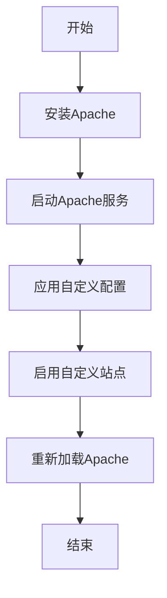

## 介绍

配置管理是系统运维中的关键环节，特别是在Debian这样的Linux发行版中。通过配置管理，您可以确保系统的状态与预期一致，减少人为错误，并提高系统的可维护性。本文将介绍Debian配置管理的基本概念、工具和最佳实践，帮助初学者掌握这一重要技能。

## 什么是配置管理？

配置管理是指通过自动化工具和流程来管理和维护系统的配置状态。它确保系统的配置与预定义的策略一致，从而减少配置漂移（configuration drift）和人为错误。在Debian中，配置管理通常涉及以下方面：

- **配置文件管理**：确保系统配置文件（如 `/etc` 目录下的文件）与预期一致。
- **软件包管理**：安装、更新和删除软件包。
- **服务管理**：启动、停止和重启服务。
- **用户和权限管理**：管理用户账户和权限。

## 配置管理工具

在Debian中，有多种工具可以用于配置管理。以下是几种常见的工具：

1. **Ansible**：一种基于YAML的自动化工具，适用于配置管理、应用部署和任务自动化。
2. **Puppet**：一种声明式配置管理工具，适用于大规模环境。
3. **Chef**：一种基于Ruby的配置管理工具，适用于复杂的环境。
4. **SaltStack**：一种基于Python的配置管理工具，适用于大规模和分布式环境。

本文将重点介绍Ansible，因为它易于学习且功能强大，非常适合初学者。

## 使用Ansible进行配置管理

### 安装Ansible

首先，您需要在Debian系统上安装Ansible。可以通过以下命令安装：

```bash
sudo apt update
sudo apt install ansible
```

### 编写Ansible Playbook

Ansible使用Playbook来定义配置管理任务。Playbook是一个YAML文件，包含了一系列任务和配置。

以下是一个简单的Playbook示例，用于确保Apache服务已安装并运行：

```yaml
---
- hosts: webservers
  become: yes
  tasks:
    - name: Ensure Apache is installed
      apt:
        name: apache2
        state: present

    - name: Ensure Apache is running
      service:
        name: apache2
        state: started
        enabled: yes
```

### 运行Ansible Playbook

保存上述Playbook为 `apache.yml`，然后运行以下命令来执行Playbook：

```bash
ansible-playbook -i inventory apache.yml
```

其中，`inventory` 是一个包含目标主机列表的文件。

### 实际案例

假设您需要管理一个包含多个Web服务器的Debian环境。您可以使用Ansible来确保所有服务器都安装了Apache，并且服务正在运行。以下是一个更复杂的Playbook示例：

```yaml
---
- hosts: webservers
  become: yes
  tasks:
    - name: Ensure Apache is installed
      apt:
        name: apache2
        state: present

    - name: Ensure Apache is running
      service:
        name: apache2
        state: started
        enabled: yes

    - name: Ensure custom configuration is applied
      copy:
        src: /path/to/custom.conf
        dest: /etc/apache2/sites-available/custom.conf
        owner: root
        group: root
        mode: '0644'

    - name: Enable custom site
      command: a2ensite custom.conf

    - name: Reload Apache
      service:
        name: apache2
        state: reloaded
```

### 使用Mermaid绘制流程图

以下是一个简单的流程图，展示了Ansible Playbook的执行流程：



## 总结

配置管理是Debian系统运维中的重要环节，通过使用工具如Ansible，您可以自动化配置管理任务，确保系统的一致性和可维护性。本文介绍了Ansible的基本用法，并通过实际案例展示了如何管理Web服务器。

## 附加资源

- [Ansible官方文档](https://docs.ansible.com/)
- [Debian官方文档](https://www.debian.org/doc/)
- [Puppet官方文档](https://puppet.com/docs/)
- [Chef官方文档](https://docs.chef.io/)
- [SaltStack官方文档](https://docs.saltproject.io/)

## 练习

1. 编写一个Ansible Playbook，确保Nginx服务已安装并运行。
2. 使用Ansible管理Debian系统中的用户和权限。
3. 尝试使用Puppet或Chef完成相同的任务，并比较它们与Ansible的异同。

:::tip
在编写Playbook时，建议使用 `ansible-lint` 工具来检查语法和最佳实践。
:::