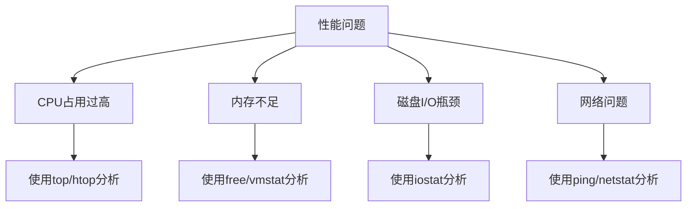

## 介绍

在使用Debian系统时，可能会遇到性能下降的问题。这些问题可能表现为系统响应缓慢、应用程序崩溃或资源占用过高。为了有效解决这些问题，我们需要了解如何分析系统性能，并找到问题的根源。

本指南将逐步介绍如何识别和解决Debian系统中的性能问题，适合初学者学习和实践。

---

## 1. 性能问题的常见原因

在开始分析之前，了解可能导致性能问题的常见原因非常重要。以下是一些常见的原因：

- **CPU占用过高**：某个进程可能占用了过多的CPU资源。
- **内存不足**：系统内存不足可能导致频繁的交换（swap）操作，从而降低性能。
- **磁盘I/O瓶颈**：磁盘读写速度慢可能导致系统响应延迟。
- **网络问题**：网络延迟或带宽不足可能影响依赖网络的应用程序。

---

## 2. 使用工具分析性能

Debian提供了多种工具来帮助分析系统性能。以下是几种常用的工具：

### 2.1 `top` 和 `htop`

`top` 是一个实时监控系统资源使用情况的工具。它可以显示CPU、内存和进程的详细信息。

```bash
top
```

`htop` 是 `top` 的增强版，提供了更友好的界面和更多功能。

```bash
htop
```

:::tip
在 `htop` 中，你可以使用方向键选择进程，并按 `F9` 终止进程。
:::

### 2.2 `vmstat`

`vmstat` 可以显示系统的虚拟内存、进程、CPU活动和磁盘I/O的统计信息。

```bash
vmstat 1
```

输出示例：

```
procs -----------memory---------- ---swap-- -----io---- -system-- ------cpu-----
 r  b   swpd   free   buff  cache   si   so    bi    bo   in   cs us sy id wa st
 1  0      0 123456  78901 234567    0    0    12    34   56   78 10  5 85  0  0
```

:::note
`vmstat` 的输出中，`us` 表示用户空间CPU使用率，`sy` 表示内核空间CPU使用率，`id` 表示空闲CPU百分比。
:::

### 2.3 `iostat`

`iostat` 用于监控系统的磁盘I/O性能。

```bash
iostat -x 1
```

输出示例：

```
Device            r/s     w/s    rkB/s    wkB/s   rrqm/s   wrqm/s  %rrqm  %wrqm  r_await  w_await  aqu-sz  %util
sda              0.12    0.34     1.23     4.56     0.00     0.00   0.00   0.00    1.23     4.56    0.12   0.34
```

:::caution
如果 `%util` 接近100%，表示磁盘可能成为性能瓶颈。
:::

---

## 3. 实际案例分析

### 案例1：CPU占用过高

**问题描述**：系统响应缓慢，`top` 显示某个进程占用了90%的CPU。

**解决方法**：
1. 使用 `top` 或 `htop` 找到占用CPU最高的进程。
2. 终止该进程（如果允许）或优化其代码。

```bash
kill -9 <PID>
```

### 案例2：内存不足

**问题描述**：系统频繁使用交换空间，导致性能下降。

**解决方法**：
1. 使用 `free -m` 检查内存使用情况。
2. 增加物理内存或优化应用程序以减少内存占用。

```bash
free -m
```

---

## 4. 总结

通过本指南，你学会了如何使用工具分析Debian系统中的性能问题，并了解了常见问题的解决方法。性能优化是一个持续的过程，需要结合实际情况进行调整。

---

## 附加资源

- [Debian官方文档](https://www.debian.org/doc/)
- [Linux性能分析工具指南](https://www.brendangregg.com/linuxperf.html)
- [htop使用手册](https://htop.dev/)

---

## 练习

1. 使用 `top` 或 `htop` 监控你的系统，找出占用CPU最高的进程。
2. 使用 `vmstat` 分析系统的内存和CPU使用情况。
3. 尝试优化一个占用内存较多的应用程序，并观察性能变化。



希望本指南能帮助你更好地理解和解决Debian系统中的性能问题！