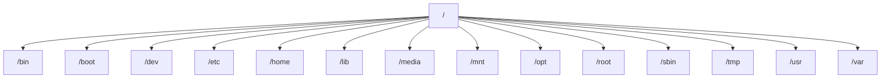

# Debian 文件系统结构

Debian文件系统是Linux操作系统中用于组织和管理文件和目录的层次结构。它遵循**文件系统层次标准（Filesystem Hierarchy Standard, FHS）**，这是一种定义Linux系统中目录和文件布局的规范。理解Debian文件系统结构对于系统管理、软件安装和故障排除至关重要。

## 文件系统概述

Debian文件系统是一个树状结构，从根目录（`/`）开始，所有其他目录和文件都从根目录分支出来。每个目录都有特定的用途，例如存储系统配置文件、用户数据或可执行程序。

### 根目录（`/`）

根目录是文件系统的起点，所有其他目录和文件都位于根目录之下。以下是一些重要的子目录及其功能：

1. **`/bin`**：存放系统启动和运行所需的基本命令（如`ls`、`cp`等）。
2. **`/boot`**：包含启动加载器和内核文件。
3. **`/dev`**：包含设备文件，用于与硬件设备交互。
4. **`/etc`**：存放系统配置文件。
5. **`/home`**：用户的主目录，每个用户都有一个独立的子目录。
6. **`/lib`**：存放系统库文件。
7. **`/media`**：用于挂载可移动设备（如USB驱动器）。
8. **`/mnt`**：临时挂载文件系统的目录。
9. **`/opt`**：存放第三方应用程序。
10. **`/root`**：系统管理员（root用户）的主目录。
11. **`/sbin`**：存放系统管理命令（如`fdisk`、`ifconfig`等）。
12. **`/tmp`**：临时文件目录。
13. **`/usr`**：存放用户程序和共享资源。
14. **`/var`**：存放可变数据（如日志文件、数据库等）。

:::tip
你可以使用`tree`命令查看文件系统的层次结构。例如：
```bash
tree -L 1 /
```
:::

## 文件系统层次结构示例

以下是一个简化的Debian文件系统层次结构图：



## 实际案例

### 案例1：查找系统配置文件

假设你需要修改网络配置，你可以导航到`/etc`目录，找到`network/interfaces`文件：

```bash
cd /etc/network
ls
```

输出可能如下：
```
interfaces  interfaces.d
```

### 案例2：查看日志文件

系统日志通常存储在`/var/log`目录中。例如，查看系统日志：

```bash
cat /var/log/syslog
```

## 总结

Debian文件系统结构是Linux系统管理的基础。通过理解每个目录的用途，你可以更高效地管理系统、安装软件和排查问题。以下是一些关键点：

- 根目录（`/`）是文件系统的起点。
- 每个目录都有特定的功能，例如`/bin`存放基本命令，`/etc`存放配置文件。
- 使用`tree`命令可以快速查看文件系统层次结构。

## 附加资源

- [Filesystem Hierarchy Standard (FHS)](https://refspecs.linuxfoundation.org/FHS_3.0/fhs-3.0.html)
- [Debian官方文档](https://www.debian.org/doc/)

## 练习

1. 使用`tree`命令查看你的系统文件系统层次结构。
2. 导航到`/var/log`目录，查看系统日志文件。
3. 尝试在`/home`目录下创建一个新用户，并为其分配主目录。

通过实践这些练习，你将更深入地理解Debian文件系统结构。