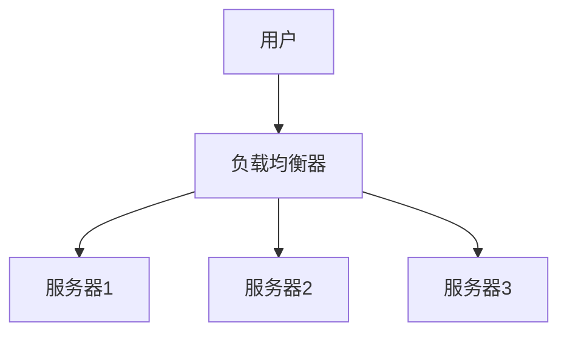

## 什么是负载均衡？

负载均衡是一种将网络流量或计算任务分配到多个服务器或资源上的技术。它的主要目的是优化资源使用、最大化吞吐量、最小化响应时间，并避免单个服务器过载。在Debian服务器上，负载均衡通常用于高流量网站、分布式系统或需要高可用性的应用场景。

## 为什么需要负载均衡？

在高流量的网络环境中，单个服务器可能无法处理所有请求，导致性能下降甚至服务中断。通过负载均衡，可以将请求分发到多个服务器上，从而：

1. **提高性能**：减少单个服务器的负载，提升整体响应速度。
2. **增强可靠性**：如果某台服务器出现故障，其他服务器可以继续处理请求。
3. **扩展性**：随着流量增长，可以轻松添加更多服务器来分担负载。

## 负载均衡的实现方式

在Debian服务器上，负载均衡可以通过多种方式实现，包括：

1. **硬件负载均衡器**：专用的硬件设备，性能强大但成本较高。
2. **软件负载均衡器**：如Nginx、HAProxy等，灵活且成本较低。

本文将重点介绍如何使用Nginx和HAProxy在Debian服务器上实现负载均衡。

---

## 使用Nginx实现负载均衡

Nginx是一个高性能的HTTP服务器和反向代理服务器，也可以用作负载均衡器。以下是如何在Debian上配置Nginx实现负载均衡的步骤。

### 1. 安装Nginx

首先，确保你的Debian系统已安装Nginx：

```bash
sudo apt update
sudo apt install nginx
```

### 2. 配置负载均衡

编辑Nginx的配置文件 `/etc/nginx/nginx.conf` 或 `/etc/nginx/sites-available/default`，添加以下内容：

```nginx
http {
    upstream backend {
        server 192.168.1.101;
        server 192.168.1.102;
        server 192.168.1.103;
    }

    server {
        listen 80;

        location / {
            proxy_pass http://backend;
        }
    }
}
```

在这个配置中：

- `upstream backend` 定义了后端服务器的列表。
- `server` 指令指定了每个后端服务器的IP地址。
- `proxy_pass` 将请求转发到后端服务器。

### 3. 重启Nginx

保存配置文件后，重启Nginx以应用更改：

```bash
sudo systemctl restart nginx
```

### 4. 测试负载均衡

你可以通过访问服务器的IP地址来测试负载均衡是否正常工作。Nginx会自动将请求分发到配置的后端服务器上。

---

## 使用HAProxy实现负载均衡

HAProxy是另一个流行的负载均衡器，特别适用于TCP和HTTP应用。以下是配置步骤。

### 1. 安装HAProxy

在Debian上安装HAProxy：

```bash
sudo apt update
sudo apt install haproxy
```

### 2. 配置HAProxy

编辑HAProxy的配置文件 `/etc/haproxy/haproxy.cfg`，添加以下内容：

```haproxy
frontend http_front
    bind *:80
    default_backend http_back

backend http_back
    balance roundrobin
    server server1 192.168.1.101:80 check
    server server2 192.168.1.102:80 check
    server server3 192.168.1.103:80 check
```

在这个配置中：

- `frontend` 定义了前端监听端口。
- `backend` 定义了后端服务器列表，并使用 `roundrobin` 算法进行负载均衡。
- `server` 指令指定了每个后端服务器的IP地址和端口。

### 3. 重启HAProxy

保存配置文件后，重启HAProxy：

```bash
sudo systemctl restart haproxy
```

### 4. 测试负载均衡

通过访问服务器的IP地址，HAProxy会将请求分发到配置的后端服务器上。

---

## 实际应用场景

### 案例：高流量网站

假设你运营一个高流量的电子商务网站，使用负载均衡可以将用户请求分发到多个服务器上，确保网站在促销活动期间仍能快速响应。



在这个案例中，负载均衡器将用户请求分发到三台服务器上，确保每台服务器的负载均衡，避免单点故障。

---

## 总结

负载均衡是提升系统性能和可靠性的关键技术。通过本文，你已经学会了如何在Debian服务器上使用Nginx和HAProxy实现负载均衡。无论是高流量网站还是分布式系统，负载均衡都能帮助你更好地管理资源，提升用户体验。

## 附加资源

- [Nginx官方文档](https://nginx.org/en/docs/)
- [HAProxy官方文档](https://www.haproxy.org/documentation/)
- [Debian官方Wiki](https://wiki.debian.org/)

## 练习

1. 尝试在本地虚拟机中配置Nginx负载均衡，并测试其效果。
2. 使用HAProxy配置一个TCP负载均衡，并观察其与HTTP负载均衡的区别。
3. 研究其他负载均衡算法（如加权轮询、最少连接数），并在配置中应用它们。

:::tip
如果你在配置过程中遇到问题，可以参考官方文档或社区论坛，获取更多帮助。
:::