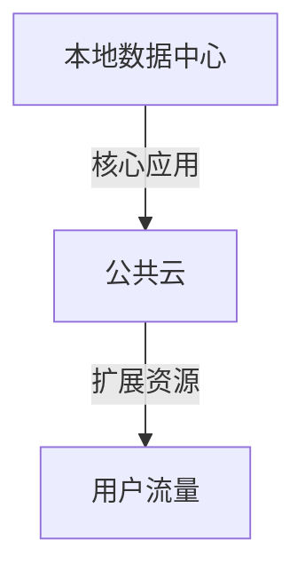

## 介绍

混合云是一种结合了本地基础设施和云服务的计算模式。它允许组织在本地数据中心和公共云之间灵活分配资源，以满足不同的业务需求。Debian作为一个稳定且广泛使用的Linux发行版，非常适合用于构建和管理混合云环境。

在本教程中，我们将探讨如何在Debian环境中管理混合云，包括如何配置本地和云资源、如何自动化部署以及如何监控和管理这些资源。

## 混合云的基本概念

混合云的核心思想是将本地基础设施与公共云服务结合起来。这种架构的主要优势包括：

- **灵活性**：可以根据需求动态调整资源。
- **成本效益**：只在需要时使用云资源，避免不必要的开支。
- **高可用性**：通过跨多个环境部署应用，提高系统的可用性。

## 配置本地和云资源

### 1. 本地资源管理

在Debian中，本地资源管理通常涉及使用虚拟化技术（如KVM或Docker）来创建和管理虚拟机或容器。以下是一个使用KVM创建虚拟机的示例：

```bash
sudo apt-get install qemu-kvm libvirt-daemon-system libvirt-clients bridge-utils virt-manager
sudo virsh net-start default
sudo virsh net-autostart default
```

### 2. 云资源管理

对于云资源管理，我们可以使用Terraform等工具来自动化云资源的创建和管理。以下是一个使用Terraform在AWS上创建EC2实例的示例：

```hcl
provider "aws" {
  region = "us-west-2"
}

resource "aws_instance" "example" {
  ami           = "ami-0c55b159cbfafe1f0"
  instance_type = "t2.micro"
}
```

## 自动化部署

自动化部署是混合云管理的关键。我们可以使用Ansible等工具来自动化本地和云资源的部署。以下是一个使用Ansible在Debian服务器上安装Nginx的示例：

```yaml
- hosts: all
  become: yes
  tasks:
    - name: Install Nginx
      apt:
        name: nginx
        state: present
```

## 监控和管理

监控和管理是确保混合云环境稳定运行的重要环节。我们可以使用Prometheus和Grafana来监控本地和云资源。以下是一个使用Prometheus监控本地服务器的示例：

```yaml
global:
  scrape_interval: 15s

scrape_configs:
  - job_name: 'node'
    static_configs:
      - targets: ['localhost:9100']
```

## 实际案例

假设我们有一个电子商务网站，需要在高峰期扩展计算资源。我们可以使用混合云架构，在本地部署核心应用，而在高峰期使用云资源来处理额外的流量。以下是一个简单的架构图：



## 总结

通过本教程，我们了解了如何在Debian环境中管理混合云。我们探讨了本地和云资源的配置、自动化部署以及监控和管理。混合云架构为组织提供了灵活性和成本效益，是现代IT基础设施的重要组成部分。

## 附加资源

- [Debian官方文档](https://www.debian.org/doc/)
- [Terraform官方文档](https://www.terraform.io/docs/)
- [Ansible官方文档](https://docs.ansible.com/)
- [Prometheus官方文档](https://prometheus.io/docs/)

## 练习

1. 使用KVM在Debian上创建一个虚拟机，并安装一个Web服务器。
2. 使用Terraform在AWS上创建一个EC2实例，并部署一个简单的应用。
3. 使用Ansible自动化在Debian服务器上安装和配置Nginx。
4. 使用Prometheus和Grafana监控本地服务器的性能。

通过这些练习，您将更深入地理解Debian混合云管理的各个方面。