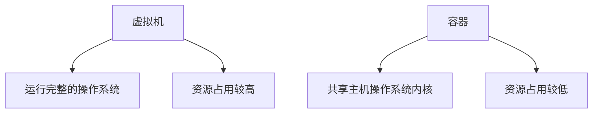

# Debian 容器技术

## 介绍

容器技术是一种轻量级的虚拟化技术，允许您将应用程序及其依赖项打包到一个独立的运行环境中。与传统的虚拟机不同，容器共享主机操作系统的内核，因此更加高效和快速。Debian 作为一款流行的 Linux 发行版，提供了强大的工具和生态系统来支持容器化技术。

本文将带您了解 Debian 容器技术的基础知识，包括如何创建、管理和使用容器，以及容器在实际应用中的场景。

---

## 容器与虚拟机的区别

在深入探讨容器技术之前，让我们先了解一下容器与虚拟机的区别。



- **虚拟机**：每个虚拟机都运行一个完整的操作系统，包括内核和用户空间。这种方式资源占用较高，启动时间较长。
- **容器**：容器共享主机操作系统的内核，仅包含应用程序及其依赖项。这种方式资源占用较低，启动时间更快。

---

## 容器技术的基础

### 1. 什么是容器？

容器是一个轻量级的、可移植的软件包，包含应用程序及其所有依赖项（如库、配置文件等）。容器可以在任何支持容器技术的环境中运行，确保应用程序在不同环境中的一致性。

### 2. 容器的核心组件

- **镜像（Image）**：容器的模板，包含运行应用程序所需的所有文件和配置。
- **容器（Container）**：镜像的运行实例。
- **容器引擎**：负责管理容器的创建、运行和销毁。常见的容器引擎包括 Docker 和 Podman。

---

## 在 Debian 上使用容器

### 1. 安装 Docker

Docker 是最流行的容器引擎之一。以下是在 Debian 上安装 Docker 的步骤：

```bash
# 更新软件包列表
sudo apt update

# 安装依赖包
sudo apt install -y apt-transport-https ca-certificates curl gnupg lsb-release

# 添加 Docker 的官方 GPG 密钥
curl -fsSL https://download.docker.com/linux/debian/gpg | sudo gpg --dearmor -o /usr/share/keyrings/docker-archive-keyring.gpg

# 添加 Docker 的软件源
echo "deb [arch=$(dpkg --print-architecture) signed-by=/usr/share/keyrings/docker-archive-keyring.gpg] https://download.docker.com/linux/debian $(lsb_release -cs) stable" | sudo tee /etc/apt/sources.list.d/docker.list > /dev/null

# 安装 Docker
sudo apt update
sudo apt install -y docker-ce docker-ce-cli containerd.io

# 启动 Docker 服务
sudo systemctl start docker

# 设置 Docker 开机自启
sudo systemctl enable docker
```

### 2. 运行第一个容器

安装 Docker 后，您可以运行一个简单的容器来测试是否安装成功。以下命令将运行一个基于 Debian 的容器，并启动一个交互式 shell：

```bash
sudo docker run -it debian bash
```

- `-it`：以交互模式运行容器，并分配一个终端。
- `debian`：使用的镜像名称。
- `bash`：在容器中运行的命令。

运行后，您将进入容器的 shell 环境。输入 `exit` 退出容器。

---

## 容器的实际应用场景

### 1. 开发环境隔离

容器可以帮助开发者在本地机器上创建与生产环境一致的开发环境，避免“在我机器上可以运行”的问题。

### 2. 持续集成与持续部署（CI/CD）

容器可以用于自动化测试和部署流程，确保每次代码更改都能在一致的环境中测试和发布。

### 3. 微服务架构

容器是微服务架构的理想选择，每个微服务可以打包为一个独立的容器，便于扩展和管理。

---

## 总结

容器技术为应用程序的部署和管理提供了一种高效、灵活的方式。通过本文，您已经了解了容器的基础知识、如何在 Debian 上使用 Docker 运行容器，以及容器的实际应用场景。

---

## 附加资源与练习

### 1. 附加资源
- [Docker 官方文档](https://docs.docker.com/)
- [Debian 容器化指南](https://wiki.debian.org/Container)

### 2. 练习
1. 尝试在 Debian 上安装 Docker 并运行一个基于 Ubuntu 的容器。
2. 创建一个自定义的 Docker 镜像，包含您常用的开发工具。
3. 使用 Docker Compose 部署一个包含多个容器的应用程序。

通过实践，您将更深入地掌握容器技术，并能够将其应用到实际项目中。