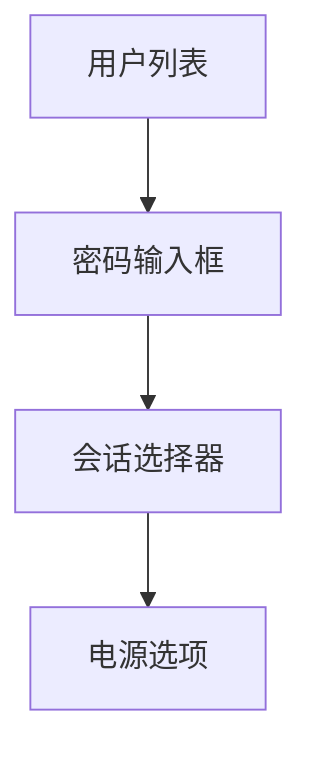

# Ubuntu 登录界面

Ubuntu登录界面是用户进入系统的第一步。它不仅是系统安全的屏障，还为用户提供了选择用户账户和输入密码的界面。本文将详细介绍Ubuntu登录界面的组成部分、登录流程以及一些常见问题的解决方法。

## 1. 登录界面的组成部分

Ubuntu登录界面通常由以下几个部分组成：

- **用户列表**：显示系统中所有可用的用户账户。
- **密码输入框**：用于输入用户密码。
- **会话选择器**：允许用户选择不同的桌面环境或会话类型（如GNOME、KDE等）。
- **电源选项**：提供关机、重启等系统操作。



## 2. 登录流程

### 2.1 选择用户

在登录界面，用户首先需要从用户列表中选择自己的账户。如果系统中只有一个用户账户，系统可能会自动选择该账户。

### 2.2 输入密码

选择用户后，系统会提示用户输入密码。密码输入框通常以星号（`*`）或圆点（`•`）隐藏输入的字符，以保护用户隐私。

### 2.3 选择会话类型

在输入密码之前或之后，用户可以选择不同的会话类型。例如，用户可以选择GNOME桌面环境或KDE桌面环境。选择会话类型后，系统会加载相应的桌面环境。

### 2.4 登录系统

输入正确的密码并选择会话类型后，系统会验证用户身份并加载桌面环境。如果密码错误，系统会提示用户重新输入密码。

## 3. 实际案例

### 3.1 多用户环境

在一个家庭或办公室环境中，多个用户可能共享同一台Ubuntu电脑。每个用户都有自己的账户和密码。登录界面允许每个用户选择自己的账户并输入密码，确保每个用户的隐私和数据安全。

### 3.2 远程登录

Ubuntu还支持远程登录。用户可以通过SSH或其他远程桌面协议登录到Ubuntu系统。远程登录的界面与本地登录界面类似，但需要通过网络进行身份验证。

## 4. 常见问题及解决方法

### 4.1 忘记密码

如果用户忘记了密码，可以通过以下步骤重置密码：

1. 重启系统并在启动时按住`Shift`键进入GRUB菜单。
2. 选择“恢复模式”（Recovery Mode）。
3. 选择“root”选项进入命令行界面。
4. 使用`passwd`命令重置密码。

```bash
passwd username
```

### 4.2 登录界面卡住

如果登录界面卡住或无法加载，可能是由于图形驱动问题或系统配置错误。可以尝试以下解决方法：

1. 重启系统并进入恢复模式。
2. 使用命令行界面登录并检查系统日志（`/var/log/Xorg.0.log`）以查找错误信息。
3. 更新或重新安装图形驱动程序。

## 5. 总结

Ubuntu登录界面是用户进入系统的第一步，它不仅提供了身份验证功能，还允许用户选择不同的会话类型。了解登录界面的组成部分和登录流程对于初学者来说非常重要。通过本文的介绍，希望您能够更好地理解和使用Ubuntu登录界面。

## 6. 附加资源

- [Ubuntu官方文档](https://help.ubuntu.com/)
- [Ubuntu社区论坛](https://ubuntuforums.org/)
- [Ubuntu Wiki](https://wiki.ubuntu.com/)

## 7. 练习

1. 尝试在Ubuntu系统中创建一个新用户，并使用新用户登录系统。
2. 尝试通过恢复模式重置一个用户的密码。
3. 探索不同的会话类型，并比较它们之间的差异。

希望这些练习能够帮助您更好地掌握Ubuntu登录界面的使用。