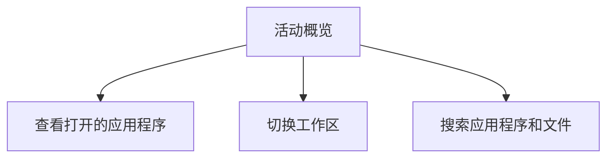

# Ubuntu 桌面组件

Ubuntu是一个基于Linux的开源操作系统，以其易用性和强大的功能而闻名。对于初学者来说，理解Ubuntu桌面环境的核心组件是掌握该系统的第一步。本文将详细介绍Ubuntu桌面的主要组件，帮助你快速上手并高效使用Ubuntu。

## 1. 桌面环境概述

Ubuntu默认使用GNOME桌面环境，这是一个现代化的、功能丰富的桌面环境。GNOME桌面环境由多个组件组成，每个组件都有其特定的功能。以下是Ubuntu桌面环境的主要组件：

- **桌面区域**：显示文件和文件夹的图标。
- **顶部栏**：包含系统菜单、应用程序菜单、通知区域和系统托盘。
- **活动概览**：显示所有打开的应用程序和工作区。
- **应用程序菜单**：用于启动和管理应用程序。
- **通知区域**：显示系统通知和状态信息。
- **系统设置**：用于配置系统偏好设置。

## 2. 桌面区域

桌面区域是用户与系统交互的主要界面。你可以在这里放置文件和文件夹的快捷方式，方便快速访问。默认情况下，Ubuntu桌面区域是空的，但你可以通过右键点击桌面来创建新文件夹、文档或快捷方式。

:::tip
你可以通过拖动文件到桌面区域来创建快捷方式，或者右键点击桌面并选择“新建文件夹”来创建新文件夹。
:::

## 3. 顶部栏

顶部栏位于屏幕的顶部，包含以下几个主要部分：

- **活动按钮**：点击此按钮可以进入活动概览，查看所有打开的应用程序和工作区。
- **应用程序菜单**：显示当前活动的应用程序名称和菜单选项。
- **系统菜单**：包含音量控制、网络设置、电源选项等系统功能。
- **通知区域**：显示系统通知、日历、时间等信息。

:::note
你可以通过点击顶部栏中的系统菜单来快速调整音量、连接Wi-Fi或关机。
:::

## 4. 活动概览

活动概览是GNOME桌面环境的核心功能之一。你可以通过点击顶部栏中的“活动”按钮或按下 `Super` 键（通常是Windows键）来进入活动概览。在活动概览中，你可以：

- 查看所有打开的应用程序。
- 切换到不同的工作区。
- 搜索应用程序、文件和设置。



## 5. 应用程序菜单

应用程序菜单是启动和管理应用程序的主要方式。你可以通过点击顶部栏中的“应用程序”按钮来打开应用程序菜单。在应用程序菜单中，你可以：

- 浏览已安装的应用程序。
- 搜索特定的应用程序。
- 将常用的应用程序添加到收藏夹。

:::caution
如果你找不到某个应用程序，可以尝试在应用程序菜单中使用搜索功能。
:::

## 6. 通知区域

通知区域位于顶部栏的右侧，显示系统通知、日历、时间等信息。你可以通过点击通知区域中的图标来查看详细通知或调整系统设置。

:::warning
如果系统通知过多，可能会导致通知区域变得混乱。你可以通过系统设置中的“通知”选项来管理通知的显示方式。
:::

## 7. 系统设置

系统设置是配置Ubuntu桌面环境的核心工具。你可以通过点击顶部栏中的系统菜单并选择“设置”来打开系统设置。在系统设置中，你可以：

- 调整显示设置。
- 配置网络连接。
- 管理用户账户。
- 设置隐私和安全选项。

```bash
# 示例：通过终端打开系统设置
gnome-control-center
```

## 8. 实际应用场景

假设你刚刚安装了Ubuntu，并且想要快速熟悉桌面环境。你可以按照以下步骤操作：

1. **创建桌面快捷方式**：右键点击桌面，选择“新建文件夹”，并命名为“工作”。
2. **启动应用程序**：点击顶部栏中的“应用程序”按钮，搜索并启动“终端”。
3. **管理通知**：点击通知区域中的日历图标，查看当天的日程安排。
4. **调整系统设置**：打开系统设置，调整显示分辨率和亮度。

## 9. 总结

通过本文，你已经了解了Ubuntu桌面环境的核心组件及其功能。掌握这些组件将帮助你更高效地使用Ubuntu操作系统。接下来，你可以尝试自定义桌面环境，或者探索更多高级功能。

## 10. 附加资源与练习

- **练习**：尝试在桌面区域创建一个新文件夹，并将其添加到收藏夹。
- **资源**：访问[Ubuntu官方文档](https://help.ubuntu.com)了解更多关于桌面环境的详细信息。

:::tip
如果你在操作过程中遇到问题，可以随时查阅Ubuntu官方文档或加入社区论坛寻求帮助。
:::