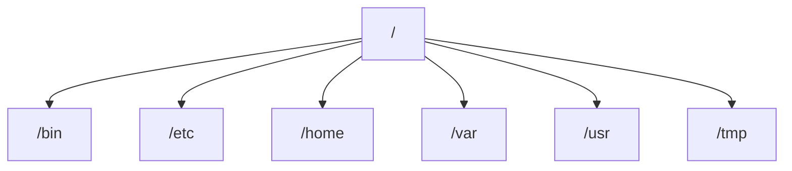

## 介绍

Ubuntu 文件系统是 Linux 操作系统中的一个核心组成部分，它定义了文件和目录的组织方式，并提供了对存储设备的管理。与 Windows 或 macOS 不同，Ubuntu 文件系统采用了一种层次化的目录结构，所有文件和目录都从根目录（`/`）开始。这种结构不仅高效，而且易于管理。

在本教程中，我们将深入探讨 Ubuntu 文件系统的基本概念、关键目录及其作用，并通过实际案例帮助您更好地理解如何在 Ubuntu 中管理和操作文件。

## Ubuntu 文件系统的基本结构

Ubuntu 文件系统采用树状结构，所有文件和目录都从根目录（`/`）开始。以下是一些关键目录及其作用：

- `/`：根目录，所有其他目录和文件的起点。
- `/bin`：包含系统启动和运行所需的基本命令（二进制文件）。
- `/etc`：包含系统配置文件。
- `/home`：用户的主目录，每个用户都有一个独立的子目录。
- `/var`：包含经常变化的文件，如日志文件。
- `/usr`：包含用户安装的应用程序和文件。
- `/tmp`：临时文件目录，系统重启后会被清空。

以下是一个简单的文件系统结构图：



## 关键目录详解

### 1. 根目录 (`/`)

根目录是文件系统的起点，所有其他目录和文件都从根目录开始。它是整个文件系统的基石。

### 2. `/bin` 目录

`/bin` 目录包含系统启动和运行所需的基本命令，例如 `ls`、`cp` 和 `mv`。这些命令对所有用户都可用。

```bash
# 示例：列出 /bin 目录中的文件
ls /bin
```

**输出：**
```
bash  cat  cp  ls  mv  ...
```

### 3. `/etc` 目录

`/etc` 目录包含系统配置文件。这些文件通常用于配置系统服务和应用程序。

```bash
# 示例：查看网络配置文件
cat /etc/network/interfaces
```

**输出：**
```
auto lo
iface lo inet loopback
```

### 4. `/home` 目录

`/home` 目录是用户的主目录。每个用户都有一个独立的子目录，用于存储个人文件和配置。

```bash
# 示例：查看当前用户的主目录
echo $HOME
```

**输出：**
```
/home/username
```

### 5. `/var` 目录

`/var` 目录包含经常变化的文件，如日志文件、数据库文件和邮件。

```bash
# 示例：查看系统日志
cat /var/log/syslog
```

**输出：**
```
Oct  1 12:34:56 ubuntu systemd[1]: Started Daily apt upgrade and clean activities.
```

### 6. `/usr` 目录

`/usr` 目录包含用户安装的应用程序和文件。它通常包含 `/usr/bin`（用户命令）、`/usr/lib`（库文件）和 `/usr/share`（共享数据）。

```bash
# 示例：查看已安装的应用程序
ls /usr/bin
```

**输出：**
```
python3  gcc  nano  ...
```

### 7. `/tmp` 目录

`/tmp` 目录用于存储临时文件。系统重启后，该目录中的文件会被清空。

```bash
# 示例：创建一个临时文件
echo "This is a temporary file" > /tmp/tempfile.txt
cat /tmp/tempfile.txt
```

**输出：**
```
This is a temporary file
```

## 实际案例

### 案例 1：查找文件

假设您需要查找系统中名为 `example.txt` 的文件，可以使用 `find` 命令：

```bash
find / -name example.txt
```

**输出：**
```
/home/username/example.txt
```

### 案例 2：备份重要文件

您可以使用 `cp` 命令将重要文件备份到另一个目录：

```bash
cp /home/username/important.txt /backup/important_backup.txt
```

**输出：**
```
# 无输出，表示文件已成功复制
```

## 总结

Ubuntu 文件系统是一个层次化的目录结构，所有文件和目录都从根目录（`/`）开始。通过了解关键目录及其作用，您可以更好地管理和操作文件。希望本教程能帮助您掌握 Ubuntu 文件系统的基本概念。

## 附加资源

- [Ubuntu 官方文档](https://ubuntu.com/documentation)
- [Linux 文件系统指南](https://www.linux.com/training-tutorials/linux-filesystem-explained/)
- [Linux 命令行教程](https://linuxcommand.org/)

## 练习

1. 使用 `ls` 命令列出 `/etc` 目录中的文件。
2. 在 `/tmp` 目录中创建一个临时文件，并在系统重启后检查该文件是否被删除。
3. 使用 `find` 命令查找系统中所有以 `.log` 结尾的文件。

祝您学习愉快！