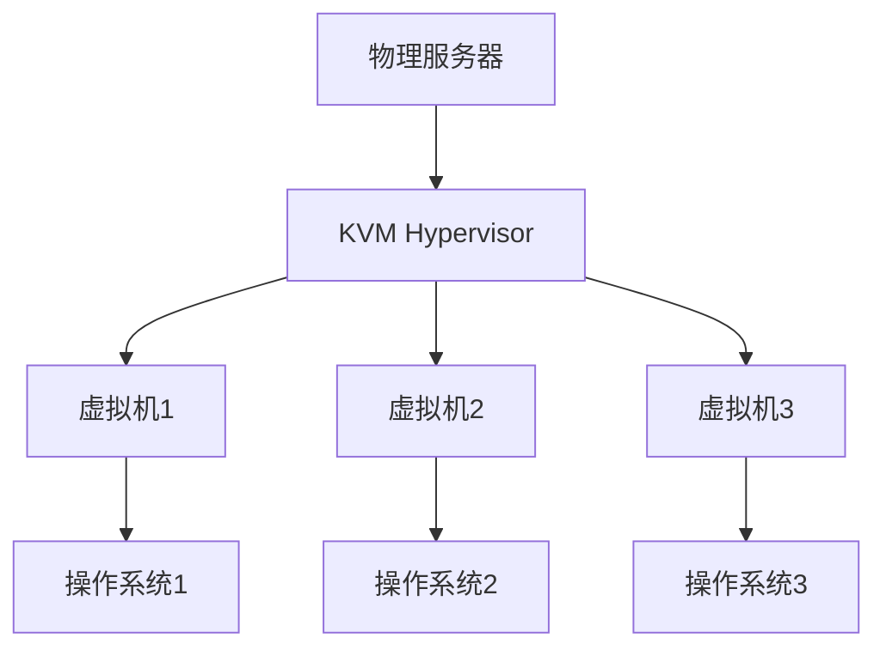

# Ubuntu 虚拟化概述

虚拟化技术是现代计算领域的重要基石之一。它允许我们在单台物理机器上运行多个独立的操作系统实例，从而提高资源利用率、降低成本并简化管理。Ubuntu作为一款流行的Linux发行版，提供了多种虚拟化解决方案，本文将为您全面介绍Ubuntu虚拟化的基本概念、技术原理及其实际应用。

## 什么是虚拟化？

虚拟化是一种将物理资源（如CPU、内存、存储和网络）抽象为虚拟资源的技术。通过虚拟化，我们可以在一台物理服务器上创建多个虚拟机（VM），每个虚拟机都可以运行独立的操作系统和应用程序。

:::note
虚拟化的核心思想是“隔离”和“共享”：隔离确保每个虚拟机独立运行，共享则最大化利用物理资源。
:::

## Ubuntu 虚拟化的主要技术

Ubuntu支持多种虚拟化技术，以下是几种常见的虚拟化方案：

1. **KVM（Kernel-based Virtual Machine）**  
   KVM是Linux内核的一部分，允许将Linux内核直接转换为虚拟机监控程序（Hypervisor）。它支持硬件虚拟化扩展（如Intel VT-x和AMD-V），能够高效地运行虚拟机。

2. **QEMU**  
   QEMU是一个开源的硬件模拟器，可以与KVM结合使用，提供完整的虚拟化解决方案。QEMU负责模拟硬件设备，而KVM负责加速虚拟机的执行。

3. **LXC/LXD**  
   LXC（Linux Containers）是一种操作系统级虚拟化技术，允许在单个Linux内核上运行多个隔离的用户空间实例。LXD是LXC的扩展，提供了更友好的管理界面。

4. **Docker**  
   虽然Docker通常被视为容器技术，但它也可以用于轻量级虚拟化。Docker通过共享主机内核来实现高效的资源利用。

## 虚拟化的实际应用场景

虚拟化技术在实际中有广泛的应用，以下是一些常见的场景：

1. **服务器整合**  
   通过虚拟化，企业可以将多台物理服务器整合到一台高性能服务器上，从而降低硬件成本和能源消耗。

2. **开发和测试环境**  
   开发者可以使用虚拟机创建多个独立的开发和测试环境，避免不同项目之间的冲突。

3. **云计算**  
   虚拟化是云计算的基础技术之一。云服务提供商通过虚拟化技术为用户提供弹性计算资源。

4. **灾难恢复**  
   虚拟机可以轻松备份和迁移，因此在灾难恢复中具有重要作用。

## 代码示例：使用KVM创建虚拟机

以下是一个简单的示例，展示如何在Ubuntu上使用KVM和QEMU创建虚拟机。

1. 安装KVM和QEMU：
   ```bash
   sudo apt update
   sudo apt install qemu-kvm libvirt-daemon-system libvirt-clients bridge-utils virt-manager
   ```

2. 启动虚拟机：
   ```bash
   sudo virt-install --name my-vm --ram 2048 --vcpus 2 --disk path=/var/lib/libvirt/images/my-vm.qcow2,size=10 --cdrom /path/to/ubuntu.iso --os-variant ubuntu20.04
   ```

3. 使用Virt-Manager管理虚拟机：
   ```bash
   sudo virt-manager
   ```

:::tip
如果您是初学者，建议使用Virt-Manager图形界面来管理虚拟机，它提供了直观的操作方式。
:::

## 虚拟化架构图

以下是一个简单的虚拟化架构图，展示了KVM和QEMU如何协同工作：



## 总结

虚拟化技术是Ubuntu生态系统中的重要组成部分，它通过隔离和共享物理资源，为用户提供了灵活、高效的解决方案。无论是服务器整合、开发测试，还是云计算和灾难恢复，虚拟化都发挥着关键作用。

## 附加资源与练习

- **官方文档**：  
  [KVM官方文档](https://www.linux-kvm.org/page/Main_Page)  
  [QEMU官方文档](https://www.qemu.org/docs/master/)  
  [LXD官方文档](https://linuxcontainers.org/lxd/docs/master/)

- **练习**：  
  1. 在Ubuntu上安装KVM并创建一个虚拟机。  
  2. 使用Virt-Manager管理虚拟机，尝试启动、停止和删除虚拟机。  
  3. 探索LXC/LXD技术，创建一个容器并运行一个简单的应用程序。

通过本文的学习，您应该对Ubuntu虚拟化技术有了初步的了解。接下来，您可以深入探索具体的虚拟化工具和技术，进一步提升您的技能！