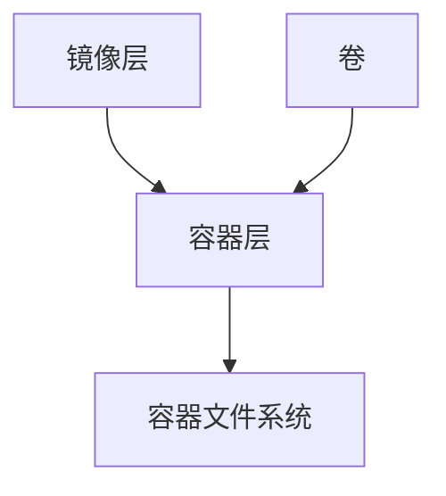

# Ubuntu 容器存储

容器技术在现代软件开发中扮演着重要角色，而容器存储则是容器运行和管理的关键部分。本文将详细介绍 Ubuntu 容器存储的概念、工作原理以及如何在实际场景中使用它。

## 什么是容器存储？

容器存储是指容器运行时使用的存储资源。与虚拟机不同，容器共享宿主机的操作系统内核，但它们需要独立的文件系统来存储应用程序及其依赖项。容器存储通常包括镜像层、容器层和卷（Volumes）。

### 镜像层
镜像是容器的只读模板，包含运行应用程序所需的所有文件和依赖项。镜像层是分层存储的基础，每一层都是只读的，多个容器可以共享相同的镜像层。

### 容器层
容器层是镜像之上的可写层，用于存储容器运行时的所有更改。当容器启动时，会在镜像层之上创建一个新的可写层，所有对文件系统的修改都保存在这一层。

### 卷（Volumes）
卷是持久化存储的一种方式，用于在容器之间共享数据或持久化数据。卷独立于容器的生命周期，即使容器被删除，卷中的数据仍然保留。

## 容器存储的工作原理

容器存储的核心是联合文件系统（Union File System，如 OverlayFS）。联合文件系统允许将多个文件系统层叠加在一起，形成一个统一的文件系统视图。



在上图中，镜像层是只读的，容器层是可写的，卷则提供了持久化存储的能力。容器运行时，文件系统的视图是这三者的叠加。

## 实际应用场景

### 场景 1：持久化数据库数据
假设你正在运行一个 MySQL 容器，并且希望数据库数据在容器重启后仍然保留。你可以使用卷来存储数据库文件。

```bash
docker run -d --name mysql-container -v /path/to/host/dir:/var/lib/mysql mysql
```

在这个例子中，`/path/to/host/dir` 是宿主机上的目录，`/var/lib/mysql` 是容器内的数据库存储路径。即使容器被删除，数据仍然保存在宿主机上。

### 场景 2：共享配置文件
假设你有多个容器需要共享同一个配置文件，你可以使用卷来实现。

```bash
docker run -d --name container1 -v /path/to/config:/app/config my-app
docker run -d --name container2 -v /path/to/config:/app/config my-app
```

在这个例子中，`/path/to/config` 是宿主机上的配置文件目录，`/app/config` 是容器内的配置文件路径。多个容器可以共享同一个配置文件。

## 总结

Ubuntu 容器存储是容器技术中不可或缺的一部分。通过理解镜像层、容器层和卷的概念，你可以更好地管理和优化容器的存储资源。在实际应用中，卷的使用尤为重要，它可以帮助你实现数据的持久化和共享。

## 附加资源

- [Docker 官方文档](https://docs.docker.com/storage/)
- [OverlayFS 文档](https://www.kernel.org/doc/html/latest/filesystems/overlayfs.html)

## 练习

1. 创建一个 MySQL 容器，并使用卷来持久化数据库数据。
2. 尝试在多个容器之间共享同一个配置文件，并观察其效果。

:::tip
如果你在练习中遇到问题，可以参考 Docker 官方文档或社区论坛获取帮助。
:::