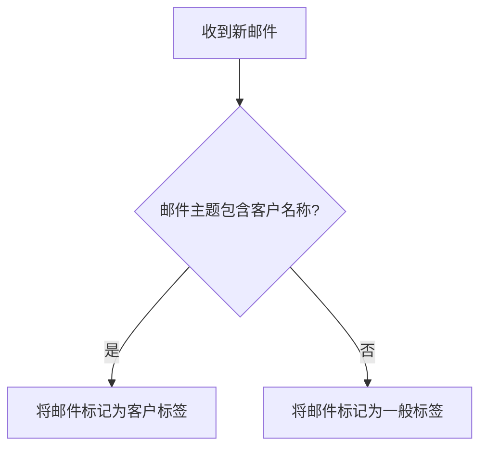

# Ubuntu 电子邮件

在Ubuntu桌面环境中，电子邮件是日常工作和沟通的重要工具。无论是个人使用还是企业环境，Ubuntu都提供了多种电子邮件客户端来满足不同的需求。本文将介绍如何在Ubuntu中设置和使用电子邮件客户端，管理邮件账户，以及处理日常邮件任务。

## 介绍

Ubuntu支持多种电子邮件客户端，如Thunderbird、Evolution和Geary等。这些客户端可以帮助你轻松地管理多个电子邮件账户，发送和接收邮件，以及组织你的收件箱。

### 选择合适的电子邮件客户端

在选择电子邮件客户端时，需要考虑以下因素：

- **功能需求**：是否需要日历、任务管理等功能？
- **用户界面**：是否喜欢简洁的界面还是功能丰富的界面？
- **兼容性**：是否支持你的邮件服务提供商（如Gmail、Outlook等）？

## 设置电子邮件客户端

以Thunderbird为例，以下是设置电子邮件客户端的步骤：

1. **安装Thunderbird**：
   ```bash
   sudo apt-get install thunderbird
   ```

2. **启动Thunderbird**：
   在Ubuntu应用程序菜单中搜索并启动Thunderbird。

3. **添加电子邮件账户**：
   - 启动Thunderbird后，点击“电子邮件”选项。
   - 输入你的姓名、电子邮件地址和密码。
   - Thunderbird会自动检测邮件服务器的设置，如果检测失败，可以手动配置。

4. **手动配置邮件服务器**：
   - 选择“手动配置”。
   - 输入接收和发送服务器的详细信息（如IMAP/POP3和SMTP服务器地址）。

## 使用电子邮件客户端

### 发送和接收邮件

- **发送邮件**：点击“撰写”按钮，填写收件人、主题和内容，然后点击“发送”。
- **接收邮件**：Thunderbird会自动检查新邮件，你也可以手动点击“获取邮件”按钮。

### 管理邮件

- **创建文件夹**：右键点击邮箱账户，选择“新建文件夹”来组织邮件。
- **过滤邮件**：使用过滤器自动将邮件分类到不同的文件夹。

## 实际案例

假设你是一名自由职业者，需要管理多个客户的项目邮件。你可以使用Thunderbird的标签和过滤器功能，为每个客户创建一个标签，并设置过滤器将相关邮件自动分类到对应的标签下。



## 总结

通过本文，你应该已经了解了如何在Ubuntu桌面环境中设置和使用电子邮件客户端。选择合适的客户端，配置邮件账户，并利用客户端的功能来高效管理你的邮件。

## 附加资源

- [Thunderbird官方文档](https://support.mozilla.org/en-US/products/thunderbird)
- [Ubuntu桌面指南](https://help.ubuntu.com/stable/ubuntu-help/index.html)

## 练习

1. 在Ubuntu上安装Thunderbird，并配置你的电子邮件账户。
2. 创建一个过滤器，将来自特定发件人的邮件自动移动到指定文件夹。
3. 尝试使用不同的电子邮件客户端，比较它们的功能和用户体验。

希望这些内容能帮助你在Ubuntu上更好地管理电子邮件！