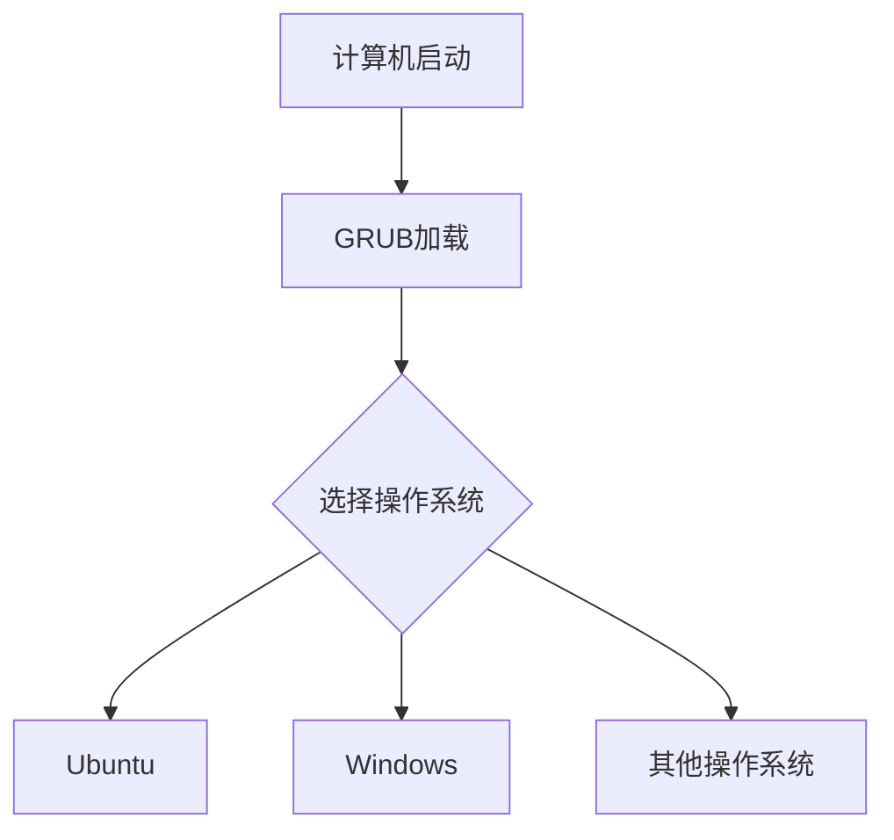

# Ubuntu 多系统引导

## 介绍

在计算机上安装多个操作系统（如Ubuntu、Windows、macOS等）时，**多系统引导**是一个关键概念。它允许你在启动计算机时选择要运行的操作系统。Ubuntu使用**GRUB（GRand Unified Bootloader）**作为默认的引导加载程序，它能够管理多个操作系统的引导。

本文将逐步讲解如何在Ubuntu中配置和管理多系统引导，适合初学者学习和实践。

---

## 什么是GRUB？

GRUB是一个功能强大的引导加载程序，负责在计算机启动时加载操作系统。它支持多系统引导，允许用户选择不同的操作系统或内核版本。GRUB的配置文件通常位于 `/boot/grub/grub.cfg`，但直接编辑此文件并不推荐，因为它是自动生成的。

:::tip
GRUB的配置文件通常通过 `/etc/default/grub` 和 `/etc/grub.d/` 目录中的文件进行自定义。
:::

---

## 多系统引导的基本原理

当你在计算机上安装多个操作系统时，每个操作系统都会在硬盘上创建一个**引导分区**。GRUB会扫描这些分区，并将它们添加到引导菜单中。启动时，GRUB会显示一个菜单，允许你选择要启动的操作系统。



---

## 配置GRUB以支持多系统引导

### 1. 安装GRUB

如果你已经安装了Ubuntu，GRUB通常会自动安装并配置。如果没有，可以通过以下命令安装：

```bash
sudo apt update
sudo apt install grub2
```

### 2. 更新GRUB配置

在安装新的操作系统或修改引导配置后，需要更新GRUB以识别这些更改。使用以下命令：

```bash
sudo update-grub
```

该命令会扫描所有硬盘分区，并将检测到的操作系统添加到GRUB菜单中。

:::note
如果你安装了Windows或其他操作系统，`update-grub` 命令会自动将它们添加到引导菜单中。
:::

### 3. 自定义GRUB菜单

你可以通过编辑 `/etc/default/grub` 文件来自定义GRUB菜单。例如，修改默认启动项或调整菜单显示时间：

```bash
GRUB_DEFAULT=0
GRUB_TIMEOUT=10
```

- `GRUB_DEFAULT`：设置默认启动项（0表示第一个菜单项）。
- `GRUB_TIMEOUT`：设置菜单显示时间（单位为秒）。

修改后，运行以下命令使更改生效：

```bash
sudo update-grub
```

---

## 实际案例：Ubuntu与Windows双系统引导

假设你已经在计算机上安装了Windows，现在想要安装Ubuntu并实现双系统引导。以下是具体步骤：

1. **安装Ubuntu**：在安装过程中，选择“与Windows共存”选项，Ubuntu会自动配置GRUB以支持双系统引导。
2. **启动计算机**：启动时，GRUB菜单会显示Ubuntu和Windows选项。
3. **选择操作系统**：使用方向键选择要启动的操作系统，然后按回车键。

:::caution
如果在安装Ubuntu后没有看到Windows选项，可以尝试运行 `sudo update-grub` 命令重新扫描操作系统。
:::

---

## 常见问题与解决方案

### 1. GRUB菜单未显示

如果启动时直接进入某个操作系统而没有显示GRUB菜单，可能是GRUB配置问题。可以通过以下步骤解决：

- 启动时按住 `Shift` 键（BIOS系统）或 `Esc` 键（UEFI系统）以强制显示GRUB菜单。
- 检查 `/etc/default/grub` 文件中的 `GRUB_TIMEOUT` 值，确保不为0。

### 2. Windows未出现在GRUB菜单中

如果Windows未出现在GRUB菜单中，可以尝试以下方法：

1. 运行 `sudo update-grub` 重新扫描操作系统。
2. 检查Windows的引导分区是否正常。

---

## 总结

多系统引导是管理多个操作系统的关键工具，而GRUB是Ubuntu中实现这一功能的强大工具。通过本文的学习，你应该能够：

- 理解GRUB的基本原理。
- 配置和更新GRUB以支持多系统引导。
- 解决常见的引导问题。

---

## 附加资源与练习

### 附加资源
- [GRUB官方文档](https://www.gnu.org/software/grub/manual/grub/)
- [Ubuntu Wiki - GRUB](https://wiki.ubuntu.com/Grub2)

### 练习
1. 在你的计算机上安装Ubuntu和另一个操作系统（如Windows），并配置双系统引导。
2. 尝试自定义GRUB菜单，修改默认启动项和菜单显示时间。
3. 研究如何通过GRUB命令行手动引导操作系统。

通过实践，你将更深入地理解多系统引导的工作原理和配置方法。祝你学习愉快！