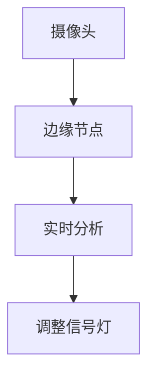

# Ubuntu 边缘计算

## 介绍

边缘计算是一种分布式计算范式，它将数据处理和存储从中心化的云端转移到靠近数据源的边缘设备上。这种架构可以减少延迟、提高响应速度，并降低带宽需求。Ubuntu 作为一个广泛使用的开源操作系统，为边缘计算提供了强大的支持。本文将带你了解 Ubuntu 边缘计算的基本概念、应用场景以及如何在实际项目中实现它。

## 什么是边缘计算？

边缘计算的核心思想是将计算资源尽可能地靠近数据生成的地方。与传统的云计算不同，边缘计算不需要将所有数据都发送到远程数据中心进行处理，而是在本地或附近的边缘节点上进行处理。这种方式特别适合需要低延迟和高带宽的应用场景，如物联网（IoT）、自动驾驶和实时视频分析。

## Ubuntu 在边缘计算中的优势

Ubuntu 是一个轻量级、灵活且高度可定制的操作系统，非常适合边缘计算环境。以下是 Ubuntu 在边缘计算中的一些优势：

- **轻量级**：Ubuntu Core 是一个专为物联网和边缘设备设计的轻量级版本，占用资源少，启动速度快。
- **安全性**：Ubuntu 提供了强大的安全功能，如 AppArmor 和 Snap 包管理系统，确保边缘设备的安全性。
- **社区支持**：Ubuntu 拥有庞大的开发者社区，提供了丰富的文档和支持资源。

## 实现 Ubuntu 边缘计算的步骤

### 1. 安装 Ubuntu Core

Ubuntu Core 是专为边缘设备设计的 Ubuntu 版本。你可以通过以下步骤在设备上安装 Ubuntu Core：

```bash
sudo snap install ubuntu-core
```

### 2. 配置边缘节点

在安装 Ubuntu Core 后，你需要配置边缘节点以连接到你的网络。你可以使用 `netplan` 工具来配置网络设置：

```yaml
network:
  version: 2
  ethernets:
    eth0:
      dhcp4: true
```

将上述配置保存为 `/etc/netplan/01-netcfg.yaml`，然后应用配置：

```bash
sudo netplan apply
```

### 3. 部署边缘应用

在边缘节点上，你可以部署各种应用程序来处理数据。例如，你可以使用 Docker 来部署一个简单的 Python 应用：

```bash
sudo docker run -d --name edge-app python:3.9-slim python -m http.server 8080
```

### 4. 监控和管理

Ubuntu 提供了多种工具来监控和管理边缘设备。你可以使用 `snapd` 来管理 Snap 包，使用 `systemd` 来管理服务：

```bash
sudo systemctl status snapd
```

## 实际案例：智能交通系统

假设你正在开发一个智能交通系统，该系统需要在路口实时分析交通流量并调整信号灯。使用 Ubuntu 边缘计算，你可以在每个路口部署一个边缘节点，实时处理摄像头数据并做出决策。



在这个案例中，边缘节点负责处理摄像头数据，减少了将数据发送到云端的需求，从而降低了延迟并提高了系统的响应速度。

## 总结

Ubuntu 边缘计算为物联网和实时应用提供了强大的支持。通过将计算资源靠近数据源，边缘计算可以显著降低延迟、提高响应速度，并减少带宽需求。本文介绍了 Ubuntu 边缘计算的基本概念、实现步骤以及一个实际应用案例。希望这些内容能帮助你更好地理解和应用 Ubuntu 边缘计算。

## 附加资源

- [Ubuntu Core 官方文档](https://ubuntu.com/core/docs)
- [边缘计算入门指南](https://www.redhat.com/en/topics/edge-computing)
- [Docker 官方文档](https://docs.docker.com/)

## 练习

1. 在你的设备上安装 Ubuntu Core 并配置网络。
2. 使用 Docker 部署一个简单的 Python 应用，并在边缘节点上运行。
3. 尝试使用 `systemd` 管理你的边缘应用。

:::tip
如果你在安装或配置过程中遇到问题，可以参考 Ubuntu 官方文档或社区论坛获取帮助。
:::