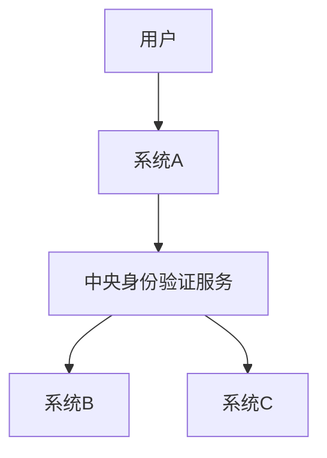

# Ubuntu 单点登录

## 介绍

单点登录（Single Sign-On，简称SSO）是一种身份验证机制，允许用户使用一组凭据（如用户名和密码）登录多个系统或服务。在Ubuntu中，SSO可以帮助用户简化登录流程，减少重复输入凭据的麻烦，同时提高系统的安全性。

本文将逐步介绍如何在Ubuntu中配置和使用SSO，并通过实际案例展示其应用场景。

## 单点登录的工作原理

SSO的核心思想是通过一个中央身份验证服务（如LDAP或OAuth）来管理用户的身份验证。当用户登录到一个系统时，该系统会向中央身份验证服务请求验证。如果验证成功，用户将获得一个令牌（token），该令牌可以用于访问其他系统或服务，而无需再次输入凭据。



## 在Ubuntu中配置SSO

### 1. 安装必要的软件包

首先，我们需要安装一些必要的软件包来支持SSO功能。打开终端并运行以下命令：

```bash
sudo apt-get update
sudo apt-get install libpam-sss sssd sssd-tools
```

### 2. 配置SSSD（System Security Services Daemon）

SSSD是一个守护进程，用于管理用户身份验证和授权。我们需要编辑SSSD的配置文件 `/etc/sssd/sssd.conf`：

```bash
sudo nano /etc/sssd/sssd.conf
```

在文件中添加以下内容：

```ini
[sssd]
config_file_version = 2
services = nss, pam
domains = example.com

[domain/example.com]
id_provider = ldap
auth_provider = ldap
ldap_uri = ldap://ldap.example.com
ldap_search_base = dc=example,dc=com
ldap_user_search_base = ou=People,dc=example,dc=com
ldap_group_search_base = ou=Groups,dc=example,dc=com
ldap_default_bind_dn = cn=admin,dc=example,dc=com
ldap_default_authtok = password
```

:::note
请将 `example.com` 替换为你的实际域名，并根据你的LDAP服务器配置调整其他参数。
:::

### 3. 配置PAM（Pluggable Authentication Modules）

PAM是Linux系统中用于管理用户身份验证的模块。我们需要编辑PAM配置文件 `/etc/pam.d/common-session`：

```bash
sudo nano /etc/pam.d/common-session
```

在文件末尾添加以下内容：

```bash
session required pam_mkhomedir.so skel=/etc/skel umask=0022
```

这将确保在用户首次登录时自动创建其主目录。

### 4. 重启SSSD服务

完成配置后，重启SSSD服务以应用更改：

```bash
sudo systemctl restart sssd
```

## 实际案例

假设你有一个公司内部网络，包含多个Ubuntu服务器和应用程序。通过配置SSO，员工只需登录一次即可访问所有系统和应用，而无需为每个系统单独输入凭据。

例如，员工可以使用他们的LDAP凭据登录到公司的Wiki系统、邮件系统和文件共享系统，而无需多次输入用户名和密码。

## 总结

单点登录（SSO）是一种强大的身份验证机制，可以简化用户的登录流程并提高系统的安全性。通过在Ubuntu中配置SSSD和PAM，你可以轻松实现SSO功能，并为用户提供无缝的登录体验。

## 附加资源

- [SSSD官方文档](https://sssd.io/)
- [PAM官方文档](http://www.linux-pam.org/)
- [LDAP入门指南](https://www.openldap.org/doc/)

## 练习

1. 尝试在你的Ubuntu系统中配置SSO，并使用LDAP服务器进行身份验证。
2. 探索其他身份验证提供程序（如OAuth）并尝试将其集成到SSO配置中。
3. 研究如何在多台Ubuntu服务器之间共享SSO配置，以实现跨系统的单点登录。

通过完成这些练习，你将更深入地理解SSO的工作原理，并能够在实际项目中应用这些知识。