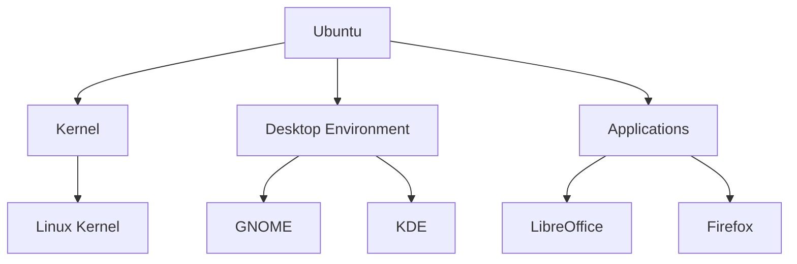

# Ubuntu 开源贡献

Ubuntu 是一个基于 Linux 的开源操作系统，由全球社区共同开发和维护。作为开源项目，Ubuntu 的成功离不开全球开发者的贡献。无论你是编程新手还是经验丰富的开发者，都可以通过多种方式为 Ubuntu 做出贡献。本文将为你详细介绍如何开始你的 Ubuntu 开源贡献之旅。

## 什么是开源贡献？

开源贡献是指个人或团队为开源项目提供代码、文档、设计、测试等资源的行为。开源项目的核心思想是“开放协作”，任何人都可以查看、修改和分发项目的源代码。通过贡献，你不仅可以提升自己的技能，还能为全球社区带来价值。

## 为什么为 Ubuntu 做贡献？

- **学习机会**：通过参与实际项目，你可以学习到最新的技术和最佳实践。
- **社区支持**：Ubuntu 拥有一个活跃的社区，你可以在其中获得帮助和支持。
- **职业发展**：开源贡献是展示你技能的好机会，有助于提升你的职业前景。
- **回馈社区**：通过贡献，你可以帮助改进 Ubuntu，使其对所有人更加友好和强大。

## 如何开始贡献？

### 1. 了解 Ubuntu 项目结构

Ubuntu 由多个子项目组成，包括内核、桌面环境、应用程序等。你可以选择你感兴趣的领域进行贡献。



### 2. 设置开发环境

在开始贡献之前，你需要设置一个适合的开发环境。以下是一个简单的步骤：

1. **安装 Ubuntu**：如果你还没有安装 Ubuntu，可以从 [Ubuntu 官方网站](https://ubuntu.com/download) 下载并安装。
2. **安装必要的工具**：使用以下命令安装 Git 和 Build Essential 工具：

   ```bash
   sudo apt update
   sudo apt install git build-essential
   ```

3. **克隆 Ubuntu 仓库**：选择一个你感兴趣的仓库并克隆它：

   ```bash
   git clone https://github.com/ubuntu/example-repo.git
   ```

### 3. 寻找贡献机会

Ubuntu 社区提供了多种贡献机会，包括：

- **代码贡献**：修复 bug、添加新功能。
- **文档贡献**：编写或改进文档。
- **翻译**：将文档或界面翻译成其他语言。
- **测试**：参与测试，报告 bug。

你可以通过 [Ubuntu 社区贡献指南](https://wiki.ubuntu.com/Contribute) 找到更多信息。

### 4. 提交你的第一个贡献

假设你发现了一个小 bug 并想修复它，以下是一个简单的流程：

1. **创建分支**：在本地仓库中创建一个新分支：

   ```bash
   git checkout -b fix-bug-123
   ```

2. **修改代码**：修复 bug 并保存更改。

3. **提交更改**：将更改提交到本地仓库：

   ```bash
   git add .
   git commit -m "Fix bug 123"
   ```

4. **推送更改**：将更改推送到远程仓库：

   ```bash
   git push origin fix-bug-123
   ```

5. **创建 Pull Request**：在 GitHub 上创建一个 Pull Request，等待社区审核。

:::tip
在提交 Pull Request 之前，确保你的代码符合项目的编码规范，并且通过了所有测试。
:::

## 实际案例

### 案例：修复文档中的拼写错误

假设你在阅读 Ubuntu 文档时发现了一个拼写错误，以下是修复步骤：

1. **克隆文档仓库**：

   ```bash
   git clone https://github.com/ubuntu/docs.git
   ```

2. **创建分支**：

   ```bash
   git checkout -b fix-spelling-error
   ```

3. **修改文档**：找到并修复拼写错误。

4. **提交更改**：

   ```bash
   git add .
   git commit -m "Fix spelling error in documentation"
   ```

5. **推送更改**：

   ```bash
   git push origin fix-spelling-error
   ```

6. **创建 Pull Request**：在 GitHub 上创建 Pull Request，等待审核。

:::note
即使是一个小小的拼写错误修复，也是对社区的宝贵贡献。
:::

## 总结

通过本文，你已经了解了如何开始为 Ubuntu 开源项目做出贡献。无论你是通过代码、文档还是其他方式，你的贡献都将对 Ubuntu 社区产生积极影响。记住，开源贡献是一个持续学习和成长的过程，不要害怕犯错，社区会帮助你不断进步。

## 附加资源与练习

- **Ubuntu 社区贡献指南**：[https://wiki.ubuntu.com/Contribute](https://wiki.ubuntu.com/Contribute)
- **GitHub 上的 Ubuntu 项目**：[https://github.com/ubuntu](https://github.com/ubuntu)
- **练习**：尝试在 Ubuntu 文档中找到一个拼写错误并提交修复。

:::caution
在贡献之前，请确保你已经阅读并理解了项目的贡献指南和代码规范。
:::