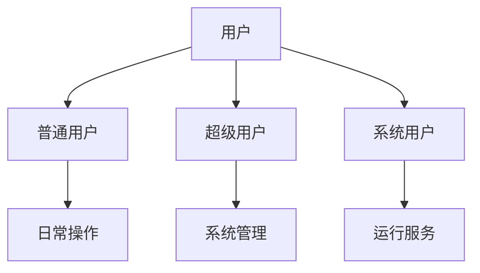

# Ubuntu 用户概念

在Ubuntu操作系统中，用户管理是系统管理的重要组成部分。无论是个人电脑还是服务器，理解用户的概念及其管理方式都是至关重要的。本文将详细介绍Ubuntu中的用户概念，帮助你快速掌握用户管理的基础知识。

## 什么是Ubuntu用户？

在Ubuntu中，**用户**是指能够登录系统并使用系统资源的个体或程序。每个用户都有一个唯一的用户名和用户ID（UID），用于标识和区分不同的用户。用户可以是人类用户，也可以是系统服务或应用程序。

### 用户类型

在Ubuntu中，用户主要分为以下几类：

1. **普通用户**：这是最常见的用户类型，通常用于日常操作。普通用户对系统资源的访问权限有限，只能访问自己的文件和目录。
2. **超级用户（root）**：超级用户拥有系统的最高权限，可以执行任何操作，包括修改系统文件和配置。root用户的UID为0。
3. **系统用户**：这些用户通常用于运行系统服务或后台进程，不用于登录系统。系统用户的UID通常小于1000。

:::note
在Ubuntu中，默认情况下，root用户是被禁用的，普通用户可以通过`sudo`命令临时获得超级用户权限。
:::

## 用户管理的基本命令

Ubuntu提供了一系列命令来管理用户。以下是一些常用的命令：

### 1. 创建用户

使用`adduser`命令可以创建一个新用户。例如，创建一个名为`john`的用户：

```bash
sudo adduser john
```

系统会提示你设置密码和其他信息。创建完成后，`john`用户将被添加到系统中。

### 2. 删除用户

使用`deluser`命令可以删除一个用户。例如，删除`john`用户：

```bash
sudo deluser john
```

:::caution
删除用户时，默认不会删除用户的主目录。如果需要删除主目录，可以使用`--remove-home`选项。
:::

### 3. 修改用户信息

使用`usermod`命令可以修改用户的属性。例如，将`john`用户添加到`sudo`组：

```bash
sudo usermod -aG sudo john
```

### 4. 查看用户信息

使用`id`命令可以查看用户的UID、GID（组ID）以及所属的组：

```bash
id john
```

输出示例：

```bash
uid=1001(john) gid=1001(john) groups=1001(john),27(sudo)
```

## 实际应用场景

### 1. 多用户环境

在一个多用户环境中，每个用户都有自己的账户和权限。例如，在一个家庭中，父母和孩子可以分别拥有自己的账户，父母可以限制孩子对某些系统资源的访问。

### 2. 服务器管理

在服务器管理中，通常会有多个系统用户用于运行不同的服务。例如，`www-data`用户用于运行Web服务器，`mysql`用户用于运行数据库服务。

### 3. 权限管理

通过用户和组的权限管理，可以有效地控制用户对系统资源的访问。例如，你可以创建一个`developers`组，并将所有开发人员添加到该组中，然后为该组设置特定的文件访问权限。

## 总结

Ubuntu中的用户管理是系统管理的基础。通过理解用户的概念和掌握基本的用户管理命令，你可以更好地管理和维护Ubuntu系统。无论是个人电脑还是服务器，合理的用户管理都能提高系统的安全性和效率。

## 附加资源与练习

- **练习1**：创建一个新用户`alice`，并将其添加到`sudo`组。
- **练习2**：删除用户`alice`，并删除其主目录。
- **附加资源**：阅读`man`手册页，了解更多关于`adduser`、`deluser`和`usermod`命令的详细信息。



通过以上内容，你应该对Ubuntu中的用户概念有了一个全面的了解。继续深入学习用户管理，你将能够更好地掌握Ubuntu系统的管理技能。