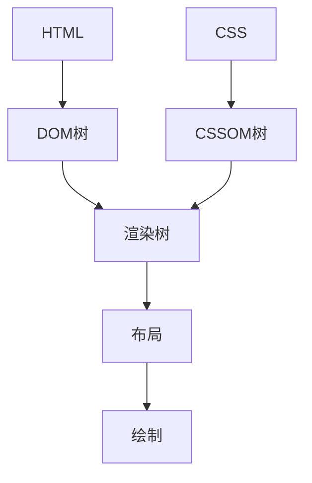

# CSS 如何工作

CSS（层叠样式表）是一种用于描述HTML文档外观和格式的语言。它允许开发者控制网页的布局、颜色、字体等视觉表现。本文将带你了解CSS的基本工作原理，以及它如何与HTML结合，最终在浏览器中呈现出来。

## CSS 与HTML的关系

CSS与HTML是紧密相关的。HTML负责定义网页的结构和内容，而CSS则负责定义这些内容的外观。CSS通过选择器（Selectors）来匹配HTML元素，并通过样式规则（Rules）来定义这些元素的样式。

### 示例：HTML与CSS的结合

以下是一个简单的HTML文档示例：

```html
<!DOCTYPE html>
<html>
<head>
    <title>我的网页</title>
    <link rel="stylesheet" href="styles.css" />
</head>
<body>
    <h1>欢迎来到我的网页</h1>
    <p>这是一个段落。</p>
</body>
</html>
```

在`styles.css`文件中，我们可以定义CSS样式：

```css
h1 {
    color: blue;
    font-size: 24px;
}

p {
    color: green;
    font-size: 16px;
}
```

在这个例子中，`h1`元素被设置为蓝色、24像素的字体大小，而`p`元素被设置为绿色、16像素的字体大小。

## 浏览器如何解析CSS

当浏览器加载一个网页时，它会按照以下步骤解析和应用CSS：

1. **加载HTML**：浏览器首先加载HTML文档。
2. **加载CSS**：浏览器接着加载外部CSS文件（通过`<link>`标签）或解析内联CSS（通过`<style>`标签）。
3. **构建DOM树**：浏览器将HTML文档解析为DOM（文档对象模型）树。
4. **构建CSSOM树**：浏览器将CSS解析为CSSOM（CSS对象模型）树。
5. **合并DOM和CSSOM**：浏览器将DOM树和CSSOM树合并，生成渲染树（Render Tree）。
6. **布局（Layout）**：浏览器计算每个元素在页面上的位置和大小。
7. **绘制（Paint）**：浏览器将页面内容绘制到屏幕上。

### 示例：渲染树



## CSS 的层叠与优先级

CSS的“层叠”特性意味着多个样式规则可以应用于同一个元素，浏览器会根据优先级来决定最终应用的样式。CSS优先级由以下因素决定：

1. **重要性（!important）**：带有`!important`的样式具有最高优先级。
2. **特异性（Specificity）**：选择器的特异性越高，优先级越高。
3. **源代码顺序**：如果优先级相同，后定义的样式会覆盖先定义的样式。

### 示例：优先级

```css
/* 特异性较低 */
p {
    color: red;
}

/* 特异性较高 */
#special-paragraph {
    color: blue;
}

/* 带有!important的样式 */
p {
    color: green !important;
}
```

在这个例子中，尽管`#special-paragraph`选择器的特异性较高，但由于`p`选择器带有`!important`，最终`p`元素的颜色将是绿色。

## 实际应用场景

### 响应式设计

CSS的媒体查询（Media Queries）允许开发者根据设备的屏幕尺寸、分辨率等条件来应用不同的样式。这使得网页可以在不同设备上呈现最佳效果。

```css
/* 默认样式 */
body {
    background-color: white;
    color: black;
}

/* 当屏幕宽度小于600px时应用 */
@media (max-width: 600px) {
    body {
        background-color: black;
        color: white;
    }
}
```

在这个例子中，当屏幕宽度小于600px时，页面的背景颜色会变为黑色，文字颜色会变为白色。

## 总结

CSS是网页设计中不可或缺的一部分，它通过选择器和样式规则来控制HTML元素的外观。浏览器通过解析HTML和CSS，构建DOM和CSSOM树，最终生成渲染树并绘制页面。理解CSS的工作原理有助于开发者更好地控制网页的样式和布局。

:::tip 提示
如果你想深入学习CSS，可以尝试以下练习：
1. 创建一个简单的HTML页面，并为其添加CSS样式。
2. 使用媒体查询为不同设备创建响应式布局。
3. 尝试使用CSS变量（Custom Properties）来管理样式。
:::

:::note 附加资源
- [MDN Web Docs: CSS](https://developer.mozilla.org/zh-CN/docs/Web/CSS)
- [W3Schools: CSS Tutorial](https://www.w3schools.com/css/)
:::