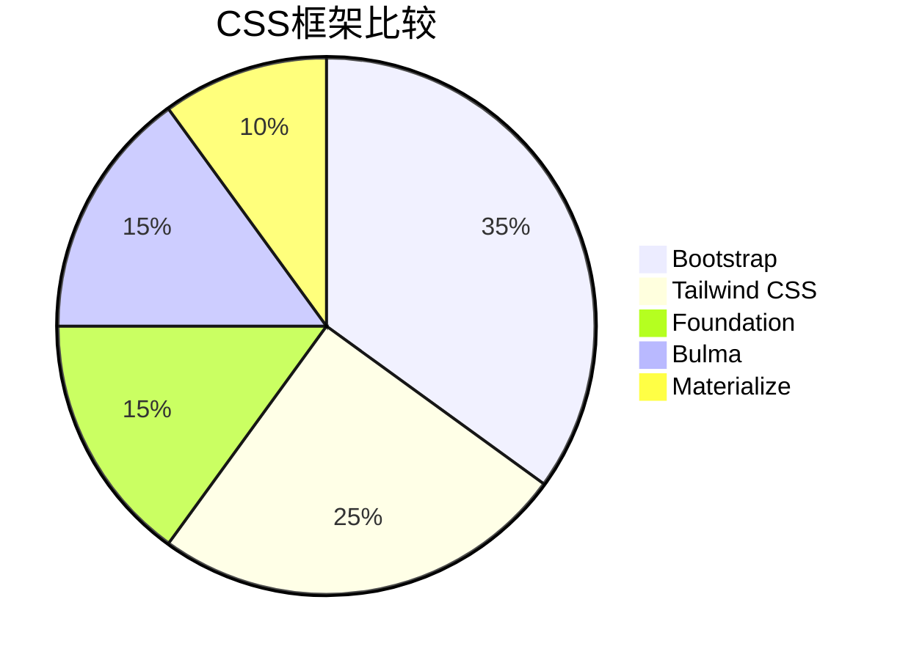

## 介绍

CSS框架是预先编写好的CSS代码库，旨在帮助开发者快速构建响应式、美观的网页。它们通常包含网格系统、预定义的样式组件（如按钮、表单、导航栏等）以及工具类，能够显著提高开发效率。对于初学者来说，选择一个合适的CSS框架可以简化学习曲线，并快速上手项目开发。

本文将比较几个流行的CSS框架，分析它们的优缺点，并通过实际案例帮助你理解如何选择和使用这些框架。

---

## 流行的CSS框架

以下是目前最流行的几个CSS框架：

1. **Bootstrap**
2. **Tailwind CSS**
3. **Foundation**
4. **Bulma**
5. **Materialize**

接下来，我们将逐一介绍这些框架的特点。

---

### 1. Bootstrap

Bootstrap 是最受欢迎的CSS框架之一，由Twitter开发并开源。它提供了丰富的组件和工具类，适合快速构建响应式网页。

#### 特点：
- **网格系统**：基于12列的响应式网格系统。
- **预定义组件**：按钮、表单、导航栏、卡片等。
- **JavaScript插件**：如模态框、轮播图等。
- **广泛的社区支持**：文档齐全，社区活跃。

#### 代码示例：
```html
<div class="container">
  <div class="row">
    <div class="col-md-6">
      <button class="btn btn-primary">Primary Button</button>
    </div>
    <div class="col-md-6">
      <button class="btn btn-secondary">Secondary Button</button>
    </div>
  </div>
</div>
```

#### 适用场景：
- 快速原型设计。
- 需要大量预定义组件的项目。

---

### 2. Tailwind CSS

Tailwind CSS 是一个实用优先的CSS框架，通过工具类直接操作样式，而不是预定义组件。

#### 特点：
- **实用类**：通过组合工具类实现样式。
- **高度可定制**：通过配置文件自定义设计系统。
- **轻量级**：按需生成CSS，减少文件大小。

#### 代码示例：
```html
<div class="p-4 bg-blue-500 text-white">
  <button class="px-4 py-2 bg-blue-700 hover:bg-blue-800">Click Me</button>
</div>
```

#### 适用场景：
- 需要高度定制化的项目。
- 开发者希望完全控制样式。

---

### 3. Foundation

Foundation 是一个企业级CSS框架，专注于灵活性和可扩展性。

#### 特点：
- **模块化设计**：按需加载组件。
- **响应式工具**：强大的响应式设计支持。
- **语义化**：强调语义化的HTML结构。

#### 代码示例：
```html
<div class="grid-x grid-padding-x">
  <div class="cell small-6">
    <button class="button primary">Primary Button</button>
  </div>
  <div class="cell small-6">
    <button class="button secondary">Secondary Button</button>
  </div>
</div>
```

#### 适用场景：
- 大型企业级项目。
- 需要高度灵活性和可扩展性的场景。

---

### 4. Bulma

Bulma 是一个基于Flexbox的现代CSS框架，专注于简洁和易用性。

#### 特点：
- **Flexbox布局**：强大的布局能力。
- **无JavaScript依赖**：纯CSS框架。
- **简洁的API**：易于学习和使用。

#### 代码示例：
```html
<div class="columns">
  <div class="column">
    <button class="button is-primary">Primary Button</button>
  </div>
  <div class="column">
    <button class="button is-secondary">Secondary Button</button>
  </div>
</div>
```

#### 适用场景：
- 需要快速构建简洁界面的项目。
- 开发者偏好纯CSS解决方案。

---

### 5. Materialize

Materialize 是一个基于Google Material Design的CSS框架，提供丰富的UI组件和动画效果。

#### 特点：
- **Material Design风格**：遵循Google的设计规范。
- **丰富的组件**：如卡片、模态框、浮动按钮等。
- **内置JavaScript插件**：如轮播图、下拉菜单等。

#### 代码示例：
```html
<div class="row">
  <div class="col s6">
    <a class="waves-effect waves-light btn">Button</a>
  </div>
  <div class="col s6">
    <a class="waves-effect waves-light btn">Button</a>
  </div>
</div>
```

#### 适用场景：
- 需要Material Design风格的项目。
- 需要丰富动画和交互效果的应用。

---

## 框架比较图表

以下是一个简单的比较图表，帮助你快速了解各框架的特点：



---

## 实际案例

假设你需要为一个初创公司开发一个简单的营销页面，以下是选择框架的建议：

- **Bootstrap**：如果你需要快速搭建页面，并且希望使用丰富的预定义组件。
- **Tailwind CSS**：如果你需要高度定制化的设计，并且愿意花时间组合工具类。
- **Bulma**：如果你偏好简洁的API和纯CSS解决方案。

---

## 总结

选择合适的CSS框架取决于项目的需求、团队的技术栈以及开发者的偏好。对于初学者来说，Bootstrap 和 Bulma 是很好的起点，因为它们提供了丰富的文档和社区支持。如果你希望更深入地控制样式，Tailwind CSS 是一个强大的选择。

---

## 附加资源

- [Bootstrap 官方文档](https://getbootstrap.com/docs)
- [Tailwind CSS 官方文档](https://tailwindcss.com/docs)
- [Foundation 官方文档](https://get.foundation/sites/docs)
- [Bulma 官方文档](https://bulma.io/documentation)
- [Materialize 官方文档](https://materializecss.com/)

---

## 练习

1. 使用Bootstrap创建一个包含导航栏、卡片和按钮的简单页面。
2. 尝试用Tailwind CSS重新实现上述页面，比较两者的开发体验。
3. 选择一个你感兴趣的框架，深入研究其网格系统和组件库。

祝你学习愉快！