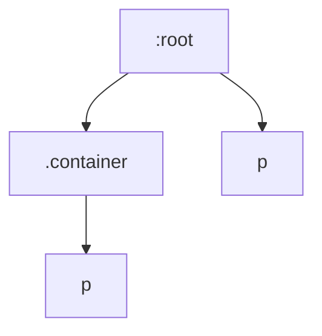

## 介绍

CSS自定义属性（也称为CSS变量）是一种强大的工具，可以帮助我们更高效地管理样式。通过使用CSS变量，我们可以在整个样式表中定义和重用值，从而减少重复代码并提高可维护性。然而，CSS变量的一个关键特性是它们的**继承机制**，这使得它们在不同层级的选择器中可以灵活地传递和覆盖。

本文将详细介绍CSS变量的继承机制，并通过代码示例和实际案例帮助你理解其工作原理。

## 什么是CSS变量继承？

CSS变量遵循CSS的继承规则。这意味着，如果一个元素没有显式定义某个CSS变量，它将从其父元素继承该变量的值。这种继承机制使得我们可以在全局范围内定义变量，并在需要时在局部范围内覆盖它们。

### 基本语法

CSS变量以`--`开头，并通过`var()`函数来引用。例如：

```css
:root {
  --main-color: blue;
}

p {
  color: var(--main-color);
}
```

在这个例子中，`--main-color`变量在`:root`选择器中定义，并在`p`元素中使用。由于`p`元素没有显式定义`--main-color`，它将继承`:root`中定义的值。

## 变量继承的工作原理

为了更好地理解CSS变量的继承机制，让我们通过一个简单的例子来说明。

```css
:root {
  --primary-color: red;
}

.container {
  --primary-color: green;
}

p {
  color: var(--primary-color);
}
```

```html
<div class="container">
  <p>这段文字的颜色是绿色。</p>
</div>
<p>这段文字的颜色是红色。</p>
```

在这个例子中，`.container`元素覆盖了`:root`中定义的`--primary-color`变量。因此，位于`.container`内部的`p`元素将使用绿色的`--primary-color`，而外部的`p`元素将使用红色的`--primary-color`。

### 继承的层级

CSS变量的继承遵循DOM的层级结构。这意味着，子元素会继承父元素的变量值，除非子元素显式地覆盖了该变量。



在这个图表中，`:root`是全局作用域，`.container`是局部作用域，`p`元素继承自其最近的父元素。

## 实际应用场景

### 主题切换

CSS变量的继承机制在主题切换中非常有用。通过在不同的层级定义变量，我们可以轻松地切换整个页面的主题。

```css
:root {
  --background-color: white;
  --text-color: black;
}

.dark-theme {
  --background-color: black;
  --text-color: white;
}

body {
  background-color: var(--background-color);
  color: var(--text-color);
}
```

```html
<body>
  <p>这是一个默认主题的段落。</p>
  <div class="dark-theme">
    <p>这是一个暗黑主题的段落。</p>
  </div>
</body>
```

在这个例子中，`.dark-theme`类覆盖了`:root`中定义的变量，从而实现了主题切换。

### 响应式设计

CSS变量的继承机制还可以用于响应式设计。通过在不同的媒体查询中定义变量，我们可以根据屏幕尺寸动态调整样式。

```css
:root {
  --font-size: 16px;
}

@media (max-width: 768px) {
  :root {
    --font-size: 14px;
  }
}

p {
  font-size: var(--font-size);
}
```

在这个例子中，当屏幕宽度小于768px时，`--font-size`变量的值将变为14px，从而影响所有使用该变量的元素。

## 总结

CSS变量的继承机制为我们提供了一种灵活的方式来管理和重用样式。通过理解变量的继承规则，我们可以更高效地编写CSS代码，并在不同的上下文中灵活地调整样式。

### 附加资源

- [MDN Web Docs: CSS Custom Properties](https://developer.mozilla.org/en-US/docs/Web/CSS/Using_CSS_custom_properties)
- [CSS Variables: A Beginner's Guide](https://www.smashingmagazine.com/2017/04/start-using-css-custom-properties/)

### 练习

1. 创建一个包含多个层级的HTML结构，并在不同层级中定义和覆盖CSS变量，观察变量的继承效果。
2. 尝试使用CSS变量实现一个简单的主题切换功能，并在不同的主题中调整背景颜色和文字颜色。
