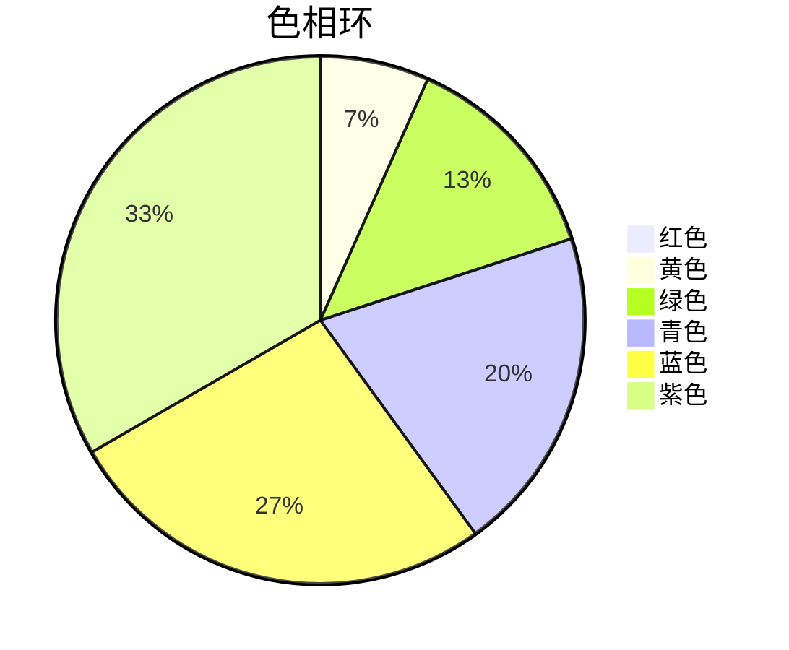

# CSS 色相旋转

CSS色相旋转（Hue Rotation）是一种强大的CSS滤镜功能，允许你通过调整颜色的色相值来动态改变元素的颜色。色相是色彩的基本属性之一，决定了颜色的“种类”，例如红色、绿色或蓝色。通过色相旋转，你可以轻松实现颜色变换效果，而无需手动定义每种颜色。

## 什么是色相旋转？

色相旋转是CSS滤镜函数 `hue-rotate()` 的一部分。它接受一个角度值（通常以 `deg` 为单位），并将元素的颜色沿着色相环旋转指定的角度。色相环是一个360度的圆形，表示所有可能的颜色。

例如，如果你将一个元素的色相旋转 `90deg`，它的颜色会从当前色相位置顺时针旋转90度，从而生成新的颜色。

## 如何使用 `hue-rotate()`

`hue-rotate()` 是 `filter` 属性的一个值。你可以将其应用于任何元素，例如图片、背景或文本。以下是一个简单的示例：

```css
.element {
  filter: hue-rotate(90deg);
}
```

在这个例子中，`.element` 的颜色会沿着色相环旋转90度。

### 示例：旋转图片的色相

假设你有一张图片，想要动态改变其颜色。你可以使用以下代码：

```html

```

```css
.hue-rotate {
  filter: hue-rotate(90deg);
}
```

应用此样式后，图片的颜色会发生变化，仿佛被“染色”了一样。

## 逐步讲解

### 1. 理解色相环

色相环是一个360度的圆形，表示所有可能的颜色。以下是一个简单的色相环示意图：



在这个色相环中，每种颜色对应一个特定的角度。例如，红色位于0度，绿色位于120度，蓝色位于240度。

### 2. 色相旋转的工作原理

当你使用 `hue-rotate()` 时，CSS会计算当前颜色的色相值，并将其旋转指定的角度。例如，如果一个元素的颜色是红色（0度），旋转 `90deg` 后，它会变成黄色（90度）。

### 3. 动态色相旋转

你可以结合CSS动画，实现动态的色相旋转效果。以下是一个示例：

```css
@keyframes hue-rotate-animation {
  0% {
    filter: hue-rotate(0deg);
  }
  100% {
    filter: hue-rotate(360deg);
  }
}

.element {
  animation: hue-rotate-animation 5s infinite;
}
```

在这个例子中，`.element` 的颜色会不断旋转，形成一个动态的彩虹效果。

## 实际应用场景

### 1. 动态背景

你可以使用色相旋转为网页背景添加动态效果。例如：

```css
body {
  background: linear-gradient(90deg, red, yellow, green, blue);
  animation: hue-rotate-animation 10s infinite;
}
```

### 2. 按钮悬停效果

当用户悬停在按钮上时，你可以改变按钮的颜色：

```css
.button {
  background-color: blue;
  transition: filter 0.3s;
}

.button:hover {
  filter: hue-rotate(90deg);
}
```

### 3. 图片滤镜

为图片添加色相旋转滤镜，可以创建独特的视觉效果：

```css
.image-filter {
  filter: hue-rotate(180deg);
}
```

## 总结

CSS色相旋转是一种简单但强大的工具，可以帮助你轻松实现颜色变换效果。通过理解色相环和 `hue-rotate()` 的工作原理，你可以为网页设计增添更多创意和动态效果。

## 附加资源与练习

- **练习1**：尝试为一个按钮添加悬停色相旋转效果，并观察颜色的变化。
- **练习2**：使用CSS动画，创建一个不断旋转色相的背景。
- **进一步学习**：探索其他CSS滤镜功能，如 `grayscale()`、`blur()` 和 `contrast()`，了解它们如何与 `hue-rotate()` 结合使用。

希望本文能帮助你掌握CSS色相旋转的技巧，并在你的项目中灵活运用！