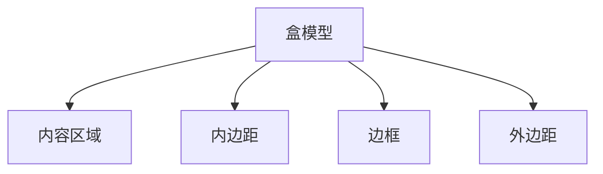

# CSS 盒模型概念

CSS盒模型是网页布局的核心概念之一。它定义了网页中的每个元素如何被渲染为一个矩形的盒子，并控制这些盒子的尺寸、边距、边框和内边距。理解盒模型是掌握CSS布局的关键。

## 什么是CSS盒模型？

CSS盒模型将每个HTML元素视为一个矩形的盒子，这个盒子由四个部分组成：

1. **内容区域（Content）**：显示实际内容的部分，比如文本、图片等。
2. **内边距（Padding）**：内容区域与边框之间的空间。
3. **边框（Border）**：围绕内容和内边距的边界。
4. **外边距（Margin）**：盒子与其他元素之间的空间。

这些部分共同决定了元素在页面上的实际占用空间。



## 盒模型的组成部分

### 1. 内容区域（Content）

内容区域是盒子的核心部分，用于显示元素的实际内容。它的尺寸由 `width` 和 `height` 属性控制。

```css
div {
  width: 200px;
  height: 100px;
  background-color: lightblue;
}
```

### 2. 内边距（Padding）

内边距是内容区域与边框之间的空间。它可以通过 `padding` 属性设置。

```css
div {
  padding: 20px;
}
```

:::tip
`padding` 可以分别设置上、右、下、左四个方向的值，例如 `padding: 10px 20px 30px 40px;`。
:::

### 3. 边框（Border）

边框是围绕内容和内边距的边界。它可以通过 `border` 属性设置。

```css
div {
  border: 2px solid black;
}
```

:::note
`border` 属性可以分别设置宽度、样式和颜色，例如 `border: 2px dashed red;`。
:::

### 4. 外边距（Margin）

外边距是盒子与其他元素之间的空间。它可以通过 `margin` 属性设置。

```css
div {
  margin: 10px;
}
```

:::caution
外边距可以设置为负值，这会使元素与其他元素重叠。
:::

## 盒模型的实际应用

### 案例1：简单的卡片布局

假设我们要创建一个简单的卡片布局，包含标题和内容。

```html
<div class="card">
  <h2>卡片标题</h2>
  <p>这是卡片的内容。</p>
</div>
```

```css
.card {
  width: 300px;
  padding: 20px;
  border: 1px solid #ccc;
  margin: 10px;
  background-color: #f9f9f9;
}
```

在这个例子中，`.card` 元素的宽度为 `300px`，内边距为 `20px`，边框为 `1px` 的实线，外边距为 `10px`。这些属性共同决定了卡片在页面上的显示效果。

### 案例2：响应式布局

在响应式布局中，盒模型的灵活运用非常重要。例如，我们可以通过调整内边距和外边距来适应不同屏幕尺寸。

```css
.container {
  width: 100%;
  padding: 10px;
  margin: 0 auto;
  max-width: 1200px;
}
```

在这个例子中，`.container` 元素的宽度为 `100%`，内边距为 `10px`，外边距为 `0 auto`，这使得容器在页面中居中，并且在不同屏幕尺寸下都能保持良好的布局。

## 总结

CSS盒模型是网页布局的基础，理解并掌握盒模型的各个部分（内容区域、内边距、边框和外边距）对于创建复杂的网页布局至关重要。通过合理设置这些属性，你可以精确控制元素在页面上的显示效果。

## 附加资源与练习

- **练习1**：创建一个包含多个卡片的页面，并尝试调整每个卡片的内边距、边框和外边距，观察它们如何影响布局。
- **练习2**：使用盒模型创建一个响应式导航栏，确保在不同屏幕尺寸下都能正常显示。

:::warning
在实际开发中，务必注意盒模型的尺寸计算方式（标准盒模型与IE盒模型），以避免布局问题。
:::

希望这篇内容能帮助你更好地理解CSS盒模型的概念，并在实际项目中灵活运用！