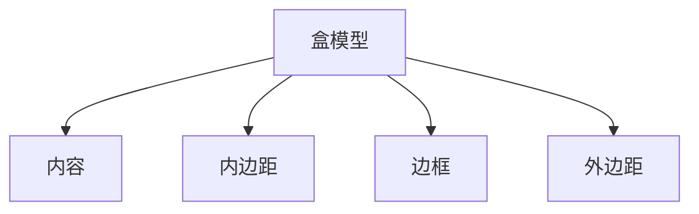

# CSS 盒模型调试

CSS盒模型是网页布局的核心概念之一。它描述了每个HTML元素在页面中占据的空间，包括内容（content）、内边距（padding）、边框（border）和外边距（margin）。理解盒模型的工作原理对于创建精确的布局至关重要。本文将介绍如何使用开发者工具调试CSS盒模型，并通过实际案例帮助你更好地掌握这一概念。

## 什么是CSS盒模型？

CSS盒模型由四个部分组成：

1. **内容（Content）**：元素的实际内容，如文本、图片等。
2. **内边距（Padding）**：内容与边框之间的空间。
3. **边框（Border）**：围绕内容和内边距的边框。
4. **外边距（Margin）**：元素与其他元素之间的空间。



## 使用开发者工具调试盒模型

现代浏览器（如Chrome、Firefox）都内置了开发者工具，可以帮助我们直观地查看和调试盒模型。

### 1. 打开开发者工具

在浏览器中右键点击页面上的元素，选择“检查”或按下 `Ctrl+Shift+I`（Windows）或 `Cmd+Option+I`（Mac）打开开发者工具。

### 2. 查看盒模型

在开发者工具的“Elements”面板中，选中一个元素后，右侧会显示该元素的样式和盒模型。盒模型通常以图形化的方式展示，清晰地标出了内容、内边距、边框和外边距的尺寸。

:::tip
你可以通过调整内边距、边框和外边距的值，实时查看元素布局的变化。
:::

### 3. 调试盒模型

在开发者工具中，你可以直接修改元素的CSS属性，观察盒模型的变化。例如，尝试增加内边距或边框的宽度，看看元素的总宽度如何变化。

```css
.box {
    width: 200px;
    padding: 20px;
    border: 5px solid black;
    margin: 10px;
}
```

:::note
默认情况下，CSS的 `box-sizing` 属性为 `content-box`，这意味着元素的宽度和高度仅包括内容区域。如果你希望宽度和高度包括内边距和边框，可以将 `box-sizing` 设置为 `border-box`。
:::

## 实际案例

假设我们有一个简单的HTML结构：

```html
<div class="container">
    <div class="box">Hello, World!</div>
</div>
```

对应的CSS样式如下：

```css
.container {
    width: 300px;
    border: 2px solid gray;
}

.box {
    width: 200px;
    padding: 20px;
    border: 5px solid black;
    margin: 10px;
}
```

在这个例子中，`.box` 元素的总宽度为：

```
总宽度 = 内容宽度 + 左内边距 + 右内边距 + 左边框 + 右边框
       = 200px + 20px + 20px + 5px + 5px
       = 250px
```

:::caution
如果你没有考虑到内边距和边框的宽度，可能会导致布局超出预期。使用 `box-sizing: border-box;` 可以避免这个问题。
:::

## 总结

CSS盒模型是网页布局的基础，理解其工作原理对于创建精确的布局至关重要。通过开发者工具，我们可以直观地查看和调试盒模型，确保布局符合预期。

### 附加资源

- [MDN Web Docs: CSS盒模型](https://developer.mozilla.org/zh-CN/docs/Learn/CSS/Building_blocks/The_box_model)
- [CSS Tricks: Box Sizing](https://css-tricks.com/box-sizing/)

### 练习

1. 创建一个包含多个盒子的页面，尝试调整每个盒子的内边距、边框和外边距，观察布局的变化。
2. 使用开发者工具调试一个复杂的布局，尝试修复布局中的问题。

通过不断练习，你将更加熟练地掌握CSS盒模型的调试技巧。