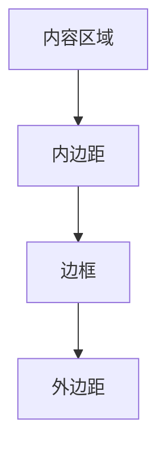

# CSS 内边距

在CSS盒模型中，内边距（padding）是控制元素内容与边框之间间距的重要属性。通过调整内边距，你可以为元素的内容提供更多的空间，从而改善布局和视觉效果。本文将详细介绍CSS内边距的概念、用法以及实际应用场景。

## 什么是内边距？

内边距是CSS盒模型中的一个区域，位于内容区域和边框之间。它用于控制元素内容与边框之间的间距。内边距的值可以是长度（如像素、百分比等），也可以是关键字（如`auto`）。

:::note
内边距不会影响元素的实际内容大小，但会增加元素的总尺寸（包括内边距、边框和外边距）。
:::

## 内边距的语法

CSS内边距可以通过以下方式设置：

```css
padding: value;
```

其中，`value`可以是以下形式之一：

- **单个值**：设置所有四个方向的内边距。
- **两个值**：第一个值设置上下内边距，第二个值设置左右内边距。
- **三个值**：第一个值设置上内边距，第二个值设置左右内边距，第三个值设置下内边距。
- **四个值**：分别设置上、右、下、左四个方向的内边距。

### 示例

```css
/* 所有方向的内边距为10px */
padding: 10px;

/* 上下内边距为10px，左右内边距为20px */
padding: 10px 20px;

/* 上内边距为10px，左右内边距为20px，下内边距为30px */
padding: 10px 20px 30px;

/* 上、右、下、左内边距分别为10px、20px、30px、40px */
padding: 10px 20px 30px 40px;
```

## 内边距的实际应用

### 1. 改善文本的可读性

通过为文本容器添加内边距，可以增加文本与容器边框之间的间距，从而提高文本的可读性。

```css
.text-container {
  padding: 20px;
  border: 1px solid #000;
}
```

### 2. 创建按钮样式

在按钮设计中，内边距用于调整按钮文本与边框之间的间距，使按钮看起来更加美观。

```css
.button {
  padding: 10px 20px;
  background-color: #007BFF;
  color: white;
  border: none;
  border-radius: 5px;
}
```

### 3. 响应式布局中的内边距

在响应式设计中，内边距可以结合百分比单位使用，以适应不同屏幕尺寸。

```css
.responsive-container {
  padding: 5%;
  border: 1px solid #000;
}
```

## 内边距与盒模型的关系

内边距是CSS盒模型的一部分，盒模型由内容区域、内边距、边框和外边距组成。以下是一个简单的盒模型示意图：



:::tip
使用`box-sizing: border-box;`可以改变盒模型的计算方式，使内边距和边框包含在元素的总宽度和高度内。
:::

## 总结

CSS内边距是控制元素内容与边框之间间距的重要属性。通过合理使用内边距，你可以改善布局、提高可读性，并创建更美观的界面设计。掌握内边距的语法和应用场景，将帮助你在CSS布局中更加得心应手。

## 附加资源与练习

- **练习**：尝试为一个包含文本的`<div>`元素设置不同的内边距值，观察其效果。
- **资源**：阅读[MDN Web Docs](https://developer.mozilla.org/zh-CN/docs/Web/CSS/padding)中关于内边距的更多详细信息。

通过不断练习和探索，你将能够更好地理解和应用CSS内边距。