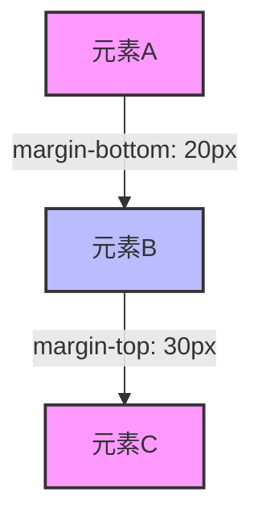

# CSS 外边距

CSS外边距（Margin）是CSS盒模型中的一个重要概念，用于控制元素与周围元素之间的空间。外边距是透明的，不会影响元素的背景颜色或内容，但它对布局的影响非常大。通过调整外边距，你可以控制元素之间的距离，从而创建更美观和一致的网页布局。

## 什么是外边距？

外边距是元素边框之外的空间。它定义了元素与其他元素之间的距离。外边距可以是正值、负值或零。正值会增加元素之间的距离，负值会使元素重叠，而零则表示元素之间没有额外的空间。

### 外边距的属性

CSS提供了以下属性来设置外边距：

- `margin-top`：设置元素的上外边距。
- `margin-right`：设置元素的右外边距。
- `margin-bottom`：设置元素的下外边距。
- `margin-left`：设置元素的左外边距。
- `margin`：简写属性，用于同时设置上、右、下、左的外边距。

### 外边距的简写

`margin`属性可以接受1到4个值：

- **1个值**：所有四个方向的外边距都相同。
  ```css
  margin: 10px;
  ```
- **2个值**：第一个值表示上下外边距，第二个值表示左右外边距。
  ```css
  margin: 10px 20px;
  ```
- **3个值**：第一个值表示上外边距，第二个值表示左右外边距，第三个值表示下外边距。
  ```css
  margin: 10px 20px 30px;
  ```
- **4个值**：分别表示上、右、下、左的外边距。
  ```css
  margin: 10px 20px 30px 40px;
  ```

## 外边距的实际应用

### 1. 创建间距

外边距最常见的用途是在元素之间创建间距。例如，你可能希望在段落之间添加一些空白，以使内容更易读。

```css
p {
  margin-bottom: 20px;
}
```

### 2. 居中元素

通过设置左右外边距为`auto`，可以将块级元素水平居中。

```css
div {
  width: 50%;
  margin: 0 auto;
}
```

### 3. 负外边距

负外边距可以用来使元素重叠或调整元素的位置。例如，你可能希望将一个元素向上移动。

```css
div {
  margin-top: -10px;
}
```

:::caution
使用负外边距时要小心，因为它可能会导致布局问题或元素重叠。
:::

## 外边距的折叠

在CSS中，垂直方向上的外边距有时会发生折叠（Margin Collapse）。当两个相邻的块级元素的外边距接触时，它们的外边距会合并为一个外边距，其大小为两者中的较大者。



在上面的例子中，元素A和元素B之间的外边距为30px，而不是50px。

:::note
外边距折叠只发生在垂直方向上，水平方向上的外边距不会折叠。
:::

## 实际案例

假设你正在设计一个博客页面，你希望在每个博客文章之间添加一些空白，同时将博客文章内容居中显示。

```css
.article {
  width: 80%;
  margin: 20px auto;
  padding: 20px;
  border: 1px solid #ccc;
}
```

在这个例子中，`.article`类的元素将在页面中居中显示，并且每个文章之间会有20px的间距。

## 总结

CSS外边距是控制元素之间距离的强大工具。通过合理使用外边距，你可以创建出更加美观和一致的网页布局。记住，外边距可以是正值、负值或零，并且可以通过简写属性`margin`来快速设置。

## 附加资源与练习

- **练习**：尝试创建一个包含多个段落的HTML页面，并使用外边距来控制段落之间的间距。
- **进一步学习**：阅读MDN文档中关于[CSS外边距](https://developer.mozilla.org/zh-CN/docs/Web/CSS/margin)的更多内容。

通过不断练习和探索，你将更好地掌握CSS外边距的使用技巧。