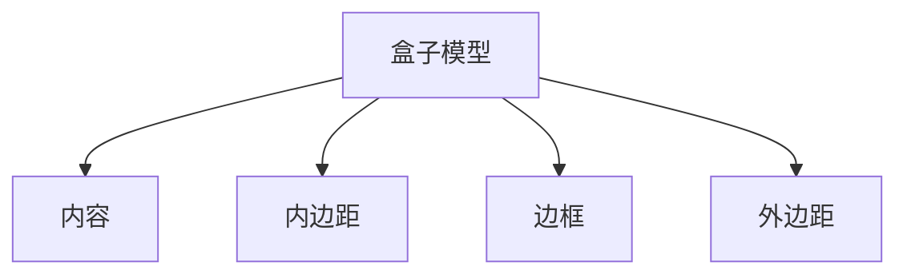

# CSS 盒子尺寸

在CSS中，**盒子尺寸**是理解网页布局的基础。每个HTML元素都可以看作是一个矩形的盒子，这个盒子由内容、内边距、边框和外边距组成。理解这些部分的尺寸如何影响元素的最终大小，是掌握CSS布局的关键。

## 盒子模型的组成部分

CSS盒子模型由以下四个部分组成：

1. **内容（Content）**：元素的实际内容，比如文本、图片等。
2. **内边距（Padding）**：内容与边框之间的空间。
3. **边框（Border）**：围绕内容和内边距的边框。
4. **外边距（Margin）**：盒子与其他元素之间的空间。



## 盒子尺寸的计算

默认情况下，CSS使用**标准盒子模型**，这意味着元素的宽度和高度仅包括内容区域。内边距、边框和外边距会额外增加元素的总尺寸。

例如，假设我们有一个宽度为200px、高度为100px的元素，内边距为10px，边框为5px，外边距为20px。那么，元素的总宽度和高度计算如下：

- **总宽度** = 内容宽度 + 左右内边距 + 左右边框 + 左右外边距
- **总高度** = 内容高度 + 上下内边距 + 上下边框 + 上下外边距

```css
.box {
    width: 200px;
    height: 100px;
    padding: 10px;
    border: 5px solid black;
    margin: 20px;
}
```

在这个例子中，元素的总宽度为：

```
200px (内容) + 20px (左右内边距) + 10px (左右边框) + 40px (左右外边距) = 270px
```

总高度为：

```
100px (内容) + 20px (上下内边距) + 10px (上下边框) + 40px (上下外边距) = 170px
```

:::note
**注意**：在标准盒子模型中，内边距、边框和外边距会增加元素的总尺寸。
:::

## 使用 `box-sizing` 属性

为了简化盒子尺寸的计算，CSS提供了 `box-sizing` 属性。默认值为 `content-box`，即标准盒子模型。如果将 `box-sizing` 设置为 `border-box`，则元素的宽度和高度将包括内容、内边距和边框。

```css
.box {
    box-sizing: border-box;
    width: 200px;
    height: 100px;
    padding: 10px;
    border: 5px solid black;
    margin: 20px;
}
```

在这个例子中，元素的总宽度和高度将分别为200px和100px，内边距和边框将包含在指定的宽度和高度内。

:::tip
**提示**：使用 `box-sizing: border-box;` 可以更直观地控制元素的尺寸，尤其是在响应式设计中。
:::

## 实际应用场景

### 1. 创建等宽列布局

在创建多列布局时，使用 `box-sizing: border-box;` 可以确保每列的宽度包括内边距和边框，从而避免布局错位。

```css
.column {
    box-sizing: border-box;
    width: 33.33%;
    padding: 10px;
    border: 1px solid #ccc;
}
```

### 2. 控制按钮尺寸

在设计按钮时，使用 `box-sizing: border-box;` 可以确保按钮的尺寸包括内边距和边框，从而避免按钮在不同浏览器中显示不一致。

```css
.button {
    box-sizing: border-box;
    width: 100px;
    padding: 10px;
    border: 2px solid #000;
}
```

## 总结

理解CSS盒子尺寸是掌握网页布局的基础。通过控制内容、内边距、边框和外边距的尺寸，你可以精确地控制元素的大小和位置。使用 `box-sizing` 属性可以简化盒子尺寸的计算，尤其是在复杂的布局中。

## 附加资源与练习

- **练习**：尝试创建一个包含多个列的布局，使用 `box-sizing: border-box;` 确保每列的宽度一致。
- **进一步学习**：阅读MDN文档中关于[盒子模型](https://developer.mozilla.org/zh-CN/docs/Learn/CSS/Building_blocks/The_box_model)的更多内容。

通过不断实践和探索，你将能够更好地掌握CSS盒子尺寸的概念，并在实际项目中灵活运用。