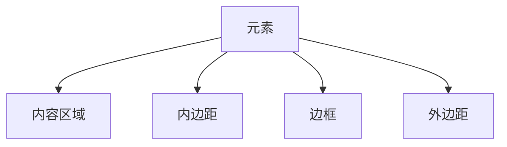

## 介绍

在CSS中，**盒模型**是网页布局的基础。每个HTML元素都可以看作是一个矩形的盒子，这个盒子由内容（content）、内边距（padding）、边框（border）和外边距（margin）组成。理解盒模型的工作原理对于掌握CSS布局至关重要。

CSS盒模型有两种类型：**标准盒模型**和**替代盒模型**。本文将详细介绍这两种盒模型的区别，并通过代码示例和实际案例帮助你更好地理解它们。

---

## 标准盒模型

在标准盒模型中，元素的宽度（width）和高度（height）仅指内容区域的尺寸。内边距、边框和外边距会额外增加元素的总尺寸。

### 标准盒模型的组成



### 代码示例

```css
.box {
  width: 200px;
  height: 100px;
  padding: 20px;
  border: 10px solid black;
  margin: 30px;
}
```

在这个例子中，元素的总宽度和高度计算如下：

- **总宽度** = 内容宽度 + 左右内边距 + 左右边框 + 左右外边距  
  `200px + 20px * 2 + 10px * 2 + 30px * 2 = 320px`

- **总高度** = 内容高度 + 上下内边距 + 上下边框 + 上下外边距  
  `100px + 20px * 2 + 10px * 2 + 30px * 2 = 220px`

:::note
在标准盒模型中，内边距和边框会增加元素的总尺寸，这可能会导致布局计算变得复杂。
:::

---

## 替代盒模型

替代盒模型（也称为“边框盒模型”）通过将内边距和边框包含在元素的宽度和高度内，简化了布局计算。在这种模型中，元素的宽度和高度直接决定了内容区域、内边距和边框的总尺寸。

### 启用替代盒模型

要启用替代盒模型，可以使用 `box-sizing` 属性：

```css
.box {
  box-sizing: border-box;
  width: 200px;
  height: 100px;
  padding: 20px;
  border: 10px solid black;
  margin: 30px;
}
```

在这个例子中，元素的总宽度和高度计算如下：

- **总宽度** = 内容宽度（包含内边距和边框） + 左右外边距  
  `200px + 30px * 2 = 260px`

- **总高度** = 内容高度（包含内边距和边框） + 上下外边距  
  `100px + 30px * 2 = 160px`

:::tip
替代盒模型是现代网页设计中推荐的方式，因为它简化了布局计算，并减少了意外的布局问题。
:::

---

## 实际应用场景

### 场景1：响应式布局

在响应式布局中，使用替代盒模型可以更轻松地控制元素的尺寸。例如，当你希望一个元素的宽度始终占据父容器的50%时，替代盒模型可以确保内边距和边框不会导致元素超出预期尺寸。

```css
.container {
  width: 100%;
}

.item {
  box-sizing: border-box;
  width: 50%;
  padding: 20px;
  border: 5px solid black;
}
```

### 场景2：网格布局

在网格布局中，替代盒模型可以确保每个网格项的尺寸一致，而不会因为内边距或边框的差异导致布局错位。

```css
.grid-container {
  display: grid;
  grid-template-columns: repeat(3, 1fr);
  gap: 10px;
}

.grid-item {
  box-sizing: border-box;
  padding: 15px;
  border: 2px solid gray;
}
```

---

## 总结

CSS盒模型是网页布局的核心概念，理解标准盒模型和替代盒模型的区别对于编写高效的CSS代码至关重要。标准盒模型将内边距和边框添加到元素的总尺寸中，而替代盒模型则将它们包含在元素的宽度和高度内。

在实际开发中，推荐使用替代盒模型（通过 `box-sizing: border-box`），因为它简化了布局计算并减少了意外的布局问题。

---

## 附加资源与练习

- **练习1**：创建一个包含多个元素的网页，分别使用标准盒模型和替代盒模型，观察它们的布局差异。
- **练习2**：尝试在网格布局中使用替代盒模型，确保每个网格项的尺寸一致。
- **资源**：  
  - [MDN Web Docs: CSS盒模型](https://developer.mozilla.org/zh-CN/docs/Learn/CSS/Building_blocks/The_box_model)  
  - [W3Schools: CSS Box Model](https://www.w3schools.com/css/css_boxmodel.asp)

通过不断练习和探索，你将能够熟练运用CSS盒模型，创建出更加灵活和稳定的网页布局。